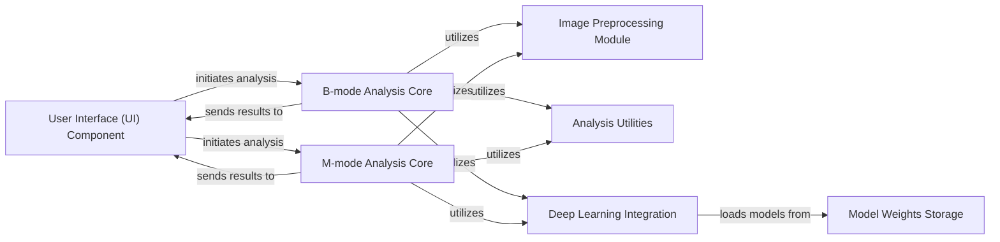

## Details

The `mouse-echo-neural-net` project is structured as a desktop application for scientific/biomedical image analysis, integrating deep learning capabilities. The architecture follows a modular design, separating concerns into distinct components for maintainability and scalability.

### User Interface (UI) Component
Serves as the primary entry point for user interaction, providing the graphical interface to load images, initiate analysis workflows, configure settings, and display results.

**Related Classes/Methods**:

- <a href="https://github.com/pfizer-opensource/mouse-echo-neural-net/blob/main/Echo_Segmenter_UI_Full.py#L1-L1" target="_blank" rel="noopener noreferrer">`Echo_Segmenter_UI_Full.py` (1:1)</a>

### B-mode Analysis Core [[Expand]](./B_mode_Analysis_Core.md)
Encapsulates the core logic for processing B-mode echocardiography images. It orchestrates the entire B-mode analysis pipeline, from image loading and preprocessing to neural network inference and post-processing for B-mode specific metrics.

**Related Classes/Methods**:

- <a href="https://github.com/pfizer-opensource/mouse-echo-neural-net/blob/main/echoanalysis_main.py#L1-L1" target="_blank" rel="noopener noreferrer">`echoanalysis_main.py` (1:1)</a>

### M-mode Analysis Core
Manages the core logic for M-mode echocardiography image analysis. Similar to the B-mode core, it handles the pipeline for M-mode images, including preprocessing, neural network application, and specific M-mode metric calculations.

**Related Classes/Methods**:

- <a href="https://github.com/pfizer-opensource/mouse-echo-neural-net/blob/main/echoanalysis_mmode_main.py#L1-L1" target="_blank" rel="noopener noreferrer">`echoanalysis_mmode_main.py` (1:1)</a>

### Image Preprocessing Module
Provides a collection of functions and utilities dedicated to preparing raw echocardiography images for analysis. This includes essential operations such as resizing, normalization, format conversion, and other transformations required before feeding images into deep learning models.

**Related Classes/Methods**:

- <a href="https://github.com/pfizer-opensource/mouse-echo-neural-net/blob/main/preprocessing_modes.py#L1-L1" target="_blank" rel="noopener noreferrer">`preprocessing_modes.py` (1:1)</a>

### Analysis Utilities [[Expand]](./Analysis_Utilities.md)
Contains a shared set of specialized helper functions and algorithms for general image manipulation, analysis, and data handling, supporting both B-mode and M-mode specific processing within their respective Analysis Cores.

**Related Classes/Methods**:

- <a href="https://github.com/pfizer-opensource/mouse-echo-neural-net/blob/main/util_bmode.py#L1-L1" target="_blank" rel="noopener noreferrer">`util_bmode.py` (1:1)</a>
- <a href="https://github.com/pfizer-opensource/mouse-echo-neural-net/blob/main/util_mmode.py#L1-L1" target="_blank" rel="noopener noreferrer">`util_mmode.py` (1:1)</a>

### Deep Learning Integration [[Expand]](./Deep_Learning_Integration.md)
Encapsulates the core deep learning functionalities, including model loading, inference execution, and post-processing logic for both B-mode and M-mode image segmentation. It acts as the interface to the pre-trained neural network models.

**Related Classes/Methods**:

- <a href="https://github.com/pfizer-opensource/mouse-echo-neural-net/blob/main/util_nn_bmode.py#L1-L1" target="_blank" rel="noopener noreferrer">`util_nn_bmode.py` (1:1)</a>
- <a href="https://github.com/pfizer-opensource/mouse-echo-neural-net/blob/main/util_nn_mmode.py#L1-L1" target="_blank" rel="noopener noreferrer">`util_nn_mmode.py` (1:1)</a>

### Model Weights Storage
A dedicated directory for securely storing pre-trained deep learning model weights (typically `.h5` files). These weights are loaded by the `Deep Learning Integration` component during the inference phase.

**Related Classes/Methods**:

- `model_weights/` (1:1)

### [FAQ](https://github.com/CodeBoarding/GeneratedOnBoardings/tree/main?tab=readme-ov-file#faq)