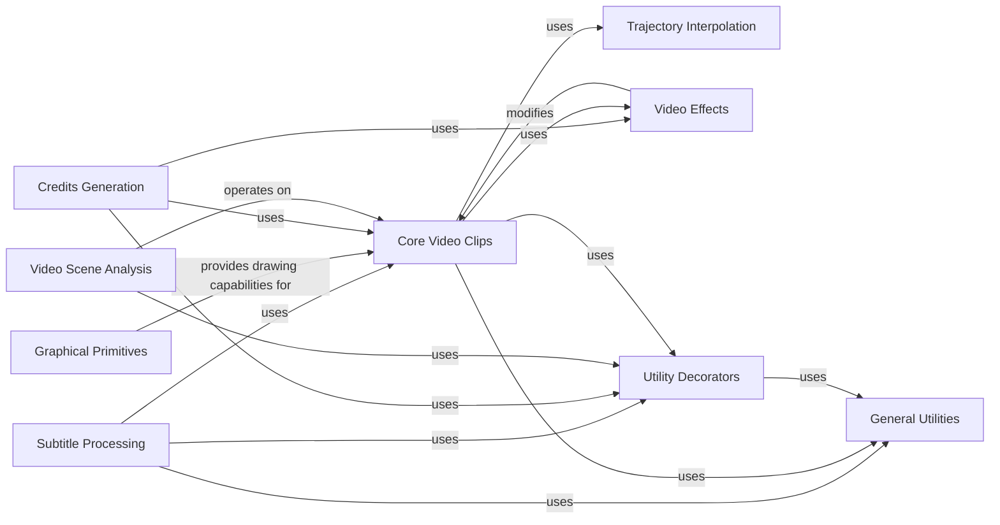

## Component Details

The Advanced Media Tools subsystem in MoviePy provides specialized, higher-level functionalities that extend beyond basic clip manipulation. This includes generating subtitles, creating animated credits, defining complex motion trajectories, and detecting scene changes within video content. These tools often build upon the core video processing capabilities, leveraging fundamental components like Core Video Clips, Graphical Primitives, and various utility functions to achieve their advanced media manipulation tasks.

### Subtitle Processing
This component is responsible for parsing subtitle files (like .srt) and generating video clips that display these subtitles. It dynamically creates text clips for subtitles only when they are needed for rendering.

**Related Classes/Methods**:

- <a href="https://github.com/Zulko/moviepy/blob/master/moviepy/video/tools/subtitles.py#L12-L173" target="_blank" rel="noopener noreferrer">`moviepy.moviepy.video.tools.subtitles.SubtitlesClip` (12:173)</a>
- <a href="https://github.com/Zulko/moviepy/blob/master/moviepy/video/tools/subtitles.py#L177-L198" target="_blank" rel="noopener noreferrer">`moviepy.moviepy.video.tools.subtitles.file_to_subtitles` (177:198)</a>

### Graphical Primitives
This component provides fundamental drawing utilities for creating various graphical elements such as linear, bilinear, and radial color gradients, as well as split-color regions and circles. These are often used as building blocks for more complex visual effects.

**Related Classes/Methods**:

- <a href="https://github.com/Zulko/moviepy/blob/master/moviepy/video/tools/drawing.py#L8-L174" target="_blank" rel="noopener noreferrer">`moviepy.moviepy.video.tools.drawing.color_gradient` (8:174)</a>
- <a href="https://github.com/Zulko/moviepy/blob/master/moviepy/video/tools/drawing.py#L177-L263" target="_blank" rel="noopener noreferrer">`moviepy.moviepy.video.tools.drawing.color_split` (177:263)</a>
- <a href="https://github.com/Zulko/moviepy/blob/master/moviepy/video/tools/drawing.py#L266-L319" target="_blank" rel="noopener noreferrer">`moviepy.moviepy.video.tools.drawing.circle` (266:319)</a>

### Credits Generation
This component specializes in generating formatted end or opening credits for videos. It parses structured text files to create two-column layouts and scales the resulting text image for integration into video compositions.

**Related Classes/Methods**:

- <a href="https://github.com/Zulko/moviepy/blob/master/moviepy/video/tools/credits.py#L11-L142" target="_blank" rel="noopener noreferrer">`moviepy.moviepy.video.tools.credits.CreditsClip` (11:142)</a>

### Trajectory Interpolation
This component handles the creation and interpolation of 2D trajectories over time. It allows for defining paths and querying positions at specific time points, useful for animating objects or camera movements.

**Related Classes/Methods**:

- <a href="https://github.com/Zulko/moviepy/blob/master/moviepy/video/tools/interpolators.py#L64-L238" target="_blank" rel="noopener noreferrer">`moviepy.moviepy.video.tools.interpolators.Trajectory` (64:238)</a>
- <a href="https://github.com/Zulko/moviepy/blob/master/moviepy/video/tools/interpolators.py#L6-L61" target="_blank" rel="noopener noreferrer">`moviepy.moviepy.video.tools.interpolators.Interpolator` (6:61)</a>

### Video Scene Analysis
This component provides tools for analyzing video content to identify patterns, matching frames, or scene changes. It supports finding video periods, detecting luminosity-based scene cuts, and managing collections of matching frames for tasks like creating looping GIFs.

**Related Classes/Methods**:

- <a href="https://github.com/Zulko/moviepy/blob/master/moviepy/video/tools/cuts.py#L12-L47" target="_blank" rel="noopener noreferrer">`moviepy.moviepy.video.tools.cuts.find_video_period` (12:47)</a>
- <a href="https://github.com/Zulko/moviepy/blob/master/moviepy/video/tools/cuts.py#L50-L98" target="_blank" rel="noopener noreferrer">`moviepy.moviepy.video.tools.cuts.FramesMatch` (50:98)</a>
- <a href="https://github.com/Zulko/moviepy/blob/master/moviepy/video/tools/cuts.py#L101-L459" target="_blank" rel="noopener noreferrer">`moviepy.moviepy.video.tools.cuts.FramesMatches` (101:459)</a>
- <a href="https://github.com/Zulko/moviepy/blob/master/moviepy/video/tools/cuts.py#L463-L522" target="_blank" rel="noopener noreferrer">`moviepy.moviepy.video.tools.cuts.detect_scenes` (463:522)</a>

### Core Video Clips
This component encompasses the fundamental building blocks for video manipulation in MoviePy, including base video clips, text-based clips, image-based clips, and composite video clips. It provides the core functionalities for creating and combining visual content.

**Related Classes/Methods**:

- <a href="https://github.com/Zulko/moviepy/blob/master/moviepy/video/VideoClip.py#L45-L1193" target="_blank" rel="noopener noreferrer">`moviepy.video.VideoClip.VideoClip` (45:1193)</a>
- <a href="https://github.com/Zulko/moviepy/blob/master/moviepy/video/VideoClip.py#L1448-L1972" target="_blank" rel="noopener noreferrer">`moviepy.video.VideoClip.TextClip` (1448:1972)</a>
- <a href="https://github.com/Zulko/moviepy/blob/master/moviepy/video/VideoClip.py#L1287-L1401" target="_blank" rel="noopener noreferrer">`moviepy.video.VideoClip.ImageClip` (1287:1401)</a>
- <a href="https://github.com/Zulko/moviepy/blob/master/moviepy/video/compositing/CompositeVideoClip.py#L12-L196" target="_blank" rel="noopener noreferrer">`moviepy.video.compositing.CompositeVideoClip.CompositeVideoClip` (12:196)</a>
- <a href="https://github.com/Zulko/moviepy/blob/master/moviepy/Clip.py#L28-L710" target="_blank" rel="noopener noreferrer">`moviepy.Clip.Clip` (28:710)</a>

### Video Effects
This component provides functionalities for applying various visual effects to video clips, such as resizing.

**Related Classes/Methods**:

- <a href="https://github.com/Zulko/moviepy/blob/master/moviepy/video/fx/Resize.py#L12-L158" target="_blank" rel="noopener noreferrer">`moviepy.video.fx.Resize.Resize` (12:158)</a>

### Utility Decorators
This component offers decorators that modify the behavior of functions, such as converting file paths to strings or parameters to seconds, streamlining common input handling tasks.

**Related Classes/Methods**:

- <a href="https://github.com/Zulko/moviepy/blob/master/moviepy/decorators.py#L114-L116" target="_blank" rel="noopener noreferrer">`moviepy.decorators.convert_path_to_string` (114:116)</a>
- <a href="https://github.com/Zulko/moviepy/blob/master/moviepy/decorators.py#L109-L111" target="_blank" rel="noopener noreferrer">`moviepy.decorators.convert_parameter_to_seconds` (109:111)</a>

### General Utilities
This component provides general-purpose utility functions, such as converting time representations to seconds, which are used across different parts of the MoviePy library.

**Related Classes/Methods**:

- <a href="https://github.com/Zulko/moviepy/blob/master/moviepy/tools.py#L64-L97" target="_blank" rel="noopener noreferrer">`moviepy.tools.convert_to_seconds` (64:97)</a>

### [FAQ](https://github.com/CodeBoarding/GeneratedOnBoardings/tree/main?tab=readme-ov-file#faq)