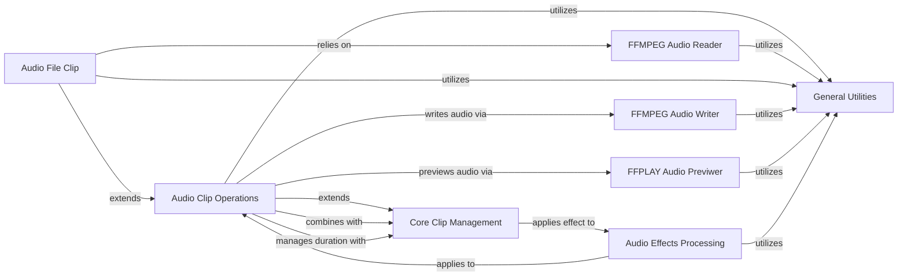

## Component Details

The Audio Core component in MoviePy is responsible for all functionalities related to audio clips. This includes their creation, manipulation, reading from various file formats, writing to different audio formats, and applying a wide range of audio effects. It builds upon the foundational Clip management and integrates with external tools like FFMPEG and FFPLAY for robust audio processing capabilities.

### Audio Clip Operations
This component focuses on the core functionalities of audio clips, including initialization, iterating through audio chunks, converting to sound arrays, volume analysis, and concatenation. It also includes specialized audio clip types like AudioArrayClip and CompositeAudioClip.

**Related Classes/Methods**:

- <a href="https://github.com/Zulko/moviepy/blob/master/moviepy/audio/AudioClip.py#L20-L313" target="_blank" rel="noopener noreferrer">`moviepy.moviepy.audio.AudioClip.AudioClip` (20:313)</a>
- <a href="https://github.com/Zulko/moviepy/blob/master/moviepy/audio/AudioClip.py#L68-L83" target="_blank" rel="noopener noreferrer">`moviepy.moviepy.audio.AudioClip.AudioClip:__init__` (68:83)</a>
- <a href="https://github.com/Zulko/moviepy/blob/master/moviepy/audio/AudioClip.py#L86-L114" target="_blank" rel="noopener noreferrer">`moviepy.moviepy.audio.AudioClip.AudioClip:iter_chunks` (86:114)</a>
- <a href="https://github.com/Zulko/moviepy/blob/master/moviepy/audio/AudioClip.py#L117-L167" target="_blank" rel="noopener noreferrer">`moviepy.moviepy.audio.AudioClip.AudioClip:to_soundarray` (117:167)</a>
- <a href="https://github.com/Zulko/moviepy/blob/master/moviepy/audio/AudioClip.py#L169-L180" target="_blank" rel="noopener noreferrer">`moviepy.moviepy.audio.AudioClip.AudioClip:max_volume` (169:180)</a>
- <a href="https://github.com/Zulko/moviepy/blob/master/moviepy/audio/AudioClip.py#L310-L313" target="_blank" rel="noopener noreferrer">`moviepy.moviepy.audio.AudioClip.AudioClip:__add__` (310:313)</a>
- <a href="https://github.com/Zulko/moviepy/blob/master/moviepy/audio/AudioClip.py#L316-L358" target="_blank" rel="noopener noreferrer">`moviepy.moviepy.audio.AudioClip.AudioArrayClip` (316:358)</a>
- <a href="https://github.com/Zulko/moviepy/blob/master/moviepy/audio/AudioClip.py#L334-L358" target="_blank" rel="noopener noreferrer">`moviepy.moviepy.audio.AudioClip.AudioArrayClip:__init__` (334:358)</a>
- <a href="https://github.com/Zulko/moviepy/blob/master/moviepy/audio/AudioClip.py#L361-L420" target="_blank" rel="noopener noreferrer">`moviepy.moviepy.audio.AudioClip.CompositeAudioClip` (361:420)</a>
- <a href="https://github.com/Zulko/moviepy/blob/master/moviepy/audio/AudioClip.py#L376-L393" target="_blank" rel="noopener noreferrer">`moviepy.moviepy.audio.AudioClip.CompositeAudioClip:__init__` (376:393)</a>
- <a href="https://github.com/Zulko/moviepy/blob/master/moviepy/audio/AudioClip.py#L423-L437" target="_blank" rel="noopener noreferrer">`moviepy.moviepy.audio.AudioClip:concatenate_audioclips` (423:437)</a>

### FFMPEG Audio Reader
This component is responsible for reading audio data from various file formats using the FFMPEG library. It manages the FFMPEG process, buffering, seeking, and frame retrieval for audio streams.

**Related Classes/Methods**:

- <a href="https://github.com/Zulko/moviepy/blob/master/moviepy/audio/io/readers.py#L13-L304" target="_blank" rel="noopener noreferrer">`moviepy.moviepy.audio.io.readers.FFMPEG_AudioReader` (13:304)</a>
- <a href="https://github.com/Zulko/moviepy/blob/master/moviepy/audio/io/readers.py#L41-L71" target="_blank" rel="noopener noreferrer">`moviepy.moviepy.audio.io.readers.FFMPEG_AudioReader:__init__` (41:71)</a>
- <a href="https://github.com/Zulko/moviepy/blob/master/moviepy/audio/io/readers.py#L73-L120" target="_blank" rel="noopener noreferrer">`moviepy.moviepy.audio.io.readers.FFMPEG_AudioReader.initialize` (73:120)</a>
- <a href="https://github.com/Zulko/moviepy/blob/master/moviepy/audio/io/readers.py#L270-L290" target="_blank" rel="noopener noreferrer">`moviepy.moviepy.audio.io.readers.FFMPEG_AudioReader.buffer_around` (270:290)</a>
- <a href="https://github.com/Zulko/moviepy/blob/master/moviepy/audio/io/readers.py#L292-L300" target="_blank" rel="noopener noreferrer">`moviepy.moviepy.audio.io.readers.FFMPEG_AudioReader.close` (292:300)</a>
- <a href="https://github.com/Zulko/moviepy/blob/master/moviepy/audio/io/readers.py#L173-L186" target="_blank" rel="noopener noreferrer">`moviepy.moviepy.audio.io.readers.FFMPEG_AudioReader:seek` (173:186)</a>
- <a href="https://github.com/Zulko/moviepy/blob/master/moviepy/audio/io/readers.py#L122-L134" target="_blank" rel="noopener noreferrer">`moviepy.moviepy.audio.io.readers.FFMPEG_AudioReader.skip_chunk` (122:134)</a>
- <a href="https://github.com/Zulko/moviepy/blob/master/moviepy/audio/io/readers.py#L188-L268" target="_blank" rel="noopener noreferrer">`moviepy.moviepy.audio.io.readers.FFMPEG_AudioReader:get_frame` (188:268)</a>
- <a href="https://github.com/Zulko/moviepy/blob/master/moviepy/audio/io/readers.py#L136-L171" target="_blank" rel="noopener noreferrer">`moviepy.moviepy.audio.io.readers.FFMPEG_AudioReader.read_chunk` (136:171)</a>
- `moviepy.moviepy.audio.io.readers:__del__` (full file reference)

### Audio File Clip
This component represents an audio clip loaded from a file. It leverages the FFMPEG Audio Reader to access and manage the audio content from a specified file path.

**Related Classes/Methods**:

- <a href="https://github.com/Zulko/moviepy/blob/master/moviepy/audio/io/AudioFileClip.py#L8-L85" target="_blank" rel="noopener noreferrer">`moviepy.moviepy.audio.io.AudioFileClip.AudioFileClip` (8:85)</a>
- <a href="https://github.com/Zulko/moviepy/blob/master/moviepy/audio/io/AudioFileClip.py#L59-L79" target="_blank" rel="noopener noreferrer">`moviepy.moviepy.audio.io.AudioFileClip.AudioFileClip:__init__` (59:79)</a>
- <a href="https://github.com/Zulko/moviepy/blob/master/moviepy/audio/io/AudioFileClip.py#L81-L85" target="_blank" rel="noopener noreferrer">`moviepy.moviepy.audio.io.AudioFileClip.AudioFileClip:close` (81:85)</a>

### FFMPEG Audio Writer
This component handles writing audio data to various file formats using the FFMPEG library. It manages the FFMPEG process for encoding and writing audio frames.

**Related Classes/Methods**:

- <a href="https://github.com/Zulko/moviepy/blob/master/moviepy/audio/io/ffmpeg_audiowriter.py#L12-L183" target="_blank" rel="noopener noreferrer">`moviepy.moviepy.audio.io.ffmpeg_audiowriter.FFMPEG_AudioWriter` (12:183)</a>
- <a href="https://github.com/Zulko/moviepy/blob/master/moviepy/audio/io/ffmpeg_audiowriter.py#L53-L106" target="_blank" rel="noopener noreferrer">`moviepy.moviepy.audio.io.ffmpeg_audiowriter.FFMPEG_AudioWriter:__init__` (53:106)</a>
- <a href="https://github.com/Zulko/moviepy/blob/master/moviepy/audio/io/ffmpeg_audiowriter.py#L173-L175" target="_blank" rel="noopener noreferrer">`moviepy.moviepy.audio.io.ffmpeg_audiowriter.FFMPEG_AudioWriter:__del__` (173:175)</a>
- <a href="https://github.com/Zulko/moviepy/blob/master/moviepy/audio/io/ffmpeg_audiowriter.py#L182-L183" target="_blank" rel="noopener noreferrer">`moviepy.moviepy.audio.io.ffmpeg_audiowriter.FFMPEG_AudioWriter:__exit__` (182:183)</a>
- <a href="https://github.com/Zulko/moviepy/blob/master/moviepy/audio/io/ffmpeg_audiowriter.py#L108-L159" target="_blank" rel="noopener noreferrer">`moviepy.moviepy.audio.io.ffmpeg_audiowriter.FFMPEG_AudioWriter.write_frames` (108:159)</a>
- <a href="https://github.com/Zulko/moviepy/blob/master/moviepy/audio/io/ffmpeg_audiowriter.py#L161-L171" target="_blank" rel="noopener noreferrer">`moviepy.moviepy.audio.io.ffmpeg_audiowriter.FFMPEG_AudioWriter.close` (161:171)</a>
- <a href="https://github.com/Zulko/moviepy/blob/master/moviepy/audio/io/ffmpeg_audiowriter.py#L187-L229" target="_blank" rel="noopener noreferrer">`moviepy.moviepy.audio.io.ffmpeg_audiowriter.ffmpeg_audiowrite` (187:229)</a>

### FFPLAY Audio Previwer
This component provides real-time audio playback and preview capabilities using the FFPLAY tool. It manages the FFPLAY process and streams audio frames for immediate listening.

**Related Classes/Methods**:

- <a href="https://github.com/Zulko/moviepy/blob/master/moviepy/audio/io/ffplay_audiopreviewer.py#L11-L109" target="_blank" rel="noopener noreferrer">`moviepy.moviepy.audio.io.ffplay_audiopreviewer.FFPLAY_AudioPreviewer` (11:109)</a>
- <a href="https://github.com/Zulko/moviepy/blob/master/moviepy/audio/io/ffplay_audiopreviewer.py#L30-L69" target="_blank" rel="noopener noreferrer">`moviepy.moviepy.audio.io.ffplay_audiopreviewer.FFPLAY_AudioPreviewer:__init__` (30:69)</a>
- <a href="https://github.com/Zulko/moviepy/blob/master/moviepy/audio/io/ffplay_audiopreviewer.py#L99-L101" target="_blank" rel="noopener noreferrer">`moviepy.moviepy.audio.io.ffplay_audiopreviewer.FFPLAY_AudioPreviewer:__del__` (99:101)</a>
- <a href="https://github.com/Zulko/moviepy/blob/master/moviepy/audio/io/ffplay_audiopreviewer.py#L108-L109" target="_blank" rel="noopener noreferrer">`moviepy.moviepy.audio.io.ffplay_audiopreviewer.FFPLAY_AudioPreviewer:__exit__` (108:109)</a>
- <a href="https://github.com/Zulko/moviepy/blob/master/moviepy/audio/io/ffplay_audiopreviewer.py#L71-L85" target="_blank" rel="noopener noreferrer">`moviepy.moviepy.audio.io.ffplay_audiopreviewer.FFPLAY_AudioPreviewer.write_frames` (71:85)</a>
- <a href="https://github.com/Zulko/moviepy/blob/master/moviepy/audio/io/ffplay_audiopreviewer.py#L87-L97" target="_blank" rel="noopener noreferrer">`moviepy.moviepy.audio.io.ffplay_audiopreviewer.FFPLAY_AudioPreviewer.close` (87:97)</a>
- <a href="https://github.com/Zulko/moviepy/blob/master/moviepy/audio/io/ffplay_audiopreviewer.py#L113-L163" target="_blank" rel="noopener noreferrer">`moviepy.moviepy.audio.io.ffplay_audiopreviewer.ffplay_audiopreview` (113:163)</a>

### Audio Effects Processing
This component encapsulates various audio effects that can be applied to audio clips, such as normalization, delay, volume multiplication, looping, fade-in, and fade-out.

**Related Classes/Methods**:

- <a href="https://github.com/Zulko/moviepy/blob/master/moviepy/audio/fx/AudioNormalize.py#L10-L31" target="_blank" rel="noopener noreferrer">`moviepy.moviepy.audio.fx.AudioNormalize.AudioNormalize` (10:31)</a>
- <a href="https://github.com/Zulko/moviepy/blob/master/moviepy/audio/fx/AudioNormalize.py#L25-L31" target="_blank" rel="noopener noreferrer">`moviepy.moviepy.audio.fx.AudioNormalize.AudioNormalize:apply` (25:31)</a>
- <a href="https://github.com/Zulko/moviepy/blob/master/moviepy/audio/fx/AudioDelay.py#L13-L70" target="_blank" rel="noopener noreferrer">`moviepy.moviepy.audio.fx.AudioDelay.AudioDelay` (13:70)</a>
- <a href="https://github.com/Zulko/moviepy/blob/master/moviepy/audio/fx/AudioDelay.py#L57-L70" target="_blank" rel="noopener noreferrer">`moviepy.moviepy.audio.fx.AudioDelay.AudioDelay:apply` (57:70)</a>
- <a href="https://github.com/Zulko/moviepy/blob/master/moviepy/audio/fx/AudioFadeIn.py#L12-L60" target="_blank" rel="noopener noreferrer">`moviepy.moviepy.audio.fx.AudioFadeIn.AudioFadeIn` (12:60)</a>
- <a href="https://github.com/Zulko/moviepy/blob/master/moviepy/audio/fx/AudioFadeIn.py#L33-L34" target="_blank" rel="noopener noreferrer">`moviepy.moviepy.audio.fx.AudioFadeIn.AudioFadeIn:__post_init__` (33:34)</a>
- <a href="https://github.com/Zulko/moviepy/blob/master/moviepy/audio/fx/AudioFadeIn.py#L47-L60" target="_blank" rel="noopener noreferrer">`moviepy.moviepy.audio.fx.AudioFadeIn.AudioFadeIn:apply` (47:60)</a>
- <a href="https://github.com/Zulko/moviepy/blob/master/moviepy/audio/fx/AudioFadeIn.py#L36-L37" target="_blank" rel="noopener noreferrer">`moviepy.moviepy.audio.fx.AudioFadeIn.AudioFadeIn._mono_factor_getter` (36:37)</a>
- <a href="https://github.com/Zulko/moviepy/blob/master/moviepy/audio/fx/AudioFadeIn.py#L39-L44" target="_blank" rel="noopener noreferrer">`moviepy.moviepy.audio.fx.AudioFadeIn.AudioFadeIn._stereo_factor_getter` (39:44)</a>
- `moviepy.moviepy.audio.fx.AudioFadeIn.AudioFadeIn._mono_factor_getter.<lambda>` (full file reference)
- <a href="https://github.com/Zulko/moviepy/blob/master/moviepy/audio/fx/MultiplyVolume.py#L12-L90" target="_blank" rel="noopener noreferrer">`moviepy.moviepy.audio.fx.MultiplyVolume.MultiplyVolume` (12:90)</a>
- <a href="https://github.com/Zulko/moviepy/blob/master/moviepy/audio/fx/MultiplyVolume.py#L51-L56" target="_blank" rel="noopener noreferrer">`moviepy.moviepy.audio.fx.MultiplyVolume.MultiplyVolume:__post_init__` (51:56)</a>
- <a href="https://github.com/Zulko/moviepy/blob/master/moviepy/audio/fx/MultiplyVolume.py#L58-L71" target="_blank" rel="noopener noreferrer">`moviepy.moviepy.audio.fx.MultiplyVolume.MultiplyVolume._multiply_volume_in_range` (58:71)</a>
- `moviepy.moviepy.audio.fx.MultiplyVolume.MultiplyVolume._multiply_volume_in_range.factors_filter` (full file reference)
- <a href="https://github.com/Zulko/moviepy/blob/master/moviepy/audio/fx/MultiplyVolume.py#L74-L90" target="_blank" rel="noopener noreferrer">`moviepy.moviepy.audio.fx.MultiplyVolume.MultiplyVolume:apply` (74:90)</a>
- <a href="https://github.com/Zulko/moviepy/blob/master/moviepy/audio/fx/AudioLoop.py#L10-L41" target="_blank" rel="noopener noreferrer">`moviepy.moviepy.audio.fx.AudioLoop.AudioLoop` (10:41)</a>
- <a href="https://github.com/Zulko/moviepy/blob/master/moviepy/audio/fx/AudioLoop.py#L33-L41" target="_blank" rel="noopener noreferrer">`moviepy.moviepy.audio.fx.AudioLoop.AudioLoop:apply` (33:41)</a>
- <a href="https://github.com/Zulko/moviepy/blob/master/moviepy/audio/fx/AudioFadeOut.py#L12-L62" target="_blank" rel="noopener noreferrer">`moviepy.moviepy.audio.fx.AudioFadeOut.AudioFadeOut` (12:62)</a>
- <a href="https://github.com/Zulko/moviepy/blob/master/moviepy/audio/fx/AudioFadeOut.py#L34-L35" target="_blank" rel="noopener noreferrer">`moviepy.moviepy.audio.fx.AudioFadeOut.AudioFadeOut:__post_init__` (34:35)</a>
- <a href="https://github.com/Zulko/moviepy/blob/master/moviepy/audio/fx/AudioFadeOut.py#L48-L62" target="_blank" rel="noopener noreferrer">`moviepy.moviepy.audio.fx.AudioFadeOut.AudioFadeOut:apply` (48:62)</a>
- <a href="https://github.com/Zulko/moviepy/blob/master/moviepy/audio/fx/AudioFadeOut.py#L37-L38" target="_blank" rel="noopener noreferrer">`moviepy.moviepy.audio.fx.AudioFadeOut.AudioFadeOut._mono_factor_getter` (37:38)</a>
- <a href="https://github.com/Zulko/moviepy/blob/master/moviepy/audio/fx/AudioFadeOut.py#L40-L45" target="_blank" rel="noopener noreferrer">`moviepy.moviepy.audio.fx.AudioFadeOut.AudioFadeOut._stereo_factor_getter` (40:45)</a>
- `moviepy.moviepy.audio.fx.AudioFadeOut.AudioFadeOut._mono_factor_getter.<lambda>` (full file reference)

### Core Clip Management
This component provides the foundational `Clip` class, which is the base for all media clips in MoviePy. It handles generic clip properties, frame retrieval, and the application of effects.

**Related Classes/Methods**:

- <a href="https://github.com/Zulko/moviepy/blob/master/moviepy/Clip.py#L28-L710" target="_blank" rel="noopener noreferrer">`moviepy.moviepy.Clip.Clip` (28:710)</a>
- <a href="https://github.com/Zulko/moviepy/blob/master/moviepy/Clip.py#L53-L60" target="_blank" rel="noopener noreferrer">`moviepy.moviepy.Clip.Clip.__init__` (53:60)</a>
- <a href="https://github.com/Zulko/moviepy/blob/master/moviepy/Clip.py#L67-L87" target="_blank" rel="noopener noreferrer">`moviepy.moviepy.Clip.Clip.get_frame` (67:87)</a>
- <a href="https://github.com/Zulko/moviepy/blob/master/moviepy/Clip.py#L699-L701" target="_blank" rel="noopener noreferrer">`moviepy.moviepy.Clip.Clip.__add__` (699:701)</a>
- <a href="https://github.com/Zulko/moviepy/blob/master/moviepy/Clip.py#L288-L314" target="_blank" rel="noopener noreferrer">`moviepy.moviepy.Clip.Clip.with_duration` (288:314)</a>
- <a href="https://github.com/Zulko/moviepy/blob/master/moviepy/Clip.py#L500-L508" target="_blank" rel="noopener noreferrer">`moviepy.moviepy.Clip.Clip:with_volume_scaled` (500:508)</a>
- <a href="https://github.com/Zulko/moviepy/blob/master/moviepy/Clip.py#L191-L207" target="_blank" rel="noopener noreferrer">`moviepy.moviepy.Clip.Clip.with_effects` (191:207)</a>

### General Utilities
This component provides a collection of general utility functions used across different parts of the MoviePy library, including path conversions, FFMPEG command escaping, cross-platform process parameters, and time unit conversions.

**Related Classes/Methods**:

- <a href="https://github.com/Zulko/moviepy/blob/master/moviepy/decorators.py#L114-L116" target="_blank" rel="noopener noreferrer">`moviepy.decorators.convert_path_to_string` (114:116)</a>
- <a href="https://github.com/Zulko/moviepy/blob/master/moviepy/tools.py#L53-L61" target="_blank" rel="noopener noreferrer">`moviepy.tools.ffmpeg_escape_filename` (53:61)</a>
- <a href="https://github.com/Zulko/moviepy/blob/master/moviepy/tools.py#L14-L24" target="_blank" rel="noopener noreferrer">`moviepy.tools.cross_platform_popen_params` (14:24)</a>
- <a href="https://github.com/Zulko/moviepy/blob/master/moviepy/tools.py#L64-L97" target="_blank" rel="noopener noreferrer">`moviepy.tools.convert_to_seconds` (64:97)</a>
- <a href="https://github.com/Zulko/moviepy/blob/master/moviepy/video/io/ffmpeg_tools.py#L255-L290" target="_blank" rel="noopener noreferrer">`moviepy.video.io.ffmpeg_tools.ffplay_version` (255:290)</a>

### [FAQ](https://github.com/CodeBoarding/GeneratedOnBoardings/tree/main?tab=readme-ov-file#faq)