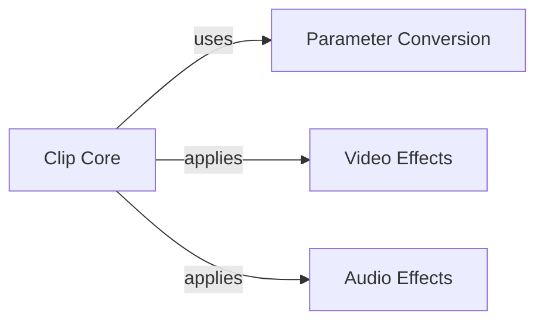

## Component Details

This graph illustrates the core components of the Clip Abstraction subsystem in MoviePy. It defines the fundamental properties and methods for all media clips (audio and video), including duration, start/end times, basic transformations, and frame retrieval. The central `Clip Core` component serves as the base class, interacting with `Parameter Conversion` for consistent time handling and applying various `Video Effects` and `Audio Effects` to media clips.

### Clip Core
The fundamental base class for all media clips (audio and video) in MoviePy. It defines core properties like duration, start/end times, and provides essential methods for frame retrieval, transformations, and effects. It also handles memoization for performance optimization.

**Related Classes/Methods**:

- <a href="https://github.com/Zulko/moviepy/blob/master/moviepy/Clip.py#L28-L710" target="_blank" rel="noopener noreferrer">`moviepy.Clip.Clip` (28:710)</a>
- <a href="https://github.com/Zulko/moviepy/blob/master/moviepy/Clip.py#L53-L60" target="_blank" rel="noopener noreferrer">`moviepy.Clip.Clip:__init__` (53:60)</a>
- <a href="https://github.com/Zulko/moviepy/blob/master/moviepy/Clip.py#L62-L64" target="_blank" rel="noopener noreferrer">`moviepy.Clip.Clip:copy` (62:64)</a>
- <a href="https://github.com/Zulko/moviepy/blob/master/moviepy/Clip.py#L67-L87" target="_blank" rel="noopener noreferrer">`moviepy.Clip.Clip:get_frame` (67:87)</a>
- <a href="https://github.com/Zulko/moviepy/blob/master/moviepy/Clip.py#L89-L147" target="_blank" rel="noopener noreferrer">`moviepy.Clip.Clip:transform` (89:147)</a>
- <a href="https://github.com/Zulko/moviepy/blob/master/moviepy/Clip.py#L149-L189" target="_blank" rel="noopener noreferrer">`moviepy.Clip.Clip:time_transform` (149:189)</a>
- <a href="https://github.com/Zulko/moviepy/blob/master/moviepy/Clip.py#L191-L207" target="_blank" rel="noopener noreferrer">`moviepy.Clip.Clip:with_effects` (191:207)</a>
- <a href="https://github.com/Zulko/moviepy/blob/master/moviepy/Clip.py#L213-L248" target="_blank" rel="noopener noreferrer">`moviepy.Clip.Clip:with_start` (213:248)</a>
- <a href="https://github.com/Zulko/moviepy/blob/master/moviepy/Clip.py#L254-L282" target="_blank" rel="noopener noreferrer">`moviepy.Clip.Clip:with_end` (254:282)</a>
- <a href="https://github.com/Zulko/moviepy/blob/master/moviepy/Clip.py#L288-L314" target="_blank" rel="noopener noreferrer">`moviepy.Clip.Clip:with_duration` (288:314)</a>
- <a href="https://github.com/Zulko/moviepy/blob/master/moviepy/Clip.py#L317-L327" target="_blank" rel="noopener noreferrer">`moviepy.Clip.Clip:with_updated_frame_function` (317:327)</a>
- <a href="https://github.com/Zulko/moviepy/blob/master/moviepy/Clip.py#L329-L352" target="_blank" rel="noopener noreferrer">`moviepy.Clip.Clip:with_fps` (329:352)</a>
- <a href="https://github.com/Zulko/moviepy/blob/master/moviepy/Clip.py#L355-L364" target="_blank" rel="noopener noreferrer">`moviepy.Clip.Clip:with_is_mask` (355:364)</a>
- <a href="https://github.com/Zulko/moviepy/blob/master/moviepy/Clip.py#L367-L376" target="_blank" rel="noopener noreferrer">`moviepy.Clip.Clip:with_memoize` (367:376)</a>
- <a href="https://github.com/Zulko/moviepy/blob/master/moviepy/Clip.py#L381-L454" target="_blank" rel="noopener noreferrer">`moviepy.Clip.Clip:subclipped` (381:454)</a>
- <a href="https://github.com/Zulko/moviepy/blob/master/moviepy/Clip.py#L457-L488" target="_blank" rel="noopener noreferrer">`moviepy.Clip.Clip:with_section_cut_out` (457:488)</a>
- <a href="https://github.com/Zulko/moviepy/blob/master/moviepy/Clip.py#L490-L498" target="_blank" rel="noopener noreferrer">`moviepy.Clip.Clip:with_speed_scaled` (490:498)</a>
- <a href="https://github.com/Zulko/moviepy/blob/master/moviepy/Clip.py#L500-L508" target="_blank" rel="noopener noreferrer">`moviepy.Clip.Clip:with_volume_scaled` (500:508)</a>
- <a href="https://github.com/Zulko/moviepy/blob/master/moviepy/Clip.py#L512-L567" target="_blank" rel="noopener noreferrer">`moviepy.Clip.Clip:iter_frames` (512:567)</a>
- <a href="https://github.com/Zulko/moviepy/blob/master/moviepy/Clip.py#L570-L594" target="_blank" rel="noopener noreferrer">`moviepy.Clip.Clip:is_playing` (570:594)</a>
- <a href="https://github.com/Zulko/moviepy/blob/master/moviepy/Clip.py#L596-L606" target="_blank" rel="noopener noreferrer">`moviepy.Clip.Clip:close` (596:606)</a>
- <a href="https://github.com/Zulko/moviepy/blob/master/moviepy/Clip.py#L608-L623" target="_blank" rel="noopener noreferrer">`moviepy.Clip.Clip:__eq__` (608:623)</a>
- <a href="https://github.com/Zulko/moviepy/blob/master/moviepy/Clip.py#L625-L630" target="_blank" rel="noopener noreferrer">`moviepy.Clip.Clip:__enter__` (625:630)</a>
- <a href="https://github.com/Zulko/moviepy/blob/master/moviepy/Clip.py#L632-L633" target="_blank" rel="noopener noreferrer">`moviepy.Clip.Clip:__exit__` (632:633)</a>
- <a href="https://github.com/Zulko/moviepy/blob/master/moviepy/Clip.py#L635-L690" target="_blank" rel="noopener noreferrer">`moviepy.Clip.Clip:__getitem__` (635:690)</a>
- <a href="https://github.com/Zulko/moviepy/blob/master/moviepy/Clip.py#L692-L697" target="_blank" rel="noopener noreferrer">`moviepy.Clip.Clip:__del__` (692:697)</a>
- <a href="https://github.com/Zulko/moviepy/blob/master/moviepy/Clip.py#L699-L701" target="_blank" rel="noopener noreferrer">`moviepy.Clip.Clip:__add__` (699:701)</a>
- <a href="https://github.com/Zulko/moviepy/blob/master/moviepy/Clip.py#L703-L710" target="_blank" rel="noopener noreferrer">`moviepy.Clip.Clip:__mul__` (703:710)</a>

### Parameter Conversion
Responsible for standardizing time-related parameters into seconds, ensuring consistent time handling across various clip operations.

**Related Classes/Methods**:

- <a href="https://github.com/Zulko/moviepy/blob/master/moviepy/decorators.py#L109-L111" target="_blank" rel="noopener noreferrer">`moviepy.decorators.convert_parameter_to_seconds` (109:111)</a>

### Video Effects
Provides functionalities to apply various visual effects and transformations to video clips, such as speed adjustments and looping.

**Related Classes/Methods**:

- <a href="https://github.com/Zulko/moviepy/blob/master/moviepy/video/fx/MultiplySpeed.py#L8-L31" target="_blank" rel="noopener noreferrer">`moviepy.video.fx.MultiplySpeed.MultiplySpeed` (8:31)</a>
- <a href="https://github.com/Zulko/moviepy/blob/master/moviepy/video/fx/Loop.py#L8-L43" target="_blank" rel="noopener noreferrer">`moviepy.video.fx.Loop.Loop` (8:43)</a>

### Audio Effects
Manages the application of audio-specific effects to clips, such as volume scaling.

**Related Classes/Methods**:

- <a href="https://github.com/Zulko/moviepy/blob/master/moviepy/audio/fx/MultiplyVolume.py#L12-L90" target="_blank" rel="noopener noreferrer">`moviepy.audio.fx.MultiplyVolume.MultiplyVolume` (12:90)</a>

### [FAQ](https://github.com/CodeBoarding/GeneratedOnBoardings/tree/main?tab=readme-ov-file#faq)