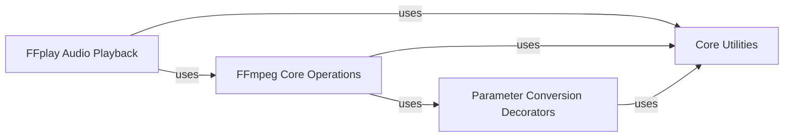

## Component Details

This graph outlines the core components involved in FFmpeg integration within the project. The main flow revolves around `FFmpeg Core Operations` which provides direct interfaces to FFmpeg for various video and audio processing tasks. These operations often rely on `Core Utilities` for subprocess management and configuration. `FFplay Audio Playback` leverages both `FFmpeg Core Operations` and `Core Utilities` for real-time audio previewing. Additionally, `Parameter Conversion Decorators` preprocess inputs for other components, ensuring consistent data formats, and also utilize `Core Utilities` for their functionality. The purpose of this subsystem is to provide robust and flexible control over multimedia processing via FFmpeg.

### FFmpeg Core Operations
Provides direct interfaces and wrappers for FFmpeg command-line operations, enabling low-level control over video and audio processing tasks such as extracting subclips, merging streams, resizing, and stabilization. It also includes functions for retrieving FFplay version information.

**Related Classes/Methods**:

- <a href="https://github.com/Zulko/moviepy/blob/master/moviepy/video/io/ffmpeg_tools.py#L14-L58" target="_blank" rel="noopener noreferrer">`moviepy.moviepy.video.io.ffmpeg_tools.ffmpeg_extract_subclip` (14:58)</a>
- <a href="https://github.com/Zulko/moviepy/blob/master/moviepy/video/io/ffmpeg_tools.py#L62-L104" target="_blank" rel="noopener noreferrer">`moviepy.moviepy.video.io.ffmpeg_tools.ffmpeg_merge_video_audio` (62:104)</a>
- <a href="https://github.com/Zulko/moviepy/blob/master/moviepy/video/io/ffmpeg_tools.py#L108-L137" target="_blank" rel="noopener noreferrer">`moviepy.moviepy.video.io.ffmpeg_tools.ffmpeg_extract_audio` (108:137)</a>
- <a href="https://github.com/Zulko/moviepy/blob/master/moviepy/video/io/ffmpeg_tools.py#L141-L165" target="_blank" rel="noopener noreferrer">`moviepy.moviepy.video.io.ffmpeg_tools.ffmpeg_resize` (141:165)</a>
- <a href="https://github.com/Zulko/moviepy/blob/master/moviepy/video/io/ffmpeg_tools.py#L169-L211" target="_blank" rel="noopener noreferrer">`moviepy.moviepy.video.io.ffmpeg_tools.ffmpeg_stabilize_video` (169:211)</a>
- <a href="https://github.com/Zulko/moviepy/blob/master/moviepy/video/io/ffmpeg_tools.py#L255-L290" target="_blank" rel="noopener noreferrer">`moviepy.moviepy.video.io.ffmpeg_tools.ffplay_version` (255:290)</a>

### FFplay Audio Playback
Manages real-time audio previewing using the FFplay tool, handling subprocess creation and audio frame playback.

**Related Classes/Methods**:

- <a href="https://github.com/Zulko/moviepy/blob/master/moviepy/audio/io/ffplay_audiopreviewer.py#L11-L109" target="_blank" rel="noopener noreferrer">`moviepy.moviepy.audio.io.ffplay_audiopreviewer.FFPLAY_AudioPreviewer` (11:109)</a>
- <a href="https://github.com/Zulko/moviepy/blob/master/moviepy/audio/io/ffplay_audiopreviewer.py#L113-L163" target="_blank" rel="noopener noreferrer">`moviepy.moviepy.audio.io.ffplay_audiopreviewer.ffplay_audiopreview` (113:163)</a>

### Core Utilities
Offers essential utility functions for interacting with external command-line tools, handling file paths, and providing cross-platform process parameters. This component also includes global configuration settings.

**Related Classes/Methods**:

- <a href="https://github.com/Zulko/moviepy/blob/master/moviepy/tools.py#L53-L61" target="_blank" rel="noopener noreferrer">`moviepy.tools.ffmpeg_escape_filename` (53:61)</a>
- <a href="https://github.com/Zulko/moviepy/blob/master/moviepy/tools.py#L27-L50" target="_blank" rel="noopener noreferrer">`moviepy.tools.subprocess_call` (27:50)</a>
- <a href="https://github.com/Zulko/moviepy/blob/master/moviepy/tools.py#L14-L24" target="_blank" rel="noopener noreferrer">`moviepy.tools.cross_platform_popen_params` (14:24)</a>
- `moviepy.config` (full file reference)

### Parameter Conversion Decorators
Provides decorators that preprocess function arguments, specifically converting file paths to strings and time parameters to seconds, ensuring consistent input formats.

**Related Classes/Methods**:

- <a href="https://github.com/Zulko/moviepy/blob/master/moviepy/decorators.py#L114-L116" target="_blank" rel="noopener noreferrer">`moviepy.decorators.convert_path_to_string` (114:116)</a>
- <a href="https://github.com/Zulko/moviepy/blob/master/moviepy/decorators.py#L109-L111" target="_blank" rel="noopener noreferrer">`moviepy.decorators.convert_parameter_to_seconds` (109:111)</a>

### [FAQ](https://github.com/CodeBoarding/GeneratedOnBoardings/tree/main?tab=readme-ov-file#faq)