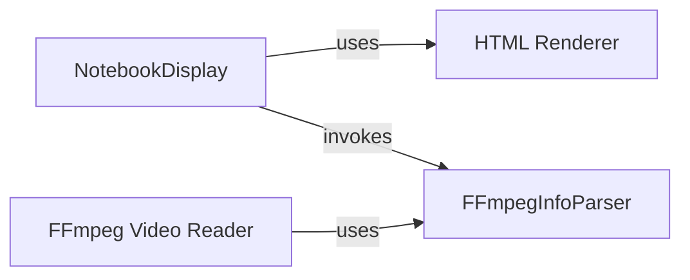

## Component Details

This system provides robust capabilities for embedding and displaying various media types within interactive notebook environments. The `NotebookDisplay` component acts as the primary interface, generating HTML5 compatible output. It relies on the `FFmpegInfoParser` to extract crucial media metadata for validation and proper rendering. The `FFmpeg Video Reader` further leverages the `FFmpegInfoParser` for low-level media file processing, ensuring accurate frame reading and handling.

### NotebookDisplay
This component is responsible for rendering and displaying various media types (video, audio, images) within interactive notebook environments like Jupyter. It generates HTML5 compatible code for embedding media, handles temporary file creation for clips, and ensures proper rendering.

**Related Classes/Methods**:

- <a href="https://github.com/Zulko/moviepy/blob/master/moviepy/video/io/display_in_notebook.py#L54-L192" target="_blank" rel="noopener noreferrer">`moviepy.moviepy.video.io.display_in_notebook.html_embed` (54:192)</a>
- <a href="https://github.com/Zulko/moviepy/blob/master/moviepy/video/io/display_in_notebook.py#L195-L284" target="_blank" rel="noopener noreferrer">`moviepy.moviepy.video.io.display_in_notebook.display_in_notebook` (195:284)</a>

### HTML Renderer
Provides the core HTML object for displaying content in Jupyter notebooks, allowing for dynamic concatenation of HTML strings.

**Related Classes/Methods**:

- <a href="https://github.com/Zulko/moviepy/blob/master/moviepy/video/io/display_in_notebook.py#L20-L25" target="_blank" rel="noopener noreferrer">`moviepy.moviepy.video.io.display_in_notebook.HTML2` (20:25)</a>

### FFmpegInfoParser
Parses the output from FFmpeg's `-i` command to extract detailed metadata about media files, such as duration, video size, frame rate, and bitrates.

**Related Classes/Methods**:

- <a href="https://github.com/Zulko/moviepy/blob/master/moviepy/video/io/ffmpeg_reader.py#L821-L910" target="_blank" rel="noopener noreferrer">`moviepy.video.io.ffmpeg_reader.ffmpeg_parse_infos` (821:910)</a>
- <a href="https://github.com/Zulko/moviepy/blob/master/moviepy/video/io/ffmpeg_reader.py#L328-L818" target="_blank" rel="noopener noreferrer">`moviepy.video.io.ffmpeg_reader.FFmpegInfosParser` (328:818)</a>

### FFmpeg Video Reader
Manages the process of reading video frames directly from media files using FFmpeg, handling initialization, frame seeking, and raw data conversion. It relies on FFmpegInfoParser for media stream information.

**Related Classes/Methods**:

- <a href="https://github.com/Zulko/moviepy/blob/master/moviepy/video/io/ffmpeg_reader.py#L18-L290" target="_blank" rel="noopener noreferrer">`moviepy.video.io.ffmpeg_reader.FFMPEG_VideoReader` (18:290)</a>

### [FAQ](https://github.com/CodeBoarding/GeneratedOnBoardings/tree/main?tab=readme-ov-file#faq)