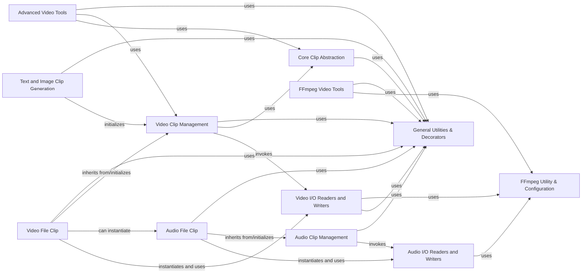

## Component Details

This graph provides an overview of the MoviePy library's core components and their interactions. The main flow revolves around the `Core Clip Abstraction`, which serves as the base for all media clips. Specialized clip types like `Audio Clip Management` and `Video Clip Management` extend this core functionality. Input/Output operations for both audio and video are handled by dedicated `I/O Readers and Writers` components, which heavily rely on the `FFmpeg Utility & Configuration` for external tool integration. Various `Utility & Configuration` components provide common helper functions and decorators used across the library, while `FFmpeg Video Tools`, `Text and Image Clip Generation`, and `Advanced Video Tools` offer higher-level functionalities for specific media manipulation tasks.

### Core Clip Abstraction
This component defines the fundamental Clip object, which serves as the base for all media clips in MoviePy. It provides core functionalities like managing start, end, and duration, retrieving frames, applying transformations, and handling effects.

**Related Classes/Methods**:

- <a href="https://github.com/Zulko/moviepy/blob/master/moviepy/Clip.py#L28-L710" target="_blank" rel="noopener noreferrer">`moviepy.Clip.Clip` (28:710)</a>

### General Utilities & Decorators
Provides a set of general-purpose helper functions and decorators for common tasks like parameter conversion, path handling, and time conversions. These utilities are used across various components.

**Related Classes/Methods**:

- <a href="https://github.com/Zulko/moviepy/blob/master/moviepy/decorators.py#L109-L111" target="_blank" rel="noopener noreferrer">`moviepy.decorators.convert_parameter_to_seconds` (109:111)</a>
- <a href="https://github.com/Zulko/moviepy/blob/master/moviepy/decorators.py#L81-L106" target="_blank" rel="noopener noreferrer">`moviepy.decorators.preprocess_args` (81:106)</a>
- <a href="https://github.com/Zulko/moviepy/blob/master/moviepy/decorators.py#L114-L116" target="_blank" rel="noopener noreferrer">`moviepy.decorators.convert_path_to_string` (114:116)</a>
- <a href="https://github.com/Zulko/moviepy/blob/master/moviepy/decorators.py#L127-L155" target="_blank" rel="noopener noreferrer">`moviepy.decorators.use_clip_fps_by_default` (127:155)</a>
- <a href="https://github.com/Zulko/moviepy/blob/master/moviepy/tools.py#L64-L97" target="_blank" rel="noopener noreferrer">`moviepy.tools.convert_to_seconds` (64:97)</a>
- <a href="https://github.com/Zulko/moviepy/blob/master/moviepy/tools.py#L166-L187" target="_blank" rel="noopener noreferrer">`moviepy.tools.find_extension` (166:187)</a>
- <a href="https://github.com/Zulko/moviepy/blob/master/moviepy/tools.py#L250-L314" target="_blank" rel="noopener noreferrer">`moviepy.tools.compute_position` (250:314)</a>

### FFmpeg Utility & Configuration
This component is responsible for configuring and executing FFmpeg commands. It includes functions for checking FFmpeg availability, handling cross-platform process parameters, and executing subprocess calls related to FFmpeg.

**Related Classes/Methods**:

- <a href="https://github.com/Zulko/moviepy/blob/master/moviepy/tools.py#L27-L50" target="_blank" rel="noopener noreferrer">`moviepy.tools.subprocess_call` (27:50)</a>
- <a href="https://github.com/Zulko/moviepy/blob/master/moviepy/tools.py#L14-L24" target="_blank" rel="noopener noreferrer">`moviepy.tools.cross_platform_popen_params` (14:24)</a>
- <a href="https://github.com/Zulko/moviepy/blob/master/moviepy/tools.py#L53-L61" target="_blank" rel="noopener noreferrer">`moviepy.tools.ffmpeg_escape_filename` (53:61)</a>
- <a href="https://github.com/Zulko/moviepy/blob/master/moviepy/config.py#L24-L35" target="_blank" rel="noopener noreferrer">`moviepy.config.try_cmd` (24:35)</a>
- <a href="https://github.com/Zulko/moviepy/blob/master/moviepy/config.py#L73-L87" target="_blank" rel="noopener noreferrer">`moviepy.config.check` (73:87)</a>

### Audio Clip Management
This component extends the core Clip functionality to manage audio-specific operations. It includes the AudioClip class and handles writing audio to files.

**Related Classes/Methods**:

- <a href="https://github.com/Zulko/moviepy/blob/master/moviepy/audio/AudioClip.py#L20-L313" target="_blank" rel="noopener noreferrer">`moviepy.audio.AudioClip.AudioClip` (20:313)</a>

### Audio I/O Readers and Writers
This component handles the low-level reading and writing of audio data, primarily interacting with FFmpeg. It includes classes for reading audio streams and writing audio files.

**Related Classes/Methods**:

- <a href="https://github.com/Zulko/moviepy/blob/master/moviepy/audio/io/readers.py#L13-L304" target="_blank" rel="noopener noreferrer">`moviepy.audio.io.readers.FFMPEG_AudioReader` (13:304)</a>
- <a href="https://github.com/Zulko/moviepy/blob/master/moviepy/audio/io/ffmpeg_audiowriter.py#L12-L183" target="_blank" rel="noopener noreferrer">`moviepy.audio.io.ffmpeg_audiowriter.FFMPEG_AudioWriter` (12:183)</a>

### Audio File Clip
This component represents audio clips loaded directly from files. It initializes AudioClip and uses FFMPEG_AudioReader to access audio data from the file.

**Related Classes/Methods**:

- <a href="https://github.com/Zulko/moviepy/blob/master/moviepy/audio/io/AudioFileClip.py#L8-L85" target="_blank" rel="noopener noreferrer">`moviepy.audio.io.AudioFileClip.AudioFileClip` (8:85)</a>

### Video Clip Management
This component extends the core Clip functionality to manage video-specific operations. It includes the VideoClip class and handles saving frames, writing video files, and GIF creation.

**Related Classes/Methods**:

- <a href="https://github.com/Zulko/moviepy/blob/master/moviepy/video/VideoClip.py#L45-L1193" target="_blank" rel="noopener noreferrer">`moviepy.video.VideoClip.VideoClip` (45:1193)</a>

### Video I/O Readers and Writers
This component handles the low-level reading and writing of video data, primarily interacting with FFmpeg. It includes classes for reading video streams and writing video files.

**Related Classes/Methods**:

- <a href="https://github.com/Zulko/moviepy/blob/master/moviepy/video/io/ffmpeg_writer.py#L15-L239" target="_blank" rel="noopener noreferrer">`moviepy.video.io.ffmpeg_writer.FFMPEG_VideoWriter` (15:239)</a>
- <a href="https://github.com/Zulko/moviepy/blob/master/moviepy/video/io/ffmpeg_reader.py#L18-L290" target="_blank" rel="noopener noreferrer">`moviepy.video.io.ffmpeg_reader.FFMPEG_VideoReader` (18:290)</a>
- <a href="https://github.com/Zulko/moviepy/blob/master/moviepy/video/io/ffmpeg_writer.py#L302-L363" target="_blank" rel="noopener noreferrer">`moviepy.video.io.ffmpeg_writer.ffmpeg_write_image` (302:363)</a>
- <a href="https://github.com/Zulko/moviepy/blob/master/moviepy/video/io/ffplay_previewer.py#L12-L88" target="_blank" rel="noopener noreferrer">`moviepy.video.io.ffplay_previewer.FFPLAY_VideoPreviewer` (12:88)</a>

### Video File Clip
This component represents video clips loaded directly from files. It initializes VideoClip and uses FFMPEG_VideoReader to access video data from the file.

**Related Classes/Methods**:

- <a href="https://github.com/Zulko/moviepy/blob/master/moviepy/video/io/VideoFileClip.py#L9-L175" target="_blank" rel="noopener noreferrer">`moviepy.video.io.VideoFileClip.VideoFileClip` (9:175)</a>

### FFmpeg Video Tools
This component provides a set of high-level utility functions for common video manipulation tasks using FFmpeg, such as extracting subclips, merging video and audio, extracting audio, and resizing.

**Related Classes/Methods**:

- `moviepy.video.io.ffmpeg_tools` (full file reference)

### Text and Image Clip Generation
This component focuses on creating video clips from text and images. It includes functionalities for rendering text, finding optimal font sizes, and handling image-based clips.

**Related Classes/Methods**:

- <a href="https://github.com/Zulko/moviepy/blob/master/moviepy/video/VideoClip.py#L1448-L1972" target="_blank" rel="noopener noreferrer">`moviepy.video.VideoClip.TextClip` (1448:1972)</a>
- <a href="https://github.com/Zulko/moviepy/blob/master/moviepy/video/VideoClip.py#L1287-L1401" target="_blank" rel="noopener noreferrer">`moviepy.video.VideoClip.ImageClip` (1287:1401)</a>
- <a href="https://github.com/Zulko/moviepy/blob/master/moviepy/video/VideoClip.py#L1975-L2091" target="_blank" rel="noopener noreferrer">`moviepy.video.VideoClip.BitmapClip` (1975:2091)</a>

### Advanced Video Tools
This component provides more specialized video processing tools, including functionalities for handling subtitles, creating credits, and analyzing video periods.

**Related Classes/Methods**:

- <a href="https://github.com/Zulko/moviepy/blob/master/moviepy/video/tools/subtitles.py#L12-L173" target="_blank" rel="noopener noreferrer">`moviepy.video.tools.subtitles.SubtitlesClip` (12:173)</a>
- <a href="https://github.com/Zulko/moviepy/blob/master/moviepy/video/tools/subtitles.py#L177-L198" target="_blank" rel="noopener noreferrer">`moviepy.video.tools.subtitles.file_to_subtitles` (177:198)</a>
- <a href="https://github.com/Zulko/moviepy/blob/master/moviepy/video/tools/credits.py#L11-L142" target="_blank" rel="noopener noreferrer">`moviepy.video.tools.credits.CreditsClip` (11:142)</a>
- <a href="https://github.com/Zulko/moviepy/blob/master/moviepy/video/tools/cuts.py#L12-L47" target="_blank" rel="noopener noreferrer">`moviepy.video.tools.cuts.find_video_period` (12:47)</a>

### [FAQ](https://github.com/CodeBoarding/GeneratedOnBoardings/tree/main?tab=readme-ov-file#faq)