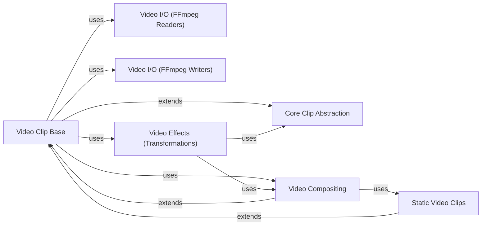

## Component Details

The Video Core component in MoviePy serves as the central hub for all video manipulation tasks. It encompasses the fundamental abstractions for video clips, enabling their creation from various sources like static images, solid colors, or text. This component facilitates the combination of multiple video clips through advanced compositing and concatenation techniques, and provides a rich set of functionalities for applying diverse visual effects. It integrates seamlessly with FFmpeg for efficient video input/output operations, allowing for reading, writing, and previewing video content.

### Core Clip Abstraction
This component defines the fundamental properties and behaviors common to all types of media clips (video and audio) within MoviePy. It handles basic attributes like start time, end time, duration, and provides generic methods for frame retrieval, copying, and applying effects.

**Related Classes/Methods**:

- <a href="https://github.com/Zulko/moviepy/blob/master/moviepy/Clip.py#L28-L710" target="_blank" rel="noopener noreferrer">`moviepy.Clip.Clip` (28:710)</a>

### Video Clip Base
This component extends the Core Clip Abstraction to provide functionalities specific to video clips. It manages video frames, size, aspect ratio, and offers methods for saving, writing, and previewing video content. It also serves as a base for more specialized video clip types.

**Related Classes/Methods**:

- <a href="https://github.com/Zulko/moviepy/blob/master/moviepy/video/VideoClip.py#L45-L1193" target="_blank" rel="noopener noreferrer">`moviepy.moviepy.video.VideoClip.VideoClip` (45:1193)</a>
- <a href="https://github.com/Zulko/moviepy/blob/master/moviepy/video/VideoClip.py#L1196-L1227" target="_blank" rel="noopener noreferrer">`moviepy.moviepy.video.VideoClip.DataVideoClip` (1196:1227)</a>
- <a href="https://github.com/Zulko/moviepy/blob/master/moviepy/video/VideoClip.py#L1230-L1274" target="_blank" rel="noopener noreferrer">`moviepy.moviepy.video.VideoClip.UpdatedVideoClip` (1230:1274)</a>

### Static Video Clips
This component comprises specialized video clips that represent static visual content, such as images, solid colors, or generated text. They inherit from Video Clip Base but often optimize frame retrieval for static content.

**Related Classes/Methods**:

- <a href="https://github.com/Zulko/moviepy/blob/master/moviepy/video/VideoClip.py#L1287-L1401" target="_blank" rel="noopener noreferrer">`moviepy.moviepy.video.VideoClip.ImageClip` (1287:1401)</a>
- <a href="https://github.com/Zulko/moviepy/blob/master/moviepy/video/VideoClip.py#L1404-L1445" target="_blank" rel="noopener noreferrer">`moviepy.moviepy.video.VideoClip.ColorClip` (1404:1445)</a>
- <a href="https://github.com/Zulko/moviepy/blob/master/moviepy/video/VideoClip.py#L1448-L1972" target="_blank" rel="noopener noreferrer">`moviepy.moviepy.video.VideoClip.TextClip` (1448:1972)</a>
- <a href="https://github.com/Zulko/moviepy/blob/master/moviepy/video/VideoClip.py#L1975-L2091" target="_blank" rel="noopener noreferrer">`moviepy.moviepy.video.VideoClip.BitmapClip` (1975:2091)</a>

### Video I/O (FFmpeg Readers)
This component focuses on reading video files using FFmpeg. It includes classes for parsing video information, extracting frames from video streams, and high-level interfaces for reading video files and image sequences. It also handles video previewing.

**Related Classes/Methods**:

- <a href="https://github.com/Zulko/moviepy/blob/master/moviepy/video/io/ImageSequenceClip.py#L13-L167" target="_blank" rel="noopener noreferrer">`moviepy.moviepy.video.io.ImageSequenceClip.ImageSequenceClip` (13:167)</a>
- <a href="https://github.com/Zulko/moviepy/blob/master/moviepy/video/io/ffmpeg_reader.py#L18-L290" target="_blank" rel="noopener noreferrer">`moviepy.moviepy.video.io.ffmpeg_reader.FFMPEG_VideoReader` (18:290)</a>
- <a href="https://github.com/Zulko/moviepy/blob/master/moviepy/video/io/ffmpeg_reader.py#L328-L818" target="_blank" rel="noopener noreferrer">`moviepy.moviepy.video.io.ffmpeg_reader.FFmpegInfosParser` (328:818)</a>
- <a href="https://github.com/Zulko/moviepy/blob/master/moviepy/video/io/ffmpeg_reader.py#L293-L325" target="_blank" rel="noopener noreferrer">`moviepy.moviepy.video.io.ffmpeg_reader.ffmpeg_read_image` (293:325)</a>
- <a href="https://github.com/Zulko/moviepy/blob/master/moviepy/video/io/ffmpeg_reader.py#L821-L910" target="_blank" rel="noopener noreferrer">`moviepy.moviepy.video.io.ffmpeg_reader.ffmpeg_parse_infos` (821:910)</a>
- <a href="https://github.com/Zulko/moviepy/blob/master/moviepy/video/io/ffplay_previewer.py#L12-L88" target="_blank" rel="noopener noreferrer">`moviepy.moviepy.video.io.ffplay_previewer.FFPLAY_VideoPreviewer` (12:88)</a>
- <a href="https://github.com/Zulko/moviepy/blob/master/moviepy/video/io/ffplay_previewer.py#L91-L137" target="_blank" rel="noopener noreferrer">`moviepy.moviepy.video.io.ffplay_previewer.ffplay_preview_video` (91:137)</a>
- <a href="https://github.com/Zulko/moviepy/blob/master/moviepy/video/io/VideoFileClip.py#L9-L175" target="_blank" rel="noopener noreferrer">`moviepy.moviepy.video.io.VideoFileClip.VideoFileClip` (9:175)</a>

### Video I/O (FFmpeg Writers)
This component handles writing video files using FFmpeg. It provides functionalities for encoding video frames into various formats and writing animated GIFs.

**Related Classes/Methods**:

- <a href="https://github.com/Zulko/moviepy/blob/master/moviepy/video/io/ffmpeg_writer.py#L15-L239" target="_blank" rel="noopener noreferrer">`moviepy.moviepy.video.io.ffmpeg_writer.FFMPEG_VideoWriter` (15:239)</a>
- <a href="https://github.com/Zulko/moviepy/blob/master/moviepy/video/io/ffmpeg_writer.py#L242-L299" target="_blank" rel="noopener noreferrer">`moviepy.moviepy.video.io.ffmpeg_writer.ffmpeg_write_video` (242:299)</a>
- <a href="https://github.com/Zulko/moviepy/blob/master/moviepy/video/io/ffmpeg_writer.py#L302-L363" target="_blank" rel="noopener noreferrer">`moviepy.moviepy.video.io.ffmpeg_writer.ffmpeg_write_image` (302:363)</a>
- <a href="https://github.com/Zulko/moviepy/blob/master/moviepy/video/io/gif_writers.py#L11-L20" target="_blank" rel="noopener noreferrer">`moviepy.moviepy.video.io.gif_writers.write_gif_with_imageio` (11:20)</a>

### Video Compositing
This component is responsible for combining multiple video clips into a single composite video. It handles layering, positioning, and blending of different video elements.

**Related Classes/Methods**:

- <a href="https://github.com/Zulko/moviepy/blob/master/moviepy/video/compositing/CompositeVideoClip.py#L12-L196" target="_blank" rel="noopener noreferrer">`moviepy.moviepy.video.compositing.CompositeVideoClip.CompositeVideoClip` (12:196)</a>
- <a href="https://github.com/Zulko/moviepy/blob/master/moviepy/video/compositing/CompositeVideoClip.py#L199-L265" target="_blank" rel="noopener noreferrer">`moviepy.moviepy.video.compositing.CompositeVideoClip.clips_array` (199:265)</a>
- <a href="https://github.com/Zulko/moviepy/blob/master/moviepy/video/compositing/CompositeVideoClip.py#L268-L380" target="_blank" rel="noopener noreferrer">`moviepy.moviepy.video.compositing.CompositeVideoClip.concatenate_videoclips` (268:380)</a>

### Video Effects (Transformations)
This component provides a wide range of visual effects and transformations that can be applied to video clips. These effects modify the appearance or temporal properties of the video content.

**Related Classes/Methods**:

- <a href="https://github.com/Zulko/moviepy/blob/master/moviepy/video/fx/Resize.py#L12-L158" target="_blank" rel="noopener noreferrer">`moviepy.moviepy.video.fx.Resize.Resize` (12:158)</a>
- <a href="https://github.com/Zulko/moviepy/blob/master/moviepy/video/fx/CrossFadeOut.py#L9-L27" target="_blank" rel="noopener noreferrer">`moviepy.moviepy.video.fx.CrossFadeOut.CrossFadeOut` (9:27)</a>
- <a href="https://github.com/Zulko/moviepy/blob/master/moviepy/video/fx/CrossFadeIn.py#L9-L27" target="_blank" rel="noopener noreferrer">`moviepy.moviepy.video.fx.CrossFadeIn.CrossFadeIn` (9:27)</a>
- <a href="https://github.com/Zulko/moviepy/blob/master/moviepy/video/fx/AccelDecel.py#L7-L83" target="_blank" rel="noopener noreferrer">`moviepy.moviepy.video.fx.AccelDecel.AccelDecel` (7:83)</a>
- <a href="https://github.com/Zulko/moviepy/blob/master/moviepy/video/fx/MakeLoopable.py#L10-L30" target="_blank" rel="noopener noreferrer">`moviepy.moviepy.video.fx.MakeLoopable.MakeLoopable` (10:30)</a>
- <a href="https://github.com/Zulko/moviepy/blob/master/moviepy/video/fx/Margin.py#L11-L90" target="_blank" rel="noopener noreferrer">`moviepy.moviepy.video.fx.Margin.Margin` (11:90)</a>
- <a href="https://github.com/Zulko/moviepy/blob/master/moviepy/video/fx/MaskColor.py#L10-L45" target="_blank" rel="noopener noreferrer">`moviepy.moviepy.video.fx.MaskColor.MaskColor` (10:45)</a>
- <a href="https://github.com/Zulko/moviepy/blob/master/moviepy/video/fx/Painting.py#L11-L63" target="_blank" rel="noopener noreferrer">`moviepy.moviepy.video.fx.Painting.Painting` (11:63)</a>
- <a href="https://github.com/Zulko/moviepy/blob/master/moviepy/video/fx/Freeze.py#L9-L55" target="_blank" rel="noopener noreferrer">`moviepy.moviepy.video.fx.Freeze.Freeze` (9:55)</a>
- <a href="https://github.com/Zulko/moviepy/blob/master/moviepy/video/fx/FreezeRegion.py#L10-L68" target="_blank" rel="noopener noreferrer">`moviepy.moviepy.video.fx.FreezeRegion.FreezeRegion` (10:68)</a>
- <a href="https://github.com/Zulko/moviepy/blob/master/moviepy/video/fx/FadeOut.py#L10-L39" target="_blank" rel="noopener noreferrer">`moviepy.moviepy.video.fx.FadeOut.FadeOut` (10:39)</a>
- <a href="https://github.com/Zulko/moviepy/blob/master/moviepy/video/fx/FadeIn.py#L10-L36" target="_blank" rel="noopener noreferrer">`moviepy.moviepy.video.fx.FadeIn.FadeIn` (10:36)</a>
- <a href="https://github.com/Zulko/moviepy/blob/master/moviepy/video/fx/Crop.py#L8-L80" target="_blank" rel="noopener noreferrer">`moviepy.moviepy.video.fx.Crop.Crop` (8:80)</a>
- <a href="https://github.com/Zulko/moviepy/blob/master/moviepy/video/fx/Rotate.py#L12-L128" target="_blank" rel="noopener noreferrer">`moviepy.moviepy.video.fx.Rotate.Rotate` (12:128)</a>
- <a href="https://github.com/Zulko/moviepy/blob/master/moviepy/video/fx/Loop.py#L8-L43" target="_blank" rel="noopener noreferrer">`moviepy.moviepy.video.fx.Loop.Loop` (8:43)</a>
- <a href="https://github.com/Zulko/moviepy/blob/master/moviepy/video/fx/MultiplySpeed.py#L8-L31" target="_blank" rel="noopener noreferrer">`moviepy.moviepy.video.fx.MultiplySpeed.MultiplySpeed` (8:31)</a>

### [FAQ](https://github.com/CodeBoarding/GeneratedOnBoardings/tree/main?tab=readme-ov-file#faq)