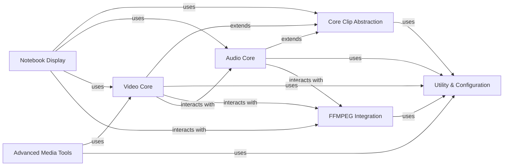

## Component Details

MoviePy is a Python library for video editing. It provides a high-level API for common video editing tasks, built on top of FFmpeg. The core functionality revolves around a `Clip` abstraction, which is extended by `AudioClip` and `VideoClip`. Utility functions and FFmpeg integration handle the low-level media processing, while specialized modules offer advanced effects and tools.

### Core Clip Abstraction
Defines the fundamental properties and methods for all media clips (audio and video), including duration, start/end times, basic transformations, and frame retrieval. It serves as the base class for `AudioClip` and `VideoClip`.

**Related Classes/Methods**:

- <a href="https://github.com/Zulko/moviepy/blob/master/moviepy/Clip.py#L28-L710" target="_blank" rel="noopener noreferrer">`moviepy.moviepy.Clip.Clip` (28:710)</a>

### Utility & Configuration
Provides a set of general-purpose helper functions, decorators for parameter conversion and path handling, and configuration checks for external tools like FFMPEG. These utilities are used across various components for common tasks.

**Related Classes/Methods**:

- <a href="https://github.com/Zulko/moviepy/blob/master/moviepy/decorators.py#L109-L111" target="_blank" rel="noopener noreferrer">`moviepy.decorators.convert_parameter_to_seconds` (109:111)</a>
- <a href="https://github.com/Zulko/moviepy/blob/master/moviepy/decorators.py#L81-L106" target="_blank" rel="noopener noreferrer">`moviepy.decorators.preprocess_args` (81:106)</a>
- <a href="https://github.com/Zulko/moviepy/blob/master/moviepy/decorators.py#L114-L116" target="_blank" rel="noopener noreferrer">`moviepy.decorators.convert_path_to_string` (114:116)</a>
- <a href="https://github.com/Zulko/moviepy/blob/master/moviepy/decorators.py#L127-L155" target="_blank" rel="noopener noreferrer">`moviepy.decorators.use_clip_fps_by_default` (127:155)</a>
- <a href="https://github.com/Zulko/moviepy/blob/master/moviepy/tools.py#L27-L50" target="_blank" rel="noopener noreferrer">`moviepy.tools.subprocess_call` (27:50)</a>
- <a href="https://github.com/Zulko/moviepy/blob/master/moviepy/tools.py#L14-L24" target="_blank" rel="noopener noreferrer">`moviepy.tools.cross_platform_popen_params` (14:24)</a>
- <a href="https://github.com/Zulko/moviepy/blob/master/moviepy/tools.py#L53-L61" target="_blank" rel="noopener noreferrer">`moviepy.tools.ffmpeg_escape_filename` (53:61)</a>
- <a href="https://github.com/Zulko/moviepy/blob/master/moviepy/tools.py#L64-L97" target="_blank" rel="noopener noreferrer">`moviepy.tools.convert_to_seconds` (64:97)</a>
- <a href="https://github.com/Zulko/moviepy/blob/master/moviepy/tools.py#L166-L187" target="_blank" rel="noopener noreferrer">`moviepy.tools.find_extension` (166:187)</a>
- <a href="https://github.com/Zulko/moviepy/blob/master/moviepy/tools.py#L250-L314" target="_blank" rel="noopener noreferrer">`moviepy.tools.compute_position` (250:314)</a>
- <a href="https://github.com/Zulko/moviepy/blob/master/moviepy/config.py#L24-L35" target="_blank" rel="noopener noreferrer">`moviepy.config.try_cmd` (24:35)</a>
- <a href="https://github.com/Zulko/moviepy/blob/master/moviepy/config.py#L73-L87" target="_blank" rel="noopener noreferrer">`moviepy.config.check` (73:87)</a>

### Audio Core
Encompasses all functionalities related to audio clips, including their creation, manipulation, reading from files, writing to various formats, and applying audio effects. It provides the foundation for audio processing within MoviePy.

**Related Classes/Methods**:

- <a href="https://github.com/Zulko/moviepy/blob/master/moviepy/audio/AudioClip.py#L20-L313" target="_blank" rel="noopener noreferrer">`moviepy.moviepy.audio.AudioClip.AudioClip` (20:313)</a>
- <a href="https://github.com/Zulko/moviepy/blob/master/moviepy/audio/AudioClip.py#L316-L358" target="_blank" rel="noopener noreferrer">`moviepy.moviepy.audio.AudioClip.AudioArrayClip` (316:358)</a>
- <a href="https://github.com/Zulko/moviepy/blob/master/moviepy/audio/AudioClip.py#L361-L420" target="_blank" rel="noopener noreferrer">`moviepy.moviepy.audio.AudioClip.CompositeAudioClip` (361:420)</a>
- <a href="https://github.com/Zulko/moviepy/blob/master/moviepy/audio/AudioClip.py#L423-L437" target="_blank" rel="noopener noreferrer">`moviepy.moviepy.audio.AudioClip.concatenate_audioclips` (423:437)</a>
- <a href="https://github.com/Zulko/moviepy/blob/master/moviepy/audio/io/readers.py#L13-L304" target="_blank" rel="noopener noreferrer">`moviepy.moviepy.audio.io.readers.FFMPEG_AudioReader` (13:304)</a>
- <a href="https://github.com/Zulko/moviepy/blob/master/moviepy/audio/io/AudioFileClip.py#L8-L85" target="_blank" rel="noopener noreferrer">`moviepy.moviepy.audio.io.AudioFileClip.AudioFileClip` (8:85)</a>
- <a href="https://github.com/Zulko/moviepy/blob/master/moviepy/audio/io/ffmpeg_audiowriter.py#L12-L183" target="_blank" rel="noopener noreferrer">`moviepy.moviepy.audio.io.ffmpeg_audiowriter.FFMPEG_AudioWriter` (12:183)</a>
- <a href="https://github.com/Zulko/moviepy/blob/master/moviepy/audio/io/ffmpeg_audiowriter.py#L187-L229" target="_blank" rel="noopener noreferrer">`moviepy.moviepy.audio.io.ffmpeg_audiowriter.ffmpeg_audiowrite` (187:229)</a>
- <a href="https://github.com/Zulko/moviepy/blob/master/moviepy/audio/io/ffplay_audiopreviewer.py#L11-L109" target="_blank" rel="noopener noreferrer">`moviepy.moviepy.audio.io.ffplay_audiopreviewer.FFPLAY_AudioPreviewer` (11:109)</a>
- <a href="https://github.com/Zulko/moviepy/blob/master/moviepy/audio/io/ffplay_audiopreviewer.py#L113-L163" target="_blank" rel="noopener noreferrer">`moviepy.moviepy.audio.io.ffplay_audiopreviewer.ffplay_audiopreview` (113:163)</a>
- <a href="https://github.com/Zulko/moviepy/blob/master/moviepy/audio/fx/AudioNormalize.py#L10-L31" target="_blank" rel="noopener noreferrer">`moviepy.moviepy.audio.fx.AudioNormalize.AudioNormalize` (10:31)</a>
- <a href="https://github.com/Zulko/moviepy/blob/master/moviepy/audio/fx/AudioDelay.py#L13-L70" target="_blank" rel="noopener noreferrer">`moviepy.moviepy.audio.fx.AudioDelay.AudioDelay` (13:70)</a>
- <a href="https://github.com/Zulko/moviepy/blob/master/moviepy/audio/fx/AudioFadeIn.py#L12-L60" target="_blank" rel="noopener noreferrer">`moviepy.moviepy.audio.fx.AudioFadeIn.AudioFadeIn` (12:60)</a>
- <a href="https://github.com/Zulko/moviepy/blob/master/moviepy/audio/fx/MultiplyVolume.py#L12-L90" target="_blank" rel="noopener noreferrer">`moviepy.moviepy.audio.fx.MultiplyVolume.MultiplyVolume` (12:90)</a>
- <a href="https://github.com/Zulko/moviepy/blob/master/moviepy/audio/fx/AudioLoop.py#L10-L41" target="_blank" rel="noopener noreferrer">`moviepy.moviepy.audio.fx.AudioLoop.AudioLoop` (10:41)</a>
- <a href="https://github.com/Zulko/moviepy/blob/master/moviepy/audio/fx/AudioFadeOut.py#L12-L62" target="_blank" rel="noopener noreferrer">`moviepy.moviepy.audio.fx.AudioFadeOut.AudioFadeOut` (12:62)</a>

### Video Core
Manages all aspects of video clips, including their creation, various types (static images, solid colors, text-generated), combining multiple clips through compositing or concatenation, and applying a wide range of visual effects. It forms the central hub for video manipulation.

**Related Classes/Methods**:

- <a href="https://github.com/Zulko/moviepy/blob/master/moviepy/video/VideoClip.py#L45-L1193" target="_blank" rel="noopener noreferrer">`moviepy.moviepy.video.VideoClip.VideoClip` (45:1193)</a>
- <a href="https://github.com/Zulko/moviepy/blob/master/moviepy/video/VideoClip.py#L1196-L1227" target="_blank" rel="noopener noreferrer">`moviepy.moviepy.video.VideoClip.DataVideoClip` (1196:1227)</a>
- <a href="https://github.com/Zulko/moviepy/blob/master/moviepy/video/VideoClip.py#L1230-L1274" target="_blank" rel="noopener noreferrer">`moviepy.moviepy.video.VideoClip.UpdatedVideoClip` (1230:1274)</a>
- <a href="https://github.com/Zulko/moviepy/blob/master/moviepy/video/VideoClip.py#L1287-L1401" target="_blank" rel="noopener noreferrer">`moviepy.moviepy.video.VideoClip.ImageClip` (1287:1401)</a>
- <a href="https://github.com/Zulko/moviepy/blob/master/moviepy/video/VideoClip.py#L1404-L1445" target="_blank" rel="noopener noreferrer">`moviepy.moviepy.video.VideoClip.ColorClip` (1404:1445)</a>
- <a href="https://github.com/Zulko/moviepy/blob/master/moviepy/video/VideoClip.py#L1448-L1972" target="_blank" rel="noopener noreferrer">`moviepy.moviepy.video.VideoClip.TextClip` (1448:1972)</a>
- <a href="https://github.com/Zulko/moviepy/blob/master/moviepy/video/VideoClip.py#L1975-L2091" target="_blank" rel="noopener noreferrer">`moviepy.moviepy.video.VideoClip.BitmapClip` (1975:2091)</a>
- <a href="https://github.com/Zulko/moviepy/blob/master/moviepy/video/io/ImageSequenceClip.py#L13-L167" target="_blank" rel="noopener noreferrer">`moviepy.moviepy.video.io.ImageSequenceClip.ImageSequenceClip` (13:167)</a>
- <a href="https://github.com/Zulko/moviepy/blob/master/moviepy/video/io/ffmpeg_reader.py#L18-L290" target="_blank" rel="noopener noreferrer">`moviepy.moviepy.video.io.ffmpeg_reader.FFMPEG_VideoReader` (18:290)</a>
- <a href="https://github.com/Zulko/moviepy/blob/master/moviepy/video/io/ffmpeg_reader.py#L328-L818" target="_blank" rel="noopener noreferrer">`moviepy.moviepy.video.io.ffmpeg_reader.FFmpegInfosParser` (328:818)</a>
- <a href="https://github.com/Zulko/moviepy/blob/master/moviepy/video/io/ffmpeg_reader.py#L293-L325" target="_blank" rel="noopener noreferrer">`moviepy.moviepy.video.io.ffmpeg_reader.ffmpeg_read_image` (293:325)</a>
- <a href="https://github.com/Zulko/moviepy/blob/master/moviepy/video/io/ffmpeg_reader.py#L821-L910" target="_blank" rel="noopener noreferrer">`moviepy.moviepy.video.io.ffmpeg_reader.ffmpeg_parse_infos` (821:910)</a>
- <a href="https://github.com/Zulko/moviepy/blob/master/moviepy/video/io/ffmpeg_writer.py#L15-L239" target="_blank" rel="noopener noreferrer">`moviepy.moviepy.video.io.ffmpeg_writer.FFMPEG_VideoWriter` (15:239)</a>
- <a href="https://github.com/Zulko/moviepy/blob/master/moviepy/video/io/ffmpeg_writer.py#L242-L299" target="_blank" rel="noopener noreferrer">`moviepy.moviepy.video.io.ffmpeg_writer.ffmpeg_write_video` (242:299)</a>
- <a href="https://github.com/Zulko/moviepy/blob/master/moviepy/video/io/ffmpeg_writer.py#L302-L363" target="_blank" rel="noopener noreferrer">`moviepy.moviepy.video.io.ffmpeg_writer.ffmpeg_write_image` (302:363)</a>
- <a href="https://github.com/Zulko/moviepy/blob/master/moviepy/video/io/ffplay_previewer.py#L12-L88" target="_blank" rel="noopener noreferrer">`moviepy.moviepy.video.io.ffplay_previewer.FFPLAY_VideoPreviewer` (12:88)</a>
- <a href="https://github.com/Zulko/moviepy/blob/master/moviepy/video/io/ffplay_previewer.py#L91-L137" target="_blank" rel="noopener noreferrer">`moviepy.moviepy.video.io.ffplay_previewer.ffplay_preview_video` (91:137)</a>
- <a href="https://github.com/Zulko/moviepy/blob/master/moviepy/video/io/VideoFileClip.py#L9-L175" target="_blank" rel="noopener noreferrer">`moviepy.moviepy.video.io.VideoFileClip.VideoFileClip` (9:175)</a>
- <a href="https://github.com/Zulko/moviepy/blob/master/moviepy/video/io/gif_writers.py#L11-L20" target="_blank" rel="noopener noreferrer">`moviepy.moviepy.video.io.gif_writers.write_gif_with_imageio` (11:20)</a>
- <a href="https://github.com/Zulko/moviepy/blob/master/moviepy/video/compositing/CompositeVideoClip.py#L12-L196" target="_blank" rel="noopener noreferrer">`moviepy.moviepy.video.compositing.CompositeVideoClip.CompositeVideoClip` (12:196)</a>
- <a href="https://github.com/Zulko/moviepy/blob/master/moviepy/video/compositing/CompositeVideoClip.py#L199-L265" target="_blank" rel="noopener noreferrer">`moviepy.moviepy.video.compositing.CompositeVideoClip.clips_array` (199:265)</a>
- <a href="https://github.com/Zulko/moviepy/blob/master/moviepy/video/compositing/CompositeVideoClip.py#L268-L380" target="_blank" rel="noopener noreferrer">`moviepy.moviepy.video.compositing.CompositeVideoClip.concatenate_videoclips` (268:380)</a>
- <a href="https://github.com/Zulko/moviepy/blob/master/moviepy/video/fx/Resize.py#L12-L158" target="_blank" rel="noopener noreferrer">`moviepy.moviepy.video.fx.Resize.Resize` (12:158)</a>
- <a href="https://github.com/Zulko/moviepy/blob/master/moviepy/video/fx/CrossFadeOut.py#L9-L27" target="_blank" rel="noopener noreferrer">`moviepy.moviepy.video.fx.CrossFadeOut.CrossFadeOut` (9:27)</a>
- <a href="https://github.com/Zulko/moviepy/blob/master/moviepy/video/fx/CrossFadeIn.py#L9-L27" target="_blank" rel="noopener noreferrer">`moviepy.moviepy.video.fx.CrossFadeIn.CrossFadeIn` (9:27)</a>
- <a href="https://github.com/Zulko/moviepy/blob/master/moviepy/video/fx/AccelDecel.py#L7-L83" target="_blank" rel="noopener noreferrer">`moviepy.moviepy.video.fx.AccelDecel.AccelDecel` (7:83)</a>
- <a href="https://github.com/Zulko/moviepy/blob/master/moviepy/video/fx/MakeLoopable.py#L10-L30" target="_blank" rel="noopener noreferrer">`moviepy.moviepy.video.fx.MakeLoopable.MakeLoopable` (10:30)</a>
- <a href="https://github.com/Zulko/moviepy/blob/master/moviepy/video/fx/Margin.py#L11-L90" target="_blank" rel="noopener noreferrer">`moviepy.moviepy.video.fx.Margin.Margin` (11:90)</a>
- <a href="https://github.com/Zulko/moviepy/blob/master/moviepy/video/fx/MaskColor.py#L10-L45" target="_blank" rel="noopener noreferrer">`moviepy.moviepy.video.fx.MaskColor.MaskColor` (10:45)</a>
- <a href="https://github.com/Zulko/moviepy/blob/master/moviepy/video/fx/Painting.py#L11-L63" target="_blank" rel="noopener noreferrer">`moviepy.moviepy.video.fx.Painting.Painting` (11:63)</a>
- <a href="https://github.com/Zulko/moviepy/blob/master/moviepy/video/fx/Freeze.py#L9-L55" target="_blank" rel="noopener noreferrer">`moviepy.moviepy.video.fx.Freeze.Freeze` (9:55)</a>
- <a href="https://github.com/Zulko/moviepy/blob/master/moviepy/video/fx/FreezeRegion.py#L10-L68" target="_blank" rel="noopener noreferrer">`moviepy.moviepy.video.fx.FreezeRegion.FreezeRegion` (10:68)</a>
- <a href="https://github.com/Zulko/moviepy/blob/master/moviepy/video/fx/FadeOut.py#L10-L39" target="_blank" rel="noopener noreferrer">`moviepy.moviepy.video.fx.FadeOut.FadeOut` (10:39)</a>
- <a href="https://github.com/Zulko/moviepy/blob/master/moviepy/video/fx/FadeIn.py#L10-L36" target="_blank" rel="noopener noreferrer">`moviepy.moviepy.video.fx.FadeIn.FadeIn` (10:36)</a>
- <a href="https://github.com/Zulko/moviepy/blob/master/moviepy/video/fx/Crop.py#L8-L80" target="_blank" rel="noopener noreferrer">`moviepy.moviepy.video.fx.Crop.Crop` (8:80)</a>
- <a href="https://github.com/Zulko/moviepy/blob/master/moviepy/video/fx/Rotate.py#L12-L128" target="_blank" rel="noopener noreferrer">`moviepy.moviepy.video.fx.Rotate.Rotate` (12:128)</a>
- <a href="https://github.com/Zulko/moviepy/blob/master/moviepy/video/fx/Loop.py#L8-L43" target="_blank" rel="noopener noreferrer">`moviepy.moviepy.video.fx.Loop.Loop` (8:43)</a>
- <a href="https://github.com/Zulko/moviepy/blob/master/moviepy/video/fx/MultiplySpeed.py#L8-L31" target="_blank" rel="noopener noreferrer">`moviepy.moviepy.video.fx.MultiplySpeed.MultiplySpeed` (8:31)</a>

### FFMPEG Integration
Provides direct interfaces and wrappers for FFMPEG command-line operations, enabling low-level control over video and audio processing tasks such as extracting subclips, merging streams, resizing, and stabilization. This component is crucial for leveraging FFMPEG's capabilities.

**Related Classes/Methods**:

- <a href="https://github.com/Zulko/moviepy/blob/master/moviepy/video/io/ffmpeg_tools.py#L14-L58" target="_blank" rel="noopener noreferrer">`moviepy.moviepy.video.io.ffmpeg_tools.ffmpeg_extract_subclip` (14:58)</a>
- <a href="https://github.com/Zulko/moviepy/blob/master/moviepy/video/io/ffmpeg_tools.py#L62-L104" target="_blank" rel="noopener noreferrer">`moviepy.moviepy.video.io.ffmpeg_tools.ffmpeg_merge_video_audio` (62:104)</a>
- <a href="https://github.com/Zulko/moviepy/blob/master/moviepy/video/io/ffmpeg_tools.py#L108-L137" target="_blank" rel="noopener noreferrer">`moviepy.moviepy.video.io.ffmpeg_tools.ffmpeg_extract_audio` (108:137)</a>
- <a href="https://github.com/Zulko/moviepy/blob/master/moviepy/video/io/ffmpeg_tools.py#L141-L165" target="_blank" rel="noopener noreferrer">`moviepy.moviepy.video.io.ffmpeg_tools.ffmpeg_resize` (141:165)</a>
- <a href="https://github.com/Zulko/moviepy/blob/master/moviepy/video/io/ffmpeg_tools.py#L169-L211" target="_blank" rel="noopener noreferrer">`moviepy.moviepy.video.io.ffmpeg_tools.ffmpeg_stabilize_video` (169:211)</a>
- <a href="https://github.com/Zulko/moviepy/blob/master/moviepy/video/io/ffmpeg_tools.py#L255-L290" target="_blank" rel="noopener noreferrer">`moviepy.moviepy.video.io.ffmpeg_tools.ffplay_version` (255:290)</a>

### Advanced Media Tools
Offers specialized, higher-level functionalities that extend beyond basic clip manipulation, such as generating subtitles, creating animated credits, defining complex motion trajectories, and detecting scene changes within video content. These tools often build upon the core video processing capabilities.

**Related Classes/Methods**:

- <a href="https://github.com/Zulko/moviepy/blob/master/moviepy/video/tools/subtitles.py#L12-L173" target="_blank" rel="noopener noreferrer">`moviepy.moviepy.video.tools.subtitles.SubtitlesClip` (12:173)</a>
- <a href="https://github.com/Zulko/moviepy/blob/master/moviepy/video/tools/subtitles.py#L177-L198" target="_blank" rel="noopener noreferrer">`moviepy.moviepy.video.tools.subtitles.file_to_subtitles` (177:198)</a>
- <a href="https://github.com/Zulko/moviepy/blob/master/moviepy/video/tools/drawing.py#L8-L174" target="_blank" rel="noopener noreferrer">`moviepy.moviepy.video.tools.drawing.color_gradient` (8:174)</a>
- <a href="https://github.com/Zulko/moviepy/blob/master/moviepy/video/tools/drawing.py#L177-L263" target="_blank" rel="noopener noreferrer">`moviepy.moviepy.video.tools.drawing.color_split` (177:263)</a>
- <a href="https://github.com/Zulko/moviepy/blob/master/moviepy/video/tools/drawing.py#L266-L319" target="_blank" rel="noopener noreferrer">`moviepy.moviepy.video.tools.drawing.circle` (266:319)</a>
- <a href="https://github.com/Zulko/moviepy/blob/master/moviepy/video/tools/credits.py#L11-L142" target="_blank" rel="noopener noreferrer">`moviepy.moviepy.video.tools.credits.CreditsClip` (11:142)</a>
- <a href="https://github.com/Zulko/moviepy/blob/master/moviepy/video/tools/interpolators.py#L64-L238" target="_blank" rel="noopener noreferrer">`moviepy.moviepy.video.tools.interpolators.Trajectory` (64:238)</a>
- <a href="https://github.com/Zulko/moviepy/blob/master/moviepy/video/tools/interpolators.py#L6-L61" target="_blank" rel="noopener noreferrer">`moviepy.moviepy.video.tools.interpolators.Interpolator` (6:61)</a>
- <a href="https://github.com/Zulko/moviepy/blob/master/moviepy/video/tools/cuts.py#L12-L47" target="_blank" rel="noopener noreferrer">`moviepy.moviepy.video.tools.cuts.find_video_period` (12:47)</a>
- <a href="https://github.com/Zulko/moviepy/blob/master/moviepy/video/tools/cuts.py#L50-L98" target="_blank" rel="noopener noreferrer">`moviepy.moviepy.video.tools.cuts.FramesMatch` (50:98)</a>
- <a href="https://github.com/Zulko/moviepy/blob/master/moviepy/video/tools/cuts.py#L101-L459" target="_blank" rel="noopener noreferrer">`moviepy.moviepy.video.tools.cuts.FramesMatches` (101:459)</a>

### Notebook Display
Provides utilities for embedding and displaying various media types (video, audio, images) directly within interactive notebook environments like Jupyter, facilitating quick previews and integration into data science workflows.

**Related Classes/Methods**:

- <a href="https://github.com/Zulko/moviepy/blob/master/moviepy/video/io/display_in_notebook.py#L54-L192" target="_blank" rel="noopener noreferrer">`moviepy.moviepy.video.io.display_in_notebook.html_embed` (54:192)</a>
- <a href="https://github.com/Zulko/moviepy/blob/master/moviepy/video/io/display_in_notebook.py#L195-L284" target="_blank" rel="noopener noreferrer">`moviepy.moviepy.video.io.display_in_notebook.display_in_notebook` (195:284)</a>

### [FAQ](https://github.com/CodeBoarding/GeneratedOnBoardings/tree/main?tab=readme-ov-file#faq)