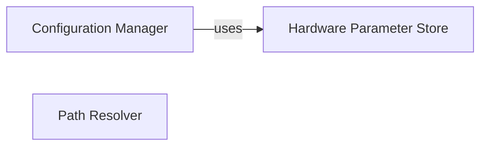

## Component Details

The Application Configuration subsystem centralizes the management of all application-wide settings, device-specific hardware parameters, and file path definitions. It ensures that the application operates correctly by providing a unified and consistent mechanism for accessing and persisting configuration data, thereby supporting various operational modes and device interactions.

### Configuration Manager
This component is responsible for managing various hardware and software configurations, including device-specific parameters like hardware code (hwcode), MEID, and SOCID. It initializes default values and handles persistent storage of certain settings.

**Related Classes/Methods**:

- <a href="https://github.com/bkerler/mtkclient/blob/master/mtkclient/config/mtk_config.py#L18-L278" target="_blank" rel="noopener noreferrer">`mtkclient.config.mtk_config.MtkConfig` (18:278)</a>
- `mtkclient.config.brom_config.Chipconfig` (full file reference)

### Hardware Parameter Store
This component provides persistent storage and retrieval mechanisms for device-specific hardware parameters such as MEID, CID, HWCode, SOCID, and OTP. It serializes and deserializes these parameters to and from a JSON file.

**Related Classes/Methods**:

- <a href="https://github.com/bkerler/mtkclient/blob/master/mtkclient/Library/settings.py#L6-L51" target="_blank" rel="noopener noreferrer">`mtkclient.Library.settings.HwParam` (6:51)</a>

### Path Resolver
This component provides standardized and absolute paths for various resources used by the application, such as loaders, payloads, GUI images, and other configuration files. It ensures that different parts of the application can consistently locate necessary files.

**Related Classes/Methods**:

- <a href="https://github.com/bkerler/mtkclient/blob/master/mtkclient/config/payloads.py#L5-L20" target="_blank" rel="noopener noreferrer">`mtkclient.config.payloads.PathConfig` (5:20)</a>

### [FAQ](https://github.com/CodeBoarding/GeneratedOnBoardings/tree/main?tab=readme-ov-file#faq)