```mermaid
graph LR
    Application_Orchestrator["Application Orchestrator"]
    Device_Abstraction_Layer["Device Abstraction Layer"]
    Configuration_Manager["Configuration Manager"]
    Preloader_BootROM_Tools["Preloader & BootROM Tools"]
    Download_Agent_DA_Handler["Download Agent (DA) Handler"]
    Exploit_Framework["Exploit Framework"]
    Hardware_Security_Module_HSM_Interface["Hardware Security Module (HSM) Interface"]
    Partition_Management_System["Partition Management System"]
    Core_Utilities_Error_Handling["Core Utilities & Error Handling"]
    META_Mode_Interface["META Mode Interface"]
    Application_Orchestrator -- "initializes and interacts with" --> Device_Abstraction_Layer
    Application_Orchestrator -- "reads and applies" --> Configuration_Manager
    Application_Orchestrator -- "invokes operations on" --> Preloader_BootROM_Tools
    Application_Orchestrator -- "delegates commands to" --> Download_Agent_DA_Handler
    Application_Orchestrator -- "initiates operations on" --> META_Mode_Interface
    Application_Orchestrator -- "uses for logging and utilities" --> Core_Utilities_Error_Handling
    Device_Abstraction_Layer -- "accesses device-specific configurations from" --> Configuration_Manager
    Device_Abstraction_Layer -- "uses for logging and error handling" --> Core_Utilities_Error_Handling
    Preloader_BootROM_Tools -- "performs operations on" --> Device_Abstraction_Layer
    Preloader_BootROM_Tools -- "utilizes for security bypasses" --> Exploit_Framework
    Preloader_BootROM_Tools -- "uses for logging and utilities" --> Core_Utilities_Error_Handling
    Download_Agent_DA_Handler -- "communicates with device via" --> Device_Abstraction_Layer
    Download_Agent_DA_Handler -- "interacts with partitions using" --> Partition_Management_System
    Download_Agent_DA_Handler -- "uses for logging and error handling" --> Core_Utilities_Error_Handling
    Exploit_Framework -- "executes exploits through" --> Device_Abstraction_Layer
    Exploit_Framework -- "may interact with" --> Hardware_Security_Module_HSM_Interface
    Exploit_Framework -- "uses for logging and utilities" --> Core_Utilities_Error_Handling
    Hardware_Security_Module_HSM_Interface -- "uses for logging and basic operations" --> Core_Utilities_Error_Handling
    Partition_Management_System -- "uses for data manipulation and logging" --> Core_Utilities_Error_Handling
    META_Mode_Interface -- "communicates with device in" --> Device_Abstraction_Layer
    META_Mode_Interface -- "uses for logging and utilities" --> Core_Utilities_Error_Handling
    Configuration_Manager -- "uses for logging and utilities" --> Core_Utilities_Error_Handling
```

## Component Details

This graph illustrates the architecture of the MTK client application, focusing on its core components and their interactions. The system is designed around a central Application Orchestrator that manages the overall flow, interacting with specialized components for device communication, configuration, security operations, and utility functions. The Device Abstraction Layer provides a unified interface for hardware interaction, while various tools and handlers manage specific functionalities like BootROM operations, Download Agent communication, and exploit execution. Core Utilities and Error Handling provide foundational support across the entire application.

### Application Orchestrator
The central component responsible for parsing command-line arguments, initializing the MTK client, and directing various operations based on user commands (e.g., flashing, dumping, exploit execution). It acts as the main control flow.

**Related Classes/Methods**:

- <a href="https://github.com/bkerler/mtkclient/blob/master/mtkclient/Library/mtk_main.py#L167-L719" target="_blank" rel="noopener noreferrer">`mtkclient.Library.mtk_main.Main` (167:719)</a>
- <a href="https://github.com/bkerler/mtkclient/blob/master/mtkclient/Library/mtk_main.py#L24-L164" target="_blank" rel="noopener noreferrer">`mtkclient.Library.mtk_main.ArgHandler` (24:164)</a>

### Device Abstraction Layer
Provides a high-level interface for interacting with MediaTek devices, abstracting away the complexities of low-level communication protocols (USB, Serial) and device-specific commands. It manages the device state and basic operations.

**Related Classes/Methods**:

- <a href="https://github.com/bkerler/mtkclient/blob/master/mtkclient/Library/mtk_class.py#L24-L213" target="_blank" rel="noopener noreferrer">`mtkclient.Library.mtk_class.Mtk` (24:213)</a>
- <a href="https://github.com/bkerler/mtkclient/blob/master/mtkclient/Library/Port.py#L15-L220" target="_blank" rel="noopener noreferrer">`mtkclient.Library.Port` (15:220)</a>
- `mtkclient.Library.Connection.devicehandler` (full file reference)
- `mtkclient.Library.Connection.seriallib` (full file reference)
- `mtkclient.Library.Connection.usblib` (full file reference)

### Configuration Manager
Handles the loading, parsing, and management of various configuration settings for the MTK client, including device-specific parameters, payload paths, and logging levels.

**Related Classes/Methods**:

- <a href="https://github.com/bkerler/mtkclient/blob/master/mtkclient/config/mtk_config.py#L18-L278" target="_blank" rel="noopener noreferrer">`mtkclient.config.mtk_config.MtkConfig` (18:278)</a>
- `mtkclient.config.brom_config` (full file reference)
- <a href="https://github.com/bkerler/mtkclient/blob/master/mtkclient/config/payloads.py#L5-L20" target="_blank" rel="noopener noreferrer">`mtkclient.config.payloads.PathConfig` (5:20)</a>
- `mtkclient.config.usb_ids` (full file reference)

### Preloader & BootROM Tools
Encapsulates functionalities related to interacting with the device's BootROM and Preloader, including dumping firmware, running custom payloads, and performing security bypasses.

**Related Classes/Methods**:

- <a href="https://github.com/bkerler/mtkclient/blob/master/mtkclient/Library/pltools.py#L17-L180" target="_blank" rel="noopener noreferrer">`mtkclient.Library.pltools.PLTools` (17:180)</a>
- `mtkclient.Library.mtk_preloader` (full file reference)

### Download Agent (DA) Handler
Manages the interaction with the device's Download Agent, facilitating operations like flashing, reading, and writing to various memory regions using different DA protocols (legacy, xflash, XML-based).

**Related Classes/Methods**:

- <a href="https://github.com/bkerler/mtkclient/blob/master/mtkclient/Library/DA/mtk_da_handler.py#L21-L944" target="_blank" rel="noopener noreferrer">`mtkclient.Library.DA.mtk_da_handler.DaHandler` (21:944)</a>
- `mtkclient.Library.DA.daconfig` (full file reference)
- `mtkclient.Library.DA.legacy.dalegacy_lib` (full file reference)
- `mtkclient.Library.DA.xflash.xflash_lib` (full file reference)
- `mtkclient.Library.DA.xml.xml_lib` (full file reference)

### Exploit Framework
Provides a collection of exploits (e.g., Kamakiri, Amonet, Hashimoto) used to gain initial access or bypass security mechanisms on MediaTek devices.

**Related Classes/Methods**:

- `mtkclient.Library.Exploit` (full file reference)
- `mtkclient.Library.exploit_handler` (full file reference)

### Hardware Security Module (HSM) Interface
Interacts with hardware-level security features of the MediaTek chipset, such as hardware crypto engines and secure configuration registers.

**Related Classes/Methods**:

- `mtkclient.Library.Hardware.hwcrypto` (full file reference)
- `mtkclient.Library.Hardware.seccfg` (full file reference)
- `mtkclient.Library.Hardware.cqdma` (full file reference)
- `mtkclient.Library.Hardware.hwcrypto_dxcc` (full file reference)
- `mtkclient.Library.Hardware.hwcrypto_gcpu` (full file reference)
- `mtkclient.Library.Hardware.hwcrypto_sej` (full file reference)

### Partition Management System
Handles the parsing, manipulation, and interaction with device partition tables, including GPT (GUID Partition Table) and PMT (Partition Map Table).

**Related Classes/Methods**:

- `mtkclient.Library.partition` (full file reference)
- <a href="https://github.com/bkerler/mtkclient/blob/master/mtkclient/Library/gpt.py#L19-L27" target="_blank" rel="noopener noreferrer">`mtkclient.Library.gpt.GptSettings` (19:27)</a>
- `mtkclient.Library.pmt` (full file reference)

### Core Utilities & Error Handling
This component provides a collection of common helper functions, data manipulation routines, and a centralized mechanism for reporting and handling errors across the entire application. It also includes cryptographic utility functions. It serves as a foundational support layer for other components.

**Related Classes/Methods**:

- `mtkclient.Library.utils` (full file reference)
- <a href="https://github.com/bkerler/mtkclient/blob/master/mtkclient/Library/error.py#L986-L999" target="_blank" rel="noopener noreferrer">`mtkclient.Library.error.ErrorHandler` (986:999)</a>
- <a href="https://github.com/bkerler/mtkclient/blob/master/mtkclient/Library/cryptutils.py#L75-L500" target="_blank" rel="noopener noreferrer">`mtkclient.Library.cryptutils.CryptUtils` (75:500)</a>

### META Mode Interface
Facilitates entering and interacting with the device's META mode, which is a special diagnostic and engineering mode used for various low-level operations.

**Related Classes/Methods**:

- <a href="https://github.com/bkerler/mtkclient/blob/master/mtkclient/Library/meta.py#L11-L97" target="_blank" rel="noopener noreferrer">`mtkclient.Library.meta.META` (11:97)</a>

### [FAQ](https://github.com/CodeBoarding/GeneratedOnBoardings/tree/main?tab=readme-ov-file#faq)