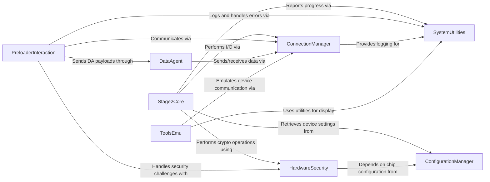

## Component Details

This component provides the foundational capabilities for interacting with MediaTek devices at a low level. It manages USB and serial connections, handles basic read/write operations, and includes functionalities for interacting with the device's preloader and performing stage2 operations for initial device access and memory manipulation. It also integrates with hardware security features and configuration management for device-specific operations.

### ConnectionManager
This component is responsible for establishing and managing communication channels with MediaTek devices, primarily via USB and serial interfaces. It provides methods for connecting, disconnecting, and performing raw USB/serial read and write operations. It also handles device detection.

**Related Classes/Methods**:

- <a href="https://github.com/bkerler/mtkclient/blob/master/mtkclient/Library/Connection/usblib.py#L97-L596" target="_blank" rel="noopener noreferrer">`mtkclient.Library.Connection.usblib.UsbClass` (97:596)</a>
- <a href="https://github.com/bkerler/mtkclient/blob/master/mtkclient/Library/Connection/seriallib.py#L28-L309" target="_blank" rel="noopener noreferrer">`mtkclient.Library.Connection.seriallib.SerialClass` (28:309)</a>
- <a href="https://github.com/bkerler/mtkclient/blob/master/mtkclient/Library/Port.py#L15-L220" target="_blank" rel="noopener noreferrer">`mtkclient.Library.Port.Port` (15:220)</a>
- <a href="https://github.com/bkerler/mtkclient/blob/master/mtkclient/Library/Connection/devicehandler.py#L12-L152" target="_blank" rel="noopener noreferrer">`mtkclient.Library.Connection.devicehandler.DeviceClass` (12:152)</a>
- `mtkclient.Library.Connection.usbscsi.Scsi` (full file reference)

### Stage2Core
This component encapsulates the core logic for interacting with MediaTek devices in "Stage 2" (likely after initial boot ROM communication). It handles low-level memory operations (read/write), flash memory dumping (eMMC, preloader, boot2, RPMB), and key extraction. It relies heavily on USB communication and hardware crypto functionalities.

**Related Classes/Methods**:

- <a href="https://github.com/bkerler/mtkclient/blob/master/stage2.py#L21-L490" target="_blank" rel="noopener noreferrer">`mtkclient.stage2.Stage2` (21:490)</a>

### PreloaderInteraction
This component specializes in interacting with the device's preloader, handling its initialization, reading/writing registers, sending DA (Download Agent) payloads, and managing security bypass mechanisms. It also includes tools for crashing the preloader and dumping its contents.

**Related Classes/Methods**:

- <a href="https://github.com/bkerler/mtkclient/blob/master/mtkclient/Library/mtk_preloader.py#L39-L901" target="_blank" rel="noopener noreferrer">`mtkclient.Library.mtk_preloader.Preloader` (39:901)</a>

### ToolsEmu
This component represents a specific tool for preloader emulation, particularly for MMC operations. It mimics the behavior of the `Stage2` class for testing or specific emulation scenarios.

**Related Classes/Methods**:

- <a href="https://github.com/bkerler/mtkclient/blob/master/Tools/preloader_emu_mmc.py#L26-L211" target="_blank" rel="noopener noreferrer">`mtkclient.Tools.preloader_emu_mmc.Stage2` (26:211)</a>

### HardwareSecurity
This component provides interfaces for interacting with the device's hardware cryptographic units (like DXCC and SEJ) to perform operations such as AES encryption/decryption, SHA256 hashing, and key derivation (RPMB, FDE, iTrustee, MTEE). It also includes functionality related to SLA (Secure Boot Loader Authentication) challenge generation.

**Related Classes/Methods**:

- <a href="https://github.com/bkerler/mtkclient/blob/master/mtkclient/Library/Hardware/hwcrypto.py#L32-L140" target="_blank" rel="noopener noreferrer">`mtkclient.Library.Hardware.hwcrypto.HwCrypto` (32:140)</a>
- <a href="https://github.com/bkerler/mtkclient/blob/master/mtkclient/Library/Hardware/hwcrypto_sej.py#L107-L808" target="_blank" rel="noopener noreferrer">`mtkclient.Library.Hardware.hwcrypto_sej.Sej` (107:808)</a>
- `mtkclient.Library.Auth.sla` (full file reference)

### ConfigurationManager
This component manages device-specific configurations, including hardware codes, blacklists, base addresses for cryptographic units, and payload paths. It stores and retrieves device parameters and settings.

**Related Classes/Methods**:

- <a href="https://github.com/bkerler/mtkclient/blob/master/mtkclient/config/mtk_config.py#L18-L278" target="_blank" rel="noopener noreferrer">`mtkclient.config.mtk_config.MtkConfig` (18:278)</a>
- <a href="https://github.com/bkerler/mtkclient/blob/master/mtkclient/config/payloads.py#L5-L20" target="_blank" rel="noopener noreferrer">`mtkclient.config.payloads.PathConfig` (5:20)</a>
- <a href="https://github.com/bkerler/mtkclient/blob/master/mtkclient/Library/settings.py#L6-L51" target="_blank" rel="noopener noreferrer">`mtkclient.Library.settings.HwParam` (6:51)</a>

### DataAgent
This component is responsible for handling Download Agent (DA) related operations, including configuring the DA and processing DA commands. It acts as an intermediary for loading and executing specific firmware components on the device.

**Related Classes/Methods**:

- <a href="https://github.com/bkerler/mtkclient/blob/master/mtkclient/Library/DA/mtk_da_handler.py#L21-L944" target="_blank" rel="noopener noreferrer">`mtkclient.Library.DA.mtk_da_handler.DaHandler` (21:944)</a>
- <a href="https://github.com/bkerler/mtkclient/blob/master/mtkclient/Library/DA/mtk_daloader.py#L24-L436" target="_blank" rel="noopener noreferrer">`mtkclient.Library.DA.mtk_daloader.DAloader` (24:436)</a>

### SystemUtilities
This component provides general utility functions such as logging setup, progress display, integer parsing, and error handling. These utilities support various operations across the `mtkclient` system.

**Related Classes/Methods**:

- <a href="https://github.com/bkerler/mtkclient/blob/master/mtkclient/Library/utils.py#L146-L230" target="_blank" rel="noopener noreferrer">`mtkclient.Library.utils.Progress` (146:230)</a>
- <a href="https://github.com/bkerler/mtkclient/blob/master/mtkclient/Library/utils.py#L805-L825" target="_blank" rel="noopener noreferrer">`mtkclient.Library.utils.print_progress` (805:825)</a>
- <a href="https://github.com/bkerler/mtkclient/blob/master/mtkclient/Library/utils.py#L461-L480" target="_blank" rel="noopener noreferrer">`mtkclient.Library.utils.logsetup` (461:480)</a>
- <a href="https://github.com/bkerler/mtkclient/blob/master/mtkclient/Library/utils.py#L420-L427" target="_blank" rel="noopener noreferrer">`mtkclient.Library.utils.getint` (420:427)</a>
- <a href="https://github.com/bkerler/mtkclient/blob/master/mtkclient/Library/error.py#L986-L999" target="_blank" rel="noopener noreferrer">`mtkclient.Library.error.ErrorHandler` (986:999)</a>

### [FAQ](https://github.com/CodeBoarding/GeneratedOnBoardings/tree/main?tab=readme-ov-file#faq)