```mermaid
graph LR
    GUI_Layer["GUI Layer"]
    Application_Core["Application Core"]
    MTK_Device_Interface["MTK Device Interface"]
    Download_Agent_Management["Download Agent Management"]
    DA_Operation_Handler["DA Operation Handler"]
    XML_Protocol_Handler["XML Protocol Handler"]
    Legacy_Protocol_Handler["Legacy Protocol Handler"]
    XFlash_Protocol_Handler["XFlash Protocol Handler"]
    Hardware_Communication_Layer["Hardware Communication Layer"]
    Configuration_Path_Management["Configuration & Path Management"]
    Shared_Utilities_Error_Handling["Shared Utilities & Error Handling"]
    GUI_Layer -- "initiates and controls" --> Application_Core
    Application_Core -- "interacts with" --> MTK_Device_Interface
    MTK_Device_Interface -- "delegates DA loading to" --> Download_Agent_Management
    Download_Agent_Management -- "utilizes" --> XML_Protocol_Handler
    Download_Agent_Management -- "utilizes" --> Legacy_Protocol_Handler
    Download_Agent_Management -- "utilizes" --> XFlash_Protocol_Handler
    MTK_Device_Interface -- "communicates via" --> Hardware_Communication_Layer
    Configuration_Path_Management -- "provides settings to" --> Application_Core
    Configuration_Path_Management -- "provides settings to" --> MTK_Device_Interface
    Shared_Utilities_Error_Handling -- "provides services to" --> Application_Core
    Shared_Utilities_Error_Handling -- "provides services to" --> GUI_Layer
    Application_Core -- "orchestrates" --> DA_Operation_Handler
    GUI_Layer -- "initiates operations via" --> DA_Operation_Handler
    DA_Operation_Handler -- "utilizes" --> Download_Agent_Management
```

## Component Details

This graph illustrates the architecture of the mtkclient application, focusing on its core functionalities for interacting with MediaTek devices. The main flow involves the GUI Layer initiating operations, which are then handled by the Application Core. The Application Core dispatches commands to the MTK Device Interface, which in turn interacts with the Download Agent Management component for complex device operations and the Hardware Communication Layer for low-level serial communication. Various protocol handlers (XML, XFlash, Legacy) are utilized by the Download Agent Management, while a dedicated DA Operation Handler abstracts DA-specific tasks. Configuration and shared utilities provide essential services across the application.

### GUI Layer
This component is responsible for managing the graphical user interface, handling user interactions, and displaying device information and operation progress. It acts as the visual front-end of the mtkclient application.

**Related Classes/Methods**:

- <a href="https://github.com/bkerler/mtkclient/blob/master/mtk_gui.py#L52-L67" target="_blank" rel="noopener noreferrer">`mtkclient.mtk_gui.DeviceHandler` (52:67)</a>
- <a href="https://github.com/bkerler/mtkclient/blob/master/mtk_gui.py#L125-L501" target="_blank" rel="noopener noreferrer">`mtkclient.mtk_gui.MainWindow` (125:501)</a>

### Application Core
This component orchestrates the overall application flow, parses command-line arguments, and dispatches various commands to the appropriate handlers for device interaction, dumping, flashing, and other operations. It serves as the central control unit for the application's logic.

**Related Classes/Methods**:

- <a href="https://github.com/bkerler/mtkclient/blob/master/mtkclient/Library/mtk_main.py#L167-L719" target="_blank" rel="noopener noreferrer">`mtkclient.Library.mtk_main.Main` (167:719)</a>

### MTK Device Interface
This component provides a high-level abstraction for interacting with the MediaTek device. It manages the connection to the device, handles preloader operations, and integrates with the Download Agent loader for more complex device interactions.

**Related Classes/Methods**:

- <a href="https://github.com/bkerler/mtkclient/blob/master/mtkclient/Library/mtk_class.py#L24-L213" target="_blank" rel="noopener noreferrer">`mtkclient.Library.mtk_class.Mtk` (24:213)</a>

### Download Agent Management
This central component orchestrates the selection and loading of specific Download Agent (DA) protocol handlers (XML, XFlash, Legacy) based on device requirements and configuration. It provides a unified interface for initializing DA-based interactions.

**Related Classes/Methods**:

- <a href="https://github.com/bkerler/mtkclient/blob/master/mtkclient/Library/DA/mtk_daloader.py#L24-L436" target="_blank" rel="noopener noreferrer">`mtkclient.Library.DA.mtk_daloader.DAloader` (24:436)</a>
- <a href="https://github.com/bkerler/mtkclient/blob/master/mtkclient/Library/DA/daconfig.py#L141-L286" target="_blank" rel="noopener noreferrer">`mtkclient.Library.DA.daconfig.DAconfig` (141:286)</a>

### DA Operation Handler
This component provides a high-level interface for performing various Download Agent (DA) operations, such as flashing, reading, and other advanced device interactions. It abstracts the complexities of specific DA protocols and is often utilized by the GUI layer for user-initiated actions.

**Related Classes/Methods**:

- <a href="https://github.com/bkerler/mtkclient/blob/master/mtkclient/Library/DA/mtk_da_handler.py#L21-L944" target="_blank" rel="noopener noreferrer">`mtkclient.Library.DA.mtk_da_handler.DaHandler` (21:944)</a>

### XML Protocol Handler
This component specifically implements the XML-based communication protocol for interacting with the device's Download Agent. It handles sending XML commands, receiving and parsing responses, and managing flash operations when the device is in XML mode.

**Related Classes/Methods**:

- `mtkclient.Library.DA.xml.xml_lib.DAXML` (full file reference)

### Legacy Protocol Handler
This component implements the older, legacy communication protocol for flash operations with the device's Download Agent. It provides methods for interacting with the device using this protocol for compatibility with older chipsets or DA versions.

**Related Classes/Methods**:

- <a href="https://github.com/bkerler/mtkclient/blob/master/mtkclient/Library/DA/legacy/dalegacy_lib.py#L47-L999" target="_blank" rel="noopener noreferrer">`mtkclient.Library.DA.legacy.dalegacy_lib.DALegacy` (47:999)</a>

### XFlash Protocol Handler
This component implements the XFlash communication protocol for interacting with the device's Download Agent. It provides specialized methods for flash operations that utilize the XFlash protocol.

**Related Classes/Methods**:

- <a href="https://github.com/bkerler/mtkclient/blob/master/mtkclient/Library/DA/xflash/xflash_lib.py#L30-L1000" target="_blank" rel="noopener noreferrer">`mtkclient.Library.DA.xflash.xflash_lib.DAXFlash` (30:1000)</a>

### Hardware Communication Layer
This component provides the fundamental low-level serial port communication capabilities for connecting to the MTK device. It handles the physical data transfer and also includes functionalities for basic preloader interactions.

**Related Classes/Methods**:

- <a href="https://github.com/bkerler/mtkclient/blob/master/mtkclient/Library/Connection/seriallib.py#L28-L309" target="_blank" rel="noopener noreferrer">`mtkclient.Library.Connection.seriallib.SerialClass` (28:309)</a>
- <a href="https://github.com/bkerler/mtkclient/blob/master/mtkclient/Library/mtk_preloader.py#L39-L901" target="_blank" rel="noopener noreferrer">`mtkclient.Library.mtk_preloader.Preloader` (39:901)</a>

### Configuration & Path Management
This component is responsible for managing application-wide configuration settings, including log levels, GUI integration parameters, device-specific hardware parameters, and paths to various payloads and images. It ensures consistent settings across the application.

**Related Classes/Methods**:

- <a href="https://github.com/bkerler/mtkclient/blob/master/mtkclient/config/mtk_config.py#L18-L278" target="_blank" rel="noopener noreferrer">`mtkclient.config.mtk_config.MtkConfig` (18:278)</a>
- <a href="https://github.com/bkerler/mtkclient/blob/master/mtkclient/config/payloads.py#L5-L20" target="_blank" rel="noopener noreferrer">`mtkclient.config.payloads.PathConfig` (5:20)</a>

### Shared Utilities & Error Handling
This component provides common utility services such as error reporting, logging, and progress indication. It also includes specialized tools for running payloads and managing operations in META mode, supporting various parts of the application.

**Related Classes/Methods**:

- <a href="https://github.com/bkerler/mtkclient/blob/master/mtkclient/Library/error.py#L986-L999" target="_blank" rel="noopener noreferrer">`mtkclient.Library.error.ErrorHandler` (986:999)</a>
- <a href="https://github.com/bkerler/mtkclient/blob/master/mtkclient/Library/utils.py#L461-L480" target="_blank" rel="noopener noreferrer">`mtkclient.Library.utils.logsetup` (461:480)</a>
- <a href="https://github.com/bkerler/mtkclient/blob/master/mtkclient/Library/utils.py#L146-L230" target="_blank" rel="noopener noreferrer">`mtkclient.Library.utils.Progress` (146:230)</a>
- <a href="https://github.com/bkerler/mtkclient/blob/master/mtkclient/Library/pltools.py#L17-L180" target="_blank" rel="noopener noreferrer">`mtkclient.Library.pltools.PLTools` (17:180)</a>
- <a href="https://github.com/bkerler/mtkclient/blob/master/mtkclient/Library/meta.py#L11-L97" target="_blank" rel="noopener noreferrer">`mtkclient.Library.meta.META` (11:97)</a>

### [FAQ](https://github.com/CodeBoarding/GeneratedOnBoardings/tree/main?tab=readme-ov-file#faq)