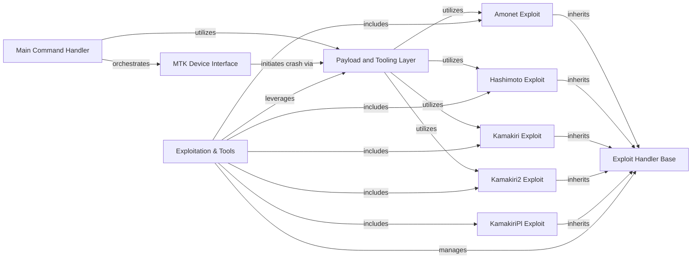

## Component Details

This graph illustrates the architecture of the `Exploitation & Tools` subsystem within the `mtkclient` project. This subsystem provides a comprehensive framework for implementing and executing various exploits and general tools to interact with and bypass security measures on MediaTek devices. It integrates a base exploit handler with specific exploit implementations and a tooling layer for advanced device control and data manipulation.

### Main Command Handler
This component serves as the primary command-line interface and orchestrator for the `mtkclient` tool. It parses user arguments, initializes the core `Mtk` object, and dispatches various operations such as dumping device memory, running payloads, performing security bypasses, and handling preloader interactions based on the command provided.

**Related Classes/Methods**:

- <a href="https://github.com/bkerler/mtkclient/blob/master/mtkclient/Library/mtk_main.py#L346-L686" target="_blank" rel="noopener noreferrer">`mtkclient.mtkclient.Library.mtk_main.Main:run` (346:686)</a>
- <a href="https://github.com/bkerler/mtkclient/blob/master/mtkclient/Library/mtk_main.py#L180-L276" target="_blank" rel="noopener noreferrer">`mtkclient.mtkclient.Library.mtk_main.Main:cmd_stage` (180:276)</a>
- <a href="https://github.com/bkerler/mtkclient/blob/master/mtkclient/Library/mtk_main.py#L702-L719" target="_blank" rel="noopener noreferrer">`mtkclient.mtkclient.Library.mtk_main.Main:cmd_payload` (702:719)</a>
- <a href="https://github.com/bkerler/mtkclient/blob/master/mtkclient/Library/mtk_main.py#L278-L344" target="_blank" rel="noopener noreferrer">`mtkclient.mtkclient.Library.mtk_main.Main:cmd_peek` (278:344)</a>
- <a href="https://github.com/bkerler/mtkclient/blob/master/mtkclient/Library/mtk_main.py#L688-L700" target="_blank" rel="noopener noreferrer">`mtkclient.mtkclient.Library.mtk_main.Main:cmd_log` (688:700)</a>

### MTK Device Interface
This component provides the core interface for interacting with MediaTek devices. It handles low-level communication, preloader initialization, security bypass mechanisms, and device-specific configurations. It acts as a central point for device state and capabilities.

**Related Classes/Methods**:

- <a href="https://github.com/bkerler/mtkclient/blob/master/mtkclient/Library/mtk_class.py#L164-L191" target="_blank" rel="noopener noreferrer">`mtkclient.mtkclient.Library.mtk_class.Mtk:crasher` (164:191)</a>
- <a href="https://github.com/bkerler/mtkclient/blob/master/mtkclient/Library/mtk_class.py#L193-L213" target="_blank" rel="noopener noreferrer">`mtkclient.mtkclient.Library.mtk_class.Mtk:bypass_security` (193:213)</a>

### Payload and Tooling Layer
This component acts as an intermediary layer for executing various payloads and specialized tools on the MediaTek device. It dynamically utilizes specific exploit implementations and provides functions for running payloads, bruteforcing, crashing the device, and dumping firmware regions like BROM and preloader.

**Related Classes/Methods**:

- <a href="https://github.com/bkerler/mtkclient/blob/master/mtkclient/Library/pltools.py#L18-L66" target="_blank" rel="noopener noreferrer">`mtkclient.mtkclient.Library.pltools.PLTools:__init__` (18:66)</a>
- <a href="https://github.com/bkerler/mtkclient/blob/master/mtkclient/Library/pltools.py#L68-L105" target="_blank" rel="noopener noreferrer">`mtkclient.mtkclient.Library.pltools.PLTools:runpayload` (68:105)</a>
- <a href="https://github.com/bkerler/mtkclient/blob/master/mtkclient/Library/pltools.py#L107-L112" target="_blank" rel="noopener noreferrer">`mtkclient.mtkclient.Library.pltools.PLTools:runbrute` (107:112)</a>
- <a href="https://github.com/bkerler/mtkclient/blob/master/mtkclient/Library/pltools.py#L114-L115" target="_blank" rel="noopener noreferrer">`mtkclient.mtkclient.Library.pltools.PLTools:crash` (114:115)</a>
- <a href="https://github.com/bkerler/mtkclient/blob/master/mtkclient/Library/pltools.py#L117-L131" target="_blank" rel="noopener noreferrer">`mtkclient.mtkclient.Library.pltools.PLTools:crasher` (117:131)</a>
- <a href="https://github.com/bkerler/mtkclient/blob/master/mtkclient/Library/pltools.py#L133-L152" target="_blank" rel="noopener noreferrer">`mtkclient.mtkclient.Library.pltools.PLTools:run_dump_brom` (133:152)</a>
- <a href="https://github.com/bkerler/mtkclient/blob/master/mtkclient/Library/pltools.py#L154-L170" target="_blank" rel="noopener noreferrer">`mtkclient.mtkclient.Library.pltools.PLTools:run_dump_preloader` (154:170)</a>

### Exploit Handler Base
This component defines the foundational interface and common functionalities for various MediaTek exploits. It provides methods for handling device communication during exploitation, managing data payloads, and performing low-level read/write operations to device memory. Specific exploit implementations inherit from this base class.

**Related Classes/Methods**:

- <a href="https://github.com/bkerler/mtkclient/blob/master/mtkclient/Library/exploit_handler.py#L14-L46" target="_blank" rel="noopener noreferrer">`mtkclient.mtkclient.Library.exploit_handler.Exploitation:__init__` (14:46)</a>
- <a href="https://github.com/bkerler/mtkclient/blob/master/mtkclient/Library/exploit_handler.py#L74-L106" target="_blank" rel="noopener noreferrer">`mtkclient.mtkclient.Library.exploit_handler.Exploitation:da_payload` (74:106)</a>
- <a href="https://github.com/bkerler/mtkclient/blob/master/mtkclient/Library/exploit_handler.py#L123-L138" target="_blank" rel="noopener noreferrer">`mtkclient.mtkclient.Library.exploit_handler.Exploitation:runpayload` (123:138)</a>
- <a href="https://github.com/bkerler/mtkclient/blob/master/mtkclient/Library/exploit_handler.py#L143-L155" target="_blank" rel="noopener noreferrer">`mtkclient.mtkclient.Library.exploit_handler.Exploitation:crash` (143:155)</a>
- <a href="https://github.com/bkerler/mtkclient/blob/master/mtkclient/Library/exploit_handler.py#L68-L69" target="_blank" rel="noopener noreferrer">`mtkclient.mtkclient.Library.exploit_handler.Exploitation:exploit` (68:69)</a>
- <a href="https://github.com/bkerler/mtkclient/blob/master/mtkclient/Library/exploit_handler.py#L62-L63" target="_blank" rel="noopener noreferrer">`mtkclient.mtkclient.Library.exploit_handler.Exploitation:da_read` (62:63)</a>
- <a href="https://github.com/bkerler/mtkclient/blob/master/mtkclient/Library/exploit_handler.py#L65-L66" target="_blank" rel="noopener noreferrer">`mtkclient.mtkclient.Library.exploit_handler.Exploitation:da_write` (65:66)</a>
- <a href="https://github.com/bkerler/mtkclient/blob/master/mtkclient/Library/exploit_handler.py#L140-L141" target="_blank" rel="noopener noreferrer">`mtkclient.mtkclient.Library.exploit_handler.Exploitation:close` (140:141)</a>

### Kamakiri Exploit
This component implements the Kamakiri exploit, a specific technique used to gain control over MediaTek devices. It provides functionalities for running custom payloads, bruteforcing security measures, and dumping device memory regions like BROM. It inherits from the Exploit Handler Base.

**Related Classes/Methods**:

- <a href="https://github.com/bkerler/mtkclient/blob/master/mtkclient/Library/Exploit/kamakiri.py#L17-L18" target="_blank" rel="noopener noreferrer">`mtkclient.mtkclient.Library.Exploit.kamakiri.Kamakiri:__init__` (17:18)</a>
- <a href="https://github.com/bkerler/mtkclient/blob/master/mtkclient/Library/Exploit/kamakiri.py#L49-L100" target="_blank" rel="noopener noreferrer">`mtkclient.mtkclient.Library.Exploit.kamakiri.Kamakiri:bruteforce` (49:100)</a>
- <a href="https://github.com/bkerler/mtkclient/blob/master/mtkclient/Library/Exploit/kamakiri.py#L159-L171" target="_blank" rel="noopener noreferrer">`mtkclient.mtkclient.Library.Exploit.kamakiri.Kamakiri:runpayload` (159:171)</a>
- <a href="https://github.com/bkerler/mtkclient/blob/master/mtkclient/Library/Exploit/kamakiri.py#L102-L117" target="_blank" rel="noopener noreferrer">`mtkclient.mtkclient.Library.Exploit.kamakiri.Kamakiri:dump_brom` (102:117)</a>
- <a href="https://github.com/bkerler/mtkclient/blob/master/mtkclient/Library/Exploit/kamakiri.py#L119-L134" target="_blank" rel="noopener noreferrer">`mtkclient.mtkclient.Library.Exploit.kamakiri.Kamakiri:dump_preloader` (119:134)</a>

### Kamakiri2 Exploit
This component implements the Kamakiri2 exploit, an evolution or variation of the Kamakiri exploit. It focuses on advanced exploitation techniques, including direct memory read/write operations, to achieve device control. It inherits from the Exploit Handler Base.

**Related Classes/Methods**:

- <a href="https://github.com/bkerler/mtkclient/blob/master/mtkclient/Library/Exploit/kamakiri2.py#L18-L21" target="_blank" rel="noopener noreferrer">`mtkclient.mtkclient.Library.Exploit.kamakiri2.Kamakiri2:__init__` (18:21)</a>
- <a href="https://github.com/bkerler/mtkclient/blob/master/mtkclient/Library/Exploit/kamakiri2.py#L63-L77" target="_blank" rel="noopener noreferrer">`mtkclient.mtkclient.Library.Exploit.kamakiri2.Kamakiri2:exploit` (63:77)</a>
- <a href="https://github.com/bkerler/mtkclient/blob/master/mtkclient/Library/Exploit/kamakiri2.py#L222-L234" target="_blank" rel="noopener noreferrer">`mtkclient.mtkclient.Library.Exploit.kamakiri2.Kamakiri2:runpayload` (222:234)</a>

### Amonet Exploit
This component provides the Amonet exploit implementation, another specialized technique for interacting with MediaTek devices. It focuses on specific payload execution methods to achieve its objectives. It inherits from the Exploit Handler Base.

**Related Classes/Methods**:

- <a href="https://github.com/bkerler/mtkclient/blob/master/mtkclient/Library/Exploit/amonet.py#L14-L15" target="_blank" rel="noopener noreferrer">`mtkclient.mtkclient.Library.Exploit.amonet.Amonet:__init__` (14:15)</a>
- <a href="https://github.com/bkerler/mtkclient/blob/master/mtkclient/Library/Exploit/amonet.py#L72-L84" target="_blank" rel="noopener noreferrer">`mtkclient.mtkclient.Library.Exploit.amonet.Amonet:runpayload` (72:84)</a>
- <a href="https://github.com/bkerler/mtkclient/blob/master/mtkclient/Library/Exploit/amonet.py#L49-L70" target="_blank" rel="noopener noreferrer">`mtkclient.mtkclient.Library.Exploit.amonet.Amonet:payload` (49:70)</a>

### Hashimoto Exploit
This component implements the Hashimoto exploit, a distinct exploitation method for MediaTek devices. It includes its own payload execution logic to interact with the device's bootrom or preloader. It inherits from the Exploit Handler Base.

**Related Classes/Methods**:

- <a href="https://github.com/bkerler/mtkclient/blob/master/mtkclient/Library/Exploit/hashimoto.py#L13-L14" target="_blank" rel="noopener noreferrer">`mtkclient.mtkclient.Library.Exploit.hashimoto.Hashimoto:__init__` (13:14)</a>
- <a href="https://github.com/bkerler/mtkclient/blob/master/mtkclient/Library/Exploit/hashimoto.py#L51-L58" target="_blank" rel="noopener noreferrer">`mtkclient.mtkclient.Library.Exploit.hashimoto.Hashimoto:runpayload` (51:58)</a>
- <a href="https://github.com/bkerler/mtkclient/blob/master/mtkclient/Library/Exploit/hashimoto.py#L28-L49" target="_blank" rel="noopener noreferrer">`mtkclient.mtkclient.Library.Exploit.hashimoto.Hashimoto:payload` (28:49)</a>

### KamakiriPl Exploit
This component represents the KamakiriPl exploit, another specialized technique within the `mtkclient` framework for interacting with MediaTek devices, likely focusing on preloader-level exploitation. It inherits from the Exploit Handler Base.

**Related Classes/Methods**:

- <a href="https://github.com/bkerler/mtkclient/blob/master/mtkclient/Library/Exploit/kamakiripl.py#L15-L17" target="_blank" rel="noopener noreferrer">`mtkclient.mtkclient.Library.Exploit.kamakiripl.KamakiriPl:__init__` (15:17)</a>

### Exploitation & Tools
This component provides a structured framework for implementing and executing various exploits designed to bypass security measures on MediaTek devices. It encompasses specific exploit implementations like Amonet, Kamakiri, Hashimoto, Kamakiri2, and KamakiriPl, which inherit from a common exploit handler base. Additionally, it includes general tools for deeper access and control over the device, facilitating payload execution, bruteforcing, and firmware dumping.

**Related Classes/Methods**:

- <a href="https://github.com/bkerler/mtkclient/blob/master/mtkclient/Library/exploit_handler.py#L13-L155" target="_blank" rel="noopener noreferrer">`mtkclient.Library.exploit_handler.Exploitation` (13:155)</a>
- <a href="https://github.com/bkerler/mtkclient/blob/master/mtkclient/Library/Exploit/amonet.py#L12-L137" target="_blank" rel="noopener noreferrer">`mtkclient.Library.Exploit.amonet.Amonet` (12:137)</a>
- <a href="https://github.com/bkerler/mtkclient/blob/master/mtkclient/Library/Exploit/kamakiri.py#L15-L171" target="_blank" rel="noopener noreferrer">`mtkclient.Library.Exploit.kamakiri.Kamakiri` (15:171)</a>
- <a href="https://github.com/bkerler/mtkclient/blob/master/mtkclient/Library/Exploit/hashimoto.py#L11-L106" target="_blank" rel="noopener noreferrer">`mtkclient.Library.Exploit.hashimoto.Hashimoto` (11:106)</a>
- <a href="https://github.com/bkerler/mtkclient/blob/master/mtkclient/Library/Exploit/kamakiri2.py#L16-L266" target="_blank" rel="noopener noreferrer">`mtkclient.Library.Exploit.kamakiri2.Kamakiri2` (16:266)</a>
- <a href="https://github.com/bkerler/mtkclient/blob/master/mtkclient/Library/Exploit/kamakiripl.py#L13-L99" target="_blank" rel="noopener noreferrer">`mtkclient.Library.Exploit.kamakiripl.KamakiriPl` (13:99)</a>
- <a href="https://github.com/bkerler/mtkclient/blob/master/mtkclient/Library/pltools.py#L17-L180" target="_blank" rel="noopener noreferrer">`mtkclient.Library.pltools.PLTools` (17:180)</a>

### [FAQ](https://github.com/CodeBoarding/GeneratedOnBoardings/tree/main?tab=readme-ov-file#faq)