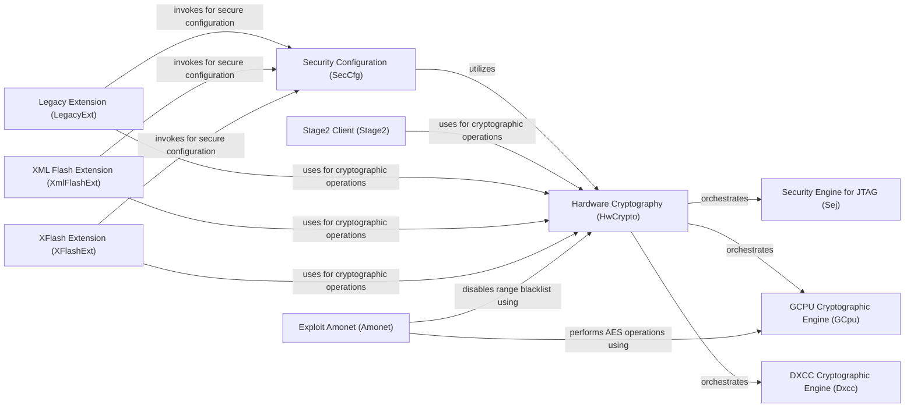

## Component Details

This component provides an abstraction layer for interacting with various hardware cryptographic units (GCPU, DXCC, SEJ) and manages security configurations on MediaTek SoCs. It handles cryptographic operations, secure boot settings, and fuse management, abstracting the complexities of different hardware implementations.

### Hardware Cryptography (HwCrypto)
Provides a unified interface and orchestrates operations across various hardware cryptographic engines (DXCC, GCPU, SEJ). It initializes and manages these engines, offering functionalities for AES encryption/decryption, RPMB key generation, and MTEE image decryption.

**Related Classes/Methods**:

- <a href="https://github.com/bkerler/mtkclient/blob/master/mtkclient/Library/Hardware/hwcrypto.py#L32-L140" target="_blank" rel="noopener noreferrer">`mtkclient.Library.Hardware.hwcrypto.HwCrypto` (32:140)</a>
- <a href="https://github.com/bkerler/mtkclient/blob/master/mtkclient/Library/Hardware/hwcrypto.py#L33-L45" target="_blank" rel="noopener noreferrer">`mtkclient.Library.Hardware.hwcrypto.HwCrypto.__init__` (33:45)</a>
- <a href="https://github.com/bkerler/mtkclient/blob/master/mtkclient/Library/Hardware/hwcrypto.py#L47-L50" target="_blank" rel="noopener noreferrer">`mtkclient.Library.Hardware.hwcrypto.HwCrypto.mtee` (47:50)</a>
- <a href="https://github.com/bkerler/mtkclient/blob/master/mtkclient/Library/Hardware/hwcrypto.py#L52-L114" target="_blank" rel="noopener noreferrer">`mtkclient.Library.Hardware.hwcrypto.HwCrypto.aes_hwcrypt` (52:114)</a>
- <a href="https://github.com/bkerler/mtkclient/blob/master/mtkclient/Library/Hardware/hwcrypto.py#L125-L140" target="_blank" rel="noopener noreferrer">`mtkclient.Library.Hardware.hwcrypto.HwCrypto.disable_range_blacklist` (125:140)</a>

### Security Engine for JTAG (Sej)
Directly interfaces with the Security Engine for JTAG (SEJ) hardware, providing functionalities for AES encryption/decryption, RPMB and MTEE key generation, and secure configuration (seccfg). It performs cryptographic operations by interacting with SEJ-specific hardware registers.

**Related Classes/Methods**:

- <a href="https://github.com/bkerler/mtkclient/blob/master/mtkclient/Library/Hardware/hwcrypto_sej.py#L107-L808" target="_blank" rel="noopener noreferrer">`mtkclient.Library.Hardware.hwcrypto_sej.Sej` (107:808)</a>
- <a href="https://github.com/bkerler/mtkclient/blob/master/mtkclient/Library/Hardware/hwcrypto_sej.py#L601-L611" target="_blank" rel="noopener noreferrer">`mtkclient.Library.Hardware.hwcrypto_sej.Sej.hw_aes128_cbc_encrypt` (601:611)</a>
- <a href="https://github.com/bkerler/mtkclient/blob/master/mtkclient/Library/Hardware/hwcrypto_sej.py#L785-L808" target="_blank" rel="noopener noreferrer">`mtkclient.Library.Hardware.hwcrypto_sej.Sej.generate_hw_meta` (785:808)</a>
- <a href="https://github.com/bkerler/mtkclient/blob/master/mtkclient/Library/Hardware/hwcrypto_sej.py#L471-L510" target="_blank" rel="noopener noreferrer">`mtkclient.Library.Hardware.hwcrypto_sej.Sej.sst_secure_algo_with_level` (471:510)</a>
- <a href="https://github.com/bkerler/mtkclient/blob/master/mtkclient/Library/Hardware/hwcrypto_sej.py#L713-L722" target="_blank" rel="noopener noreferrer">`mtkclient.Library.Hardware.hwcrypto_sej.Sej.generate_rpmb` (713:722)</a>
- <a href="https://github.com/bkerler/mtkclient/blob/master/mtkclient/Library/Hardware/hwcrypto_sej.py#L763-L767" target="_blank" rel="noopener noreferrer">`mtkclient.Library.Hardware.hwcrypto_sej.Sej.generate_mtee` (763:767)</a>
- <a href="https://github.com/bkerler/mtkclient/blob/master/mtkclient/Library/Hardware/hwcrypto_sej.py#L774-L783" target="_blank" rel="noopener noreferrer">`mtkclient.Library.Hardware.hwcrypto_sej.Sej.generate_mtee_hw` (774:783)</a>
- <a href="https://github.com/bkerler/mtkclient/blob/master/mtkclient/Library/Hardware/hwcrypto_sej.py#L672-L685" target="_blank" rel="noopener noreferrer">`mtkclient.Library.Hardware.hwcrypto_sej.Sej.sej_sec_cfg_sw` (672:685)</a>
- <a href="https://github.com/bkerler/mtkclient/blob/master/mtkclient/Library/Hardware/hwcrypto_sej.py#L696-L707" target="_blank" rel="noopener noreferrer">`mtkclient.Library.Hardware.hwcrypto_sej.Sej.sej_sec_cfg_hw` (696:707)</a>

### GCPU Cryptographic Engine (GCpu)
Manages the General-Purpose Cryptographic Unit (GCPU) hardware. It provides methods for AES encryption/decryption in ECB and CBC modes, MTEE image decryption, and disabling range blacklists, interacting with GCPU-specific registers and commands.

**Related Classes/Methods**:

- <a href="https://github.com/bkerler/mtkclient/blob/master/mtkclient/Library/Hardware/hwcrypto_gcpu.py#L195-L696" target="_blank" rel="noopener noreferrer">`mtkclient.Library.Hardware.hwcrypto_gcpu.GCpu` (195:696)</a>
- <a href="https://github.com/bkerler/mtkclient/blob/master/mtkclient/Library/Hardware/hwcrypto_gcpu.py#L490-L498" target="_blank" rel="noopener noreferrer">`mtkclient.Library.Hardware.hwcrypto_gcpu.GCpu.aes_read_ecb` (490:498)</a>
- <a href="https://github.com/bkerler/mtkclient/blob/master/mtkclient/Library/Hardware/hwcrypto_gcpu.py#L426-L454" target="_blank" rel="noopener noreferrer">`mtkclient.Library.Hardware.hwcrypto_gcpu.GCpu.aes_setup_cbc` (426:454)</a>
- <a href="https://github.com/bkerler/mtkclient/blob/master/mtkclient/Library/Hardware/hwcrypto_gcpu.py#L417-L423" target="_blank" rel="noopener noreferrer">`mtkclient.Library.Hardware.hwcrypto_gcpu.GCpu.aes_read_cbc` (417:423)</a>
- <a href="https://github.com/bkerler/mtkclient/blob/master/mtkclient/Library/Hardware/hwcrypto_gcpu.py#L461-L488" target="_blank" rel="noopener noreferrer">`mtkclient.Library.Hardware.hwcrypto_gcpu.GCpu.mtk_gcpu_decrypt_mtee_img` (461:488)</a>
- <a href="https://github.com/bkerler/mtkclient/blob/master/mtkclient/Library/Hardware/hwcrypto_gcpu.py#L579-L590" target="_blank" rel="noopener noreferrer">`mtkclient.Library.Hardware.hwcrypto_gcpu.GCpu.mtk_gcpu_mtee_6735` (579:590)</a>
- <a href="https://github.com/bkerler/mtkclient/blob/master/mtkclient/Library/Hardware/hwcrypto_gcpu.py#L592-L604" target="_blank" rel="noopener noreferrer">`mtkclient.Library.Hardware.hwcrypto_gcpu.GCpu.mtk_gcpu_mtee_8167` (592:604)</a>
- <a href="https://github.com/bkerler/mtkclient/blob/master/mtkclient/Library/Hardware/hwcrypto_gcpu.py#L634-L644" target="_blank" rel="noopener noreferrer">`mtkclient.Library.Hardware.hwcrypto_gcpu.GCpu.disable_range_blacklist` (634:644)</a>

### DXCC Cryptographic Engine (Dxcc)
Interfaces with the Discretix CryptoCell (DXCC) hardware. It supports generating various keys (RPMB, FDE, iTrustee, provisioning keys) and SHA256 hashing, using a descriptor-based approach for hardware cryptographic operations.

**Related Classes/Methods**:

- `mtkclient.Library.Hardware.hwcrypto_dxcc.Dxcc` (full file reference)
- `mtkclient.Library.Hardware.hwcrypto_dxcc.Dxcc.generate_rpmb` (full file reference)
- `mtkclient.Library.Hardware.hwcrypto_dxcc.Dxcc.generate_rpmb_mitee` (full file reference)
- `mtkclient.Library.Hardware.hwcrypto_dxcc.Dxcc.generate_itrustee_fbe` (full file reference)
- `mtkclient.Library.Hardware.hwcrypto_dxcc.Dxcc.generate_provision_key` (full file reference)
- `mtkclient.Library.Hardware.hwcrypto_dxcc.Dxcc.generate_sha256` (full file reference)

### Security Configuration (SecCfg)
Responsible for parsing and creating secure configuration data, including secure boot and device lock states. It utilizes the HwCrypto component to perform necessary cryptographic operations.

**Related Classes/Methods**:

- <a href="https://github.com/bkerler/mtkclient/blob/master/mtkclient/Library/Hardware/seccfg.py#L146-L297" target="_blank" rel="noopener noreferrer">`mtkclient.Library.Hardware.seccfg.SecCfgV3` (146:297)</a>
- <a href="https://github.com/bkerler/mtkclient/blob/master/mtkclient/Library/Hardware/seccfg.py#L11-L110" target="_blank" rel="noopener noreferrer">`mtkclient.Library.Hardware.seccfg.SecCfgV4` (11:110)</a>
- <a href="https://github.com/bkerler/mtkclient/blob/master/mtkclient/Library/Hardware/seccfg.py#L191-L240" target="_blank" rel="noopener noreferrer">`mtkclient.Library.Hardware.seccfg.SecCfgV3.parse` (191:240)</a>
- <a href="https://github.com/bkerler/mtkclient/blob/master/mtkclient/Library/Hardware/seccfg.py#L242-L297" target="_blank" rel="noopener noreferrer">`mtkclient.Library.Hardware.seccfg.SecCfgV3.create` (242:297)</a>

### Stage2 Client (Stage2)
A client for interacting with the MTK device in Stage2 mode. It handles basic device operations and provides an interface to extract hardware keys (RPMB, FDE, MTEE) by utilizing the HwCrypto component. It also supports generating secure configuration files.

**Related Classes/Methods**:

- <a href="https://github.com/bkerler/mtkclient/blob/master/stage2.py#L21-L490" target="_blank" rel="noopener noreferrer">`mtkclient.stage2.Stage2` (21:490)</a>
- <a href="https://github.com/bkerler/mtkclient/blob/master/stage2.py#L22-L47" target="_blank" rel="noopener noreferrer">`mtkclient.stage2.Stage2.__init__` (22:47)</a>
- <a href="https://github.com/bkerler/mtkclient/blob/master/stage2.py#L49-L68" target="_blank" rel="noopener noreferrer">`mtkclient.stage2.Stage2.preinit` (49:68)</a>
- <a href="https://github.com/bkerler/mtkclient/blob/master/stage2.py#L374-L485" target="_blank" rel="noopener noreferrer">`mtkclient.stage2.Stage2.keys` (374:485)</a>

### Legacy Extension (LegacyExt)
Provides extended functionalities for legacy DA (Download Agent) operations, including patching, hash fixing, memory/register R/W, OTP setting, and secure configuration. It supports decrypting TEE images and generating hardware keys by leveraging the HwCrypto and SecCfg components.

**Related Classes/Methods**:

- <a href="https://github.com/bkerler/mtkclient/blob/master/mtkclient/Library/DA/legacy/extension/legacy.py#L23-L365" target="_blank" rel="noopener noreferrer">`mtkclient.Library.DA.legacy.extension.legacy.LegacyExt` (23:365)</a>
- <a href="https://github.com/bkerler/mtkclient/blob/master/mtkclient/Library/DA/legacy/extension/legacy.py#L152-L163" target="_blank" rel="noopener noreferrer">`mtkclient.Library.DA.legacy.extension.legacy.LegacyExt.cryptosetup` (152:163)</a>
- <a href="https://github.com/bkerler/mtkclient/blob/master/mtkclient/Library/DA/legacy/extension/legacy.py#L165-L200" target="_blank" rel="noopener noreferrer">`mtkclient.Library.DA.legacy.extension.legacy.LegacyExt.seccfg` (165:200)</a>
- <a href="https://github.com/bkerler/mtkclient/blob/master/mtkclient/Library/DA/legacy/extension/legacy.py#L202-L214" target="_blank" rel="noopener noreferrer">`mtkclient.Library.DA.legacy.extension.legacy.LegacyExt.decrypt_tee` (202:214)</a>
- <a href="https://github.com/bkerler/mtkclient/blob/master/mtkclient/Library/DA/legacy/extension/legacy.py#L224-L362" target="_blank" rel="noopener noreferrer">`mtkclient.Library.DA.legacy.extension.legacy.LegacyExt.generate_keys` (224:362)</a>

### XML Flash Extension (XmlFlashExt)
Extends the XML flash tool with custom commands for RPMB operations (read, write, erase, init) and secure configuration. It also provides functionalities for decrypting TEE images and generating hardware keys, leveraging the underlying hardware crypto capabilities via HwCrypto and SecCfg.

**Related Classes/Methods**:

- <a href="https://github.com/bkerler/mtkclient/blob/master/mtkclient/Library/DA/xml/extension/v6.py#L29-L925" target="_blank" rel="noopener noreferrer">`mtkclient.Library.DA.xml.extension.v6.XmlFlashExt` (29:925)</a>
- <a href="https://github.com/bkerler/mtkclient/blob/master/mtkclient/Library/DA/xml/extension/v6.py#L385-L441" target="_blank" rel="noopener noreferrer">`mtkclient.Library.DA.xml.extension.v6.XmlFlashExt.custom_rpmb_init` (385:441)</a>
- <a href="https://github.com/bkerler/mtkclient/blob/master/mtkclient/Library/DA/xml/extension/v6.py#L453-L487" target="_blank" rel="noopener noreferrer">`mtkclient.Library.DA.xml.extension.v6.XmlFlashExt.read_rpmb` (453:487)</a>
- <a href="https://github.com/bkerler/mtkclient/blob/master/mtkclient/Library/DA/xml/extension/v6.py#L489-L522" target="_blank" rel="noopener noreferrer">`mtkclient.Library.DA.xml.extension.v6.XmlFlashExt.write_rpmb` (489:522)</a>
- <a href="https://github.com/bkerler/mtkclient/blob/master/mtkclient/Library/DA/xml/extension/v6.py#L524-L550" target="_blank" rel="noopener noreferrer">`mtkclient.Library.DA.xml.extension.v6.XmlFlashExt.erase_rpmb` (524:550)</a>
- <a href="https://github.com/bkerler/mtkclient/blob/master/mtkclient/Library/DA/xml/extension/v6.py#L672-L684" target="_blank" rel="noopener noreferrer">`mtkclient.Library.DA.xml.extension.v6.XmlFlashExt.cryptosetup` (672:684)</a>
- <a href="https://github.com/bkerler/mtkclient/blob/master/mtkclient/Library/DA/xml/extension/v6.py#L686-L726" target="_blank" rel="noopener noreferrer">`mtkclient.Library.DA.xml.extension.v6.XmlFlashExt.seccfg` (686:726)</a>
- <a href="https://github.com/bkerler/mtkclient/blob/master/mtkclient/Library/DA/xml/extension/v6.py#L728-L740" target="_blank" rel="noopener noreferrer">`mtkclient.Library.DA.xml.extension.v6.XmlFlashExt.decrypt_tee` (728:740)</a>
- <a href="https://github.com/bkerler/mtkclient/blob/master/mtkclient/Library/DA/xml/extension/v6.py#L776-L925" target="_blank" rel="noopener noreferrer">`mtkclient.Library.DA.xml.extension.v6.XmlFlashExt.generate_keys` (776:925)</a>

### XFlash Extension (XFlashExt)
Provides extended functionalities for the XFlash tool, including custom commands for RPMB operations (read, write, erase, init) and secure configuration. It also supports decrypting TEE images and generating hardware keys, utilizing the underlying hardware crypto capabilities via HwCrypto and SecCfg.

**Related Classes/Methods**:

- <a href="https://github.com/bkerler/mtkclient/blob/master/mtkclient/Library/DA/xflash/extension/xflash.py#L44-L878" target="_blank" rel="noopener noreferrer">`mtkclient.Library.DA.xflash.extension.xflash.XFlashExt` (44:878)</a>
- <a href="https://github.com/bkerler/mtkclient/blob/master/mtkclient/Library/DA/xflash/extension/xflash.py#L468-L498" target="_blank" rel="noopener noreferrer">`mtkclient.Library.DA.xflash.extension.xflash.XFlashExt.custom_rpmb_init` (468:498)</a>
- <a href="https://github.com/bkerler/mtkclient/blob/master/mtkclient/Library/DA/xflash/extension/xflash.py#L510-L541" target="_blank" rel="noopener noreferrer">`mtkclient.Library.DA.xflash.extension.xflash.XFlashExt.read_rpmb` (510:541)</a>
- <a href="https://github.com/bkerler/mtkclient/blob/master/mtkclient/Library/DA/xflash/extension/xflash.py#L543-L577" target="_blank" rel="noopener noreferrer">`mtkclient.Library.DA.xflash.extension.xflash.XFlashExt.write_rpmb` (543:577)</a>
- <a href="https://github.com/bkerler/mtkclient/blob/master/mtkclient/Library/DA/xflash/extension/xflash.py#L579-L606" target="_blank" rel="noopener noreferrer">`mtkclient.Library.DA.xflash.extension.xflash.XFlashExt.erase_rpmb` (579:606)</a>
- <a href="https://github.com/bkerler/mtkclient/blob/master/mtkclient/Library/DA/xflash/extension/xflash.py#L608-L620" target="_blank" rel="noopener noreferrer">`mtkclient.Library.DA.xflash.extension.xflash.XFlashExt.cryptosetup` (608:620)</a>
- <a href="https://github.com/bkerler/mtkclient/blob/master/mtkclient/Library/DA/xflash/extension/xflash.py#L622-L660" target="_blank" rel="noopener noreferrer">`mtkclient.Library.DA.xflash.extension.xflash.XFlashExt.seccfg` (622:660)</a>
- <a href="https://github.com/bkerler/mtkclient/blob/master/mtkclient/Library/DA/xflash/extension/xflash.py#L662-L674" target="_blank" rel="noopener noreferrer">`mtkclient.Library.DA.xflash.extension.xflash.XFlashExt.decrypt_tee` (662:674)</a>
- <a href="https://github.com/bkerler/mtkclient/blob/master/mtkclient/Library/DA/xflash/extension/xflash.py#L719-L878" target="_blank" rel="noopener noreferrer">`mtkclient.Library.DA.xflash.extension.xflash.XFlashExt.generate_keys` (719:878)</a>

### Exploit Amonet (Amonet)
An exploit component providing functionalities for reading/writing data, running payloads, and dumping preloader/bootrom. It leverages the HwCrypto and GCPU components to disable range blacklists and perform memory operations.

**Related Classes/Methods**:

- <a href="https://github.com/bkerler/mtkclient/blob/master/mtkclient/Library/Exploit/amonet.py#L12-L137" target="_blank" rel="noopener noreferrer">`mtkclient.Library.Exploit.amonet.Amonet` (12:137)</a>
- <a href="https://github.com/bkerler/mtkclient/blob/master/mtkclient/Library/Exploit/amonet.py#L20-L41" target="_blank" rel="noopener noreferrer">`mtkclient.Library.Exploit.amonet.Amonet.da_read_write` (20:41)</a>
- <a href="https://github.com/bkerler/mtkclient/blob/master/mtkclient/Library/Exploit/amonet.py#L49-L70" target="_blank" rel="noopener noreferrer">`mtkclient.Library.Exploit.amonet.Amonet.payload` (49:70)</a>
- <a href="https://github.com/bkerler/mtkclient/blob/master/mtkclient/Library/Exploit/amonet.py#L86-L116" target="_blank" rel="noopener noreferrer">`mtkclient.Library.Exploit.amonet.Amonet.dump_preloader` (86:116)</a>
- <a href="https://github.com/bkerler/mtkclient/blob/master/mtkclient/Library/Exploit/amonet.py#L118-L137" target="_blank" rel="noopener noreferrer">`mtkclient.Library.Exploit.amonet.Amonet.dump_brom` (118:137)</a>

### [FAQ](https://github.com/CodeBoarding/GeneratedOnBoardings/tree/main?tab=readme-ov-file#faq)