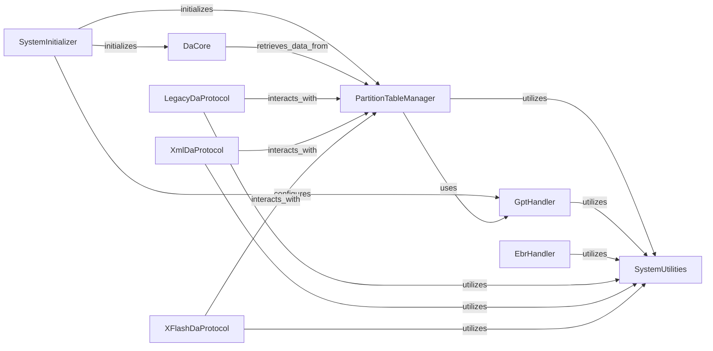

## Component Details

This system is designed to manage and interact with MediaTek devices, focusing on initial setup, partition table management (GPT, PMT, EBR), and communication via various Download Agent (DA) protocols. It provides functionalities for parsing device storage layouts, handling different DA communication methods, and includes core utilities for logging and error handling.

### SystemInitializer
Manages the initial setup of the MTK client, including device-specific configurations, argument parsing, and global settings for GPT and DA operations.

**Related Classes/Methods**:

- <a href="https://github.com/bkerler/mtkclient/blob/master/mtkclient/Library/Connection/devicehandler.py#L12-L152" target="_blank" rel="noopener noreferrer">`mtkclient.Library.Connection.devicehandler.DeviceClass` (12:152)</a>
- <a href="https://github.com/bkerler/mtkclient/blob/master/mtkclient/config/mtk_config.py#L18-L278" target="_blank" rel="noopener noreferrer">`mtkclient.config.mtk_config.MtkConfig` (18:278)</a>
- <a href="https://github.com/bkerler/mtkclient/blob/master/mtkclient/Library/gpt.py#L30-L347" target="_blank" rel="noopener noreferrer">`mtkclient.Library.gpt.GPT` (30:347)</a>
- <a href="https://github.com/bkerler/mtkclient/blob/master/mtkclient/Library/DA/mtk_da_handler.py#L21-L944" target="_blank" rel="noopener noreferrer">`mtkclient.Library.DA.mtk_da_handler.DaHandler` (21:944)</a>
- <a href="https://github.com/bkerler/mtkclient/blob/master/mtkclient/Library/mtk_class.py#L24-L213" target="_blank" rel="noopener noreferrer">`mtkclient.Library.mtk_class.Mtk` (24:213)</a>
- <a href="https://github.com/bkerler/mtkclient/blob/master/mtkclient/Library/mtk_main.py#L167-L719" target="_blank" rel="noopener noreferrer">`mtkclient.Library.mtk_main.Main` (167:719)</a>
- <a href="https://github.com/bkerler/mtkclient/blob/master/mtkclient/Library/utils.py#L461-L480" target="_blank" rel="noopener noreferrer">`mtkclient.Library.utils.logsetup` (461:480)</a>
- <a href="https://github.com/bkerler/mtkclient/blob/master/mtkclient/Library/utils.py#L420-L427" target="_blank" rel="noopener noreferrer">`mtkclient.Library.utils.getint` (420:427)</a>

### PartitionTableManager
Provides core functionalities for reading, parsing, and managing various partition tables, including GPT and PMT, and interacts with specific handlers for these formats.

**Related Classes/Methods**:

- <a href="https://github.com/bkerler/mtkclient/blob/master/mtkclient/Library/partition.py#L11-L136" target="_blank" rel="noopener noreferrer">`mtkclient.Library.partition.Partition` (11:136)</a>
- <a href="https://github.com/bkerler/mtkclient/blob/master/mtkclient/Library/pmt.py#L11-L48" target="_blank" rel="noopener noreferrer">`mtkclient.Library.pmt.PMT` (11:48)</a>
- <a href="https://github.com/bkerler/mtkclient/blob/master/mtkclient/Library/pmt.py#L12-L19" target="_blank" rel="noopener noreferrer">`mtkclient.Library.pmt.PMT.PtResident` (12:19)</a>
- <a href="https://github.com/bkerler/mtkclient/blob/master/mtkclient/Library/partition.py#L32-L67" target="_blank" rel="noopener noreferrer">`mtkclient.Library.partition.Partition.get_pmt` (32:67)</a>

### GptHandler
Dedicated component for parsing, interpreting, and managing GUID Partition Tables (GPT), including header and partition entry analysis.

**Related Classes/Methods**:

- <a href="https://github.com/bkerler/mtkclient/blob/master/mtkclient/Library/gpt.py#L30-L347" target="_blank" rel="noopener noreferrer">`mtkclient.Library.gpt.GPT` (30:347)</a>
- <a href="https://github.com/bkerler/mtkclient/blob/master/mtkclient/Library/gpt.py#L31-L46" target="_blank" rel="noopener noreferrer">`mtkclient.Library.gpt.GPT.GptHeader` (31:46)</a>
- <a href="https://github.com/bkerler/mtkclient/blob/master/mtkclient/Library/gpt.py#L48-L56" target="_blank" rel="noopener noreferrer">`mtkclient.Library.gpt.GPT.GptPartition` (48:56)</a>
- <a href="https://github.com/bkerler/mtkclient/blob/master/mtkclient/Library/gpt.py#L58-L143" target="_blank" rel="noopener noreferrer">`mtkclient.Library.gpt.GPT.EfiType` (58:143)</a>
- <a href="https://github.com/bkerler/mtkclient/blob/master/mtkclient/Library/gpt.py#L166-L204" target="_blank" rel="noopener noreferrer">`mtkclient.Library.gpt.GPT.parse_bpi` (166:204)</a>
- <a href="https://github.com/bkerler/mtkclient/blob/master/mtkclient/Library/gpt.py#L206-L262" target="_blank" rel="noopener noreferrer">`mtkclient.Library.gpt.GPT.parse` (206:262)</a>
- <a href="https://github.com/bkerler/mtkclient/blob/master/mtkclient/Library/gpt.py#L267-L275" target="_blank" rel="noopener noreferrer">`mtkclient.Library.gpt.GPT.tostring` (267:275)</a>

### EbrHandler
Focuses on parsing and managing Extended Boot Records (EBR) and their associated Master Boot Record (MBR) entries.

**Related Classes/Methods**:

- <a href="https://github.com/bkerler/mtkclient/blob/master/mtkclient/Library/ebr.py#L30-L44" target="_blank" rel="noopener noreferrer">`mtkclient.Library.ebr.Ebr` (30:44)</a>
- <a href="https://github.com/bkerler/mtkclient/blob/master/mtkclient/Library/ebr.py#L14-L28" target="_blank" rel="noopener noreferrer">`mtkclient.Library.ebr.MbrEntry` (14:28)</a>
- <a href="https://github.com/bkerler/mtkclient/blob/master/mtkclient/Library/ebr.py#L4-L12" target="_blank" rel="noopener noreferrer">`mtkclient.Library.ebr.CHS` (4:12)</a>
- <a href="https://github.com/bkerler/mtkclient/blob/master/mtkclient/Library/utils.py#L65-L112" target="_blank" rel="noopener noreferrer">`mtkclient.Library.utils.StructhelperIo` (65:112)</a>

### DaCore
Provides fundamental Download Agent functionalities, including detecting and retrieving partition data, and serves as a base for different DA protocol implementations.

**Related Classes/Methods**:

- <a href="https://github.com/bkerler/mtkclient/blob/master/mtkclient/Library/DA/mtk_daloader.py#L24-L436" target="_blank" rel="noopener noreferrer">`mtkclient.Library.DA.mtk_daloader.DAloader` (24:436)</a>
- <a href="https://github.com/bkerler/mtkclient/blob/master/mtkclient/Library/DA/mtk_daloader.py#L358-L361" target="_blank" rel="noopener noreferrer">`mtkclient.Library.DA.mtk_daloader.DAloader.partition_table_category` (358:361)</a>

### LegacyDaProtocol
Implements the legacy Download Agent communication protocol, handling commands, responses, and port interactions.

**Related Classes/Methods**:

- <a href="https://github.com/bkerler/mtkclient/blob/master/mtkclient/Library/DA/legacy/dalegacy_lib.py#L47-L999" target="_blank" rel="noopener noreferrer">`mtkclient.Library.DA.legacy.dalegacy_lib.DALegacy` (47:999)</a>
- <a href="https://github.com/bkerler/mtkclient/blob/master/mtkclient/Library/DA/legacy/dalegacy_param.py#L1-L128" target="_blank" rel="noopener noreferrer">`mtkclient.Library.DA.legacy.dalegacy_param.Cmd` (1:128)</a>
- <a href="https://github.com/bkerler/mtkclient/blob/master/mtkclient/Library/DA/legacy/dalegacy_param.py#L131-L139" target="_blank" rel="noopener noreferrer">`mtkclient.Library.DA.legacy.dalegacy_param.Rsp` (131:139)</a>
- <a href="https://github.com/bkerler/mtkclient/blob/master/mtkclient/Library/DA/legacy/dalegacy_param.py#L142-L155" target="_blank" rel="noopener noreferrer">`mtkclient.Library.DA.legacy.dalegacy_param.PortValues` (142:155)</a>
- <a href="https://github.com/bkerler/mtkclient/blob/master/mtkclient/Library/DA/legacy/extension/legacy.py#L23-L365" target="_blank" rel="noopener noreferrer">`mtkclient.Library.DA.legacy.extension.legacy.LegacyExt` (23:365)</a>

### XmlDaProtocol
Manages Download Agent operations using an XML-based protocol, including sending and receiving XML commands for tasks like reading partition tables.

**Related Classes/Methods**:

- `mtkclient.Library.DA.xml.xml_lib.DAXML` (full file reference)
- <a href="https://github.com/bkerler/mtkclient/blob/master/mtkclient/Library/DA/xml/xml_cmd.py#L11-L606" target="_blank" rel="noopener noreferrer">`mtkclient.Library.DA.xml.xml_cmd.XMLCmd` (11:606)</a>
- <a href="https://github.com/bkerler/mtkclient/blob/master/mtkclient/Library/DA/xml/extension/v6.py#L29-L925" target="_blank" rel="noopener noreferrer">`mtkclient.Library.DA.xml.extension.v6.XmlFlashExt` (29:925)</a>
- `mtkclient.Library.DA.xml.xml_lib.get_field` (full file reference)
- `mtkclient.Library.DA.xml.xml_lib.DAXML.read_partition_table.PartitionTable` (full file reference)

### XFlashDaProtocol
Handles Download Agent operations specific to the XFlash protocol, including checksum calculations and data type management.

**Related Classes/Methods**:

- <a href="https://github.com/bkerler/mtkclient/blob/master/mtkclient/Library/DA/xflash/xflash_lib.py#L30-L1000" target="_blank" rel="noopener noreferrer">`mtkclient.Library.DA.xflash.xflash_lib.DAXFlash` (30:1000)</a>
- <a href="https://github.com/bkerler/mtkclient/blob/master/mtkclient/Library/DA/xflash/xflash_param.py#L1-L74" target="_blank" rel="noopener noreferrer">`mtkclient.Library.DA.xflash.xflash_param.Cmd` (1:74)</a>
- <a href="https://github.com/bkerler/mtkclient/blob/master/mtkclient/Library/DA/xflash/xflash_param.py#L77-L80" target="_blank" rel="noopener noreferrer">`mtkclient.Library.DA.xflash.xflash_param.ChecksumAlgorithm` (77:80)</a>
- <a href="https://github.com/bkerler/mtkclient/blob/master/mtkclient/Library/DA/xflash/xflash_param.py#L83-L85" target="_blank" rel="noopener noreferrer">`mtkclient.Library.DA.xflash.xflash_param.FtSystemOSE` (83:85)</a>
- <a href="https://github.com/bkerler/mtkclient/blob/master/mtkclient/Library/DA/xflash/xflash_param.py#L88-L90" target="_blank" rel="noopener noreferrer">`mtkclient.Library.DA.xflash.xflash_param.DataType` (88:90)</a>
- <a href="https://github.com/bkerler/mtkclient/blob/master/mtkclient/Library/DA/xflash/extension/xflash.py#L44-L878" target="_blank" rel="noopener noreferrer">`mtkclient.Library.DA.xflash.extension.xflash.XFlashExt` (44:878)</a>

### SystemUtilities
Provides common utility functions such as logging, error handling, and low-level I/O operations used across various components.

**Related Classes/Methods**:

- <a href="https://github.com/bkerler/mtkclient/blob/master/mtkclient/Library/error.py#L986-L999" target="_blank" rel="noopener noreferrer">`mtkclient.Library.error.ErrorHandler` (986:999)</a>
- <a href="https://github.com/bkerler/mtkclient/blob/master/mtkclient/config/payloads.py#L5-L20" target="_blank" rel="noopener noreferrer">`mtkclient.config.payloads.PathConfig` (5:20)</a>
- <a href="https://github.com/bkerler/mtkclient/blob/master/mtkclient/Library/utils.py#L461-L480" target="_blank" rel="noopener noreferrer">`mtkclient.Library.utils.logsetup` (461:480)</a>
- <a href="https://github.com/bkerler/mtkclient/blob/master/mtkclient/Library/utils.py#L420-L427" target="_blank" rel="noopener noreferrer">`mtkclient.Library.utils.getint` (420:427)</a>
- <a href="https://github.com/bkerler/mtkclient/blob/master/mtkclient/Library/utils.py#L65-L112" target="_blank" rel="noopener noreferrer">`mtkclient.Library.utils.StructhelperIo` (65:112)</a>

### [FAQ](https://github.com/CodeBoarding/GeneratedOnBoardings/tree/main?tab=readme-ov-file#faq)