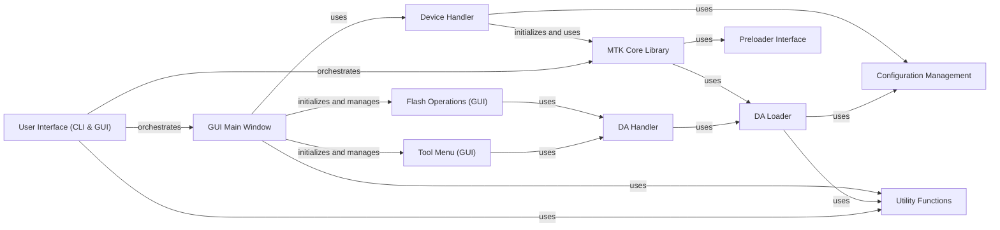

## Component Details

This graph illustrates the architecture of the MTKClient application, focusing on its user interface and core device interaction components. The main flow involves the User Interface (CLI & GUI) orchestrating either the GUI Main Window or directly interacting with the MTK Core Library. The GUI components, such as the GUI Main Window, Flash Operations (GUI), and Tool Menu (GUI), rely on the Device Handler and DA Handler to perform operations on MTK devices. The underlying device communication is handled by the MTK Core Library, DA Loader, and Preloader Interface, which in turn utilize Configuration Management and Utility Functions for various tasks.

### User Interface (CLI & GUI)
This component provides the primary interaction points for users, offering both a command-line interface for scripting and automated tasks, and a graphical user interface for visual control and ease of use. It handles argument parsing, orchestrates the overall application flow, and translates user actions into calls to underlying device operation components.

**Related Classes/Methods**:

- <a href="https://github.com/bkerler/mtkclient/blob/master/mtk.py#L45-L1000" target="_blank" rel="noopener noreferrer">`mtkclient.mtk:main` (45:1000)</a>
- <a href="https://github.com/bkerler/mtkclient/blob/master/mtkclient/Library/mtk_main.py#L167-L719" target="_blank" rel="noopener noreferrer">`mtkclient.Library.mtk_main.Main` (167:719)</a>
- <a href="https://github.com/bkerler/mtkclient/blob/master/mtkclient/Library/mtk_main.py#L24-L164" target="_blank" rel="noopener noreferrer">`mtkclient.Library.mtk_main.ArgHandler` (24:164)</a>
- <a href="https://github.com/bkerler/mtkclient/blob/master/mtk_gui.py#L504-L554" target="_blank" rel="noopener noreferrer">`mtkclient.mtk_gui:main` (504:554)</a>
- <a href="https://github.com/bkerler/mtkclient/blob/master/mtk_gui.py#L125-L501" target="_blank" rel="noopener noreferrer">`mtkclient.mtk_gui.MainWindow` (125:501)</a>
- <a href="https://github.com/bkerler/mtkclient/blob/master/mtk_gui.py#L52-L67" target="_blank" rel="noopener noreferrer">`mtkclient.mtk_gui.DeviceHandler` (52:67)</a>
- <a href="https://github.com/bkerler/mtkclient/blob/master/mtkclient/gui/main_gui.py#L26-L849" target="_blank" rel="noopener noreferrer">`mtkclient.gui.main_gui.Ui_MainWindow` (26:849)</a>

### GUI Main Window
This component represents the main graphical user interface of the MTKClient application. It handles the initialization of the UI, updates the display based on device status and progress, and manages interactions with various sub-windows for specific operations like reading, writing, and erasing flash partitions, and generating keys.

**Related Classes/Methods**:

- <a href="https://github.com/bkerler/mtkclient/blob/master/mtk_gui.py#L125-L501" target="_blank" rel="noopener noreferrer">`mtkclient.mtk_gui.MainWindow` (125:501)</a>
- <a href="https://github.com/bkerler/mtkclient/blob/master/mtk_gui.py#L126-L147" target="_blank" rel="noopener noreferrer">`mtkclient.mtk_gui.MainWindow:__init__` (126:147)</a>
- <a href="https://github.com/bkerler/mtkclient/blob/master/mtk_gui.py#L155-L199" target="_blank" rel="noopener noreferrer">`mtkclient.mtk_gui.MainWindow:updateState` (155:199)</a>
- <a href="https://github.com/bkerler/mtkclient/blob/master/mtk_gui.py#L224-L234" target="_blank" rel="noopener noreferrer">`mtkclient.mtk_gui.MainWindow:updateProgress` (224:234)</a>
- <a href="https://github.com/bkerler/mtkclient/blob/master/mtk_gui.py#L241-L251" target="_blank" rel="noopener noreferrer">`mtkclient.mtk_gui.MainWindow:initread` (241:251)</a>
- <a href="https://github.com/bkerler/mtkclient/blob/master/mtk_gui.py#L253-L257" target="_blank" rel="noopener noreferrer">`mtkclient.mtk_gui.MainWindow:initkeys` (253:257)</a>
- <a href="https://github.com/bkerler/mtkclient/blob/master/mtk_gui.py#L259-L264" target="_blank" rel="noopener noreferrer">`mtkclient.mtk_gui.MainWindow:initunlock` (259:264)</a>
- <a href="https://github.com/bkerler/mtkclient/blob/master/mtk_gui.py#L266-L274" target="_blank" rel="noopener noreferrer">`mtkclient.mtk_gui.MainWindow:initerase` (266:274)</a>
- <a href="https://github.com/bkerler/mtkclient/blob/master/mtk_gui.py#L276-L285" target="_blank" rel="noopener noreferrer">`mtkclient.mtk_gui.MainWindow:initwrite` (276:285)</a>
- <a href="https://github.com/bkerler/mtkclient/blob/master/mtk_gui.py#L340-L406" target="_blank" rel="noopener noreferrer">`mtkclient.mtk_gui.MainWindow:getpartitions` (340:406)</a>
- <a href="https://github.com/bkerler/mtkclient/blob/master/mtk_gui.py#L408-L418" target="_blank" rel="noopener noreferrer">`mtkclient.mtk_gui.MainWindow:selectWriteFile` (408:418)</a>
- <a href="https://github.com/bkerler/mtkclient/blob/master/mtk_gui.py#L427-L466" target="_blank" rel="noopener noreferrer">`mtkclient.mtk_gui.MainWindow:updateGui` (427:466)</a>
- <a href="https://github.com/bkerler/mtkclient/blob/master/mtk_gui.py#L477-L501" target="_blank" rel="noopener noreferrer">`mtkclient.mtk_gui.MainWindow:initpixmap` (477:501)</a>

### Device Handler
This component is responsible for managing the connection and interaction with the MTK device. It initializes the MTK configuration, handles DA (Download Agent) operations, and provides device information to the GUI.

**Related Classes/Methods**:

- <a href="https://github.com/bkerler/mtkclient/blob/master/mtk_gui.py#L52-L67" target="_blank" rel="noopener noreferrer">`mtkclient.mtk_gui.DeviceHandler` (52:67)</a>
- <a href="https://github.com/bkerler/mtkclient/blob/master/mtk_gui.py#L58-L67" target="_blank" rel="noopener noreferrer">`mtkclient.mtk_gui.DeviceHandler:__init__` (58:67)</a>
- <a href="https://github.com/bkerler/mtkclient/blob/master/mtk_gui.py#L70-L101" target="_blank" rel="noopener noreferrer">`mtkclient.mtk_gui.getDevInfo` (70:101)</a>

### MTK Core Library
This component provides the core functionalities for interacting with MTK devices at a low level, including preloader operations, security bypasses, and communication with the device's bootrom and DA.

**Related Classes/Methods**:

- <a href="https://github.com/bkerler/mtkclient/blob/master/mtkclient/Library/mtk_class.py#L24-L213" target="_blank" rel="noopener noreferrer">`mtkclient.Library.mtk_class.Mtk` (24:213)</a>
- <a href="https://github.com/bkerler/mtkclient/blob/master/mtkclient/Library/mtk_class.py#L25-L37" target="_blank" rel="noopener noreferrer">`mtkclient.Library.mtk_class.Mtk:__init__` (25:37)</a>
- <a href="https://github.com/bkerler/mtkclient/blob/master/mtkclient/Library/mtk_class.py#L39-L83" target="_blank" rel="noopener noreferrer">`mtkclient.Library.mtk_class.Mtk:patch_preloader_security_da1` (39:83)</a>
- <a href="https://github.com/bkerler/mtkclient/blob/master/mtkclient/Library/mtk_class.py#L144-L162" target="_blank" rel="noopener noreferrer">`mtkclient.Library.mtk_class.Mtk:setup` (144:162)</a>
- <a href="https://github.com/bkerler/mtkclient/blob/master/mtkclient/Library/mtk_class.py#L164-L191" target="_blank" rel="noopener noreferrer">`mtkclient.Library.mtk_class.Mtk:crasher` (164:191)</a>
- <a href="https://github.com/bkerler/mtkclient/blob/master/mtkclient/Library/mtk_class.py#L193-L213" target="_blank" rel="noopener noreferrer">`mtkclient.Library.mtk_class.Mtk:bypass_security` (193:213)</a>

### DA Loader
This component handles the loading and interaction with the Download Agent (DA) on the MTK device. It manages DA configuration, flash operations (read, write, erase), and various device-specific commands.

**Related Classes/Methods**:

- <a href="https://github.com/bkerler/mtkclient/blob/master/mtkclient/Library/DA/mtk_daloader.py#L24-L436" target="_blank" rel="noopener noreferrer">`mtkclient.Library.DA.mtk_daloader.DAloader` (24:436)</a>
- <a href="https://github.com/bkerler/mtkclient/blob/master/mtkclient/Library/DA/mtk_daloader.py#L25-L47" target="_blank" rel="noopener noreferrer">`mtkclient.Library.DA.mtk_daloader.DAloader:__init__` (25:47)</a>
- <a href="https://github.com/bkerler/mtkclient/blob/master/mtkclient/Library/DA/mtk_daloader.py#L77-L93" target="_blank" rel="noopener noreferrer">`mtkclient.Library.DA.mtk_daloader.DAloader:compute_hash_pos` (77:93)</a>
- <a href="https://github.com/bkerler/mtkclient/blob/master/mtkclient/Library/DA/mtk_daloader.py#L140-L195" target="_blank" rel="noopener noreferrer">`mtkclient.Library.DA.mtk_daloader.DAloader:reinit` (140:195)</a>
- <a href="https://github.com/bkerler/mtkclient/blob/master/mtkclient/Library/DA/mtk_daloader.py#L197-L204" target="_blank" rel="noopener noreferrer">`mtkclient.Library.DA.mtk_daloader.DAloader:patch_da2` (197:204)</a>
- <a href="https://github.com/bkerler/mtkclient/blob/master/mtkclient/Library/DA/mtk_daloader.py#L206-L228" target="_blank" rel="noopener noreferrer">`mtkclient.Library.DA.mtk_daloader.DAloader:set_da` (206:228)</a>
- <a href="https://github.com/bkerler/mtkclient/blob/master/mtkclient/Library/DA/mtk_daloader.py#L230-L241" target="_blank" rel="noopener noreferrer">`mtkclient.Library.DA.mtk_daloader.DAloader:setmetamode` (230:241)</a>
- <a href="https://github.com/bkerler/mtkclient/blob/master/mtkclient/Library/DA/mtk_daloader.py#L243-L257" target="_blank" rel="noopener noreferrer">`mtkclient.Library.DA.mtk_daloader.DAloader:detect_partition` (243:257)</a>
- <a href="https://github.com/bkerler/mtkclient/blob/master/mtkclient/Library/DA/mtk_daloader.py#L259-L269" target="_blank" rel="noopener noreferrer">`mtkclient.Library.DA.mtk_daloader.DAloader:get_partition_data` (259:269)</a>
- <a href="https://github.com/bkerler/mtkclient/blob/master/mtkclient/Library/DA/mtk_daloader.py#L271-L280" target="_blank" rel="noopener noreferrer">`mtkclient.Library.DA.mtk_daloader.DAloader:get_gpt` (271:280)</a>
- <a href="https://github.com/bkerler/mtkclient/blob/master/mtkclient/Library/DA/mtk_daloader.py#L282-L283" target="_blank" rel="noopener noreferrer">`mtkclient.Library.DA.mtk_daloader.DAloader:upload` (282:283)</a>
- <a href="https://github.com/bkerler/mtkclient/blob/master/mtkclient/Library/DA/mtk_daloader.py#L290-L291" target="_blank" rel="noopener noreferrer">`mtkclient.Library.DA.mtk_daloader.DAloader:shutdown` (290:291)</a>
- <a href="https://github.com/bkerler/mtkclient/blob/master/mtkclient/Library/DA/mtk_daloader.py#L293-L297" target="_blank" rel="noopener noreferrer">`mtkclient.Library.DA.mtk_daloader.DAloader:upload_da` (293:297)</a>
- <a href="https://github.com/bkerler/mtkclient/blob/master/mtkclient/Library/DA/mtk_daloader.py#L299-L302" target="_blank" rel="noopener noreferrer">`mtkclient.Library.DA.mtk_daloader.DAloader:boot_to` (299:302)</a>
- <a href="https://github.com/bkerler/mtkclient/blob/master/mtkclient/Library/DA/mtk_daloader.py#L304-L306" target="_blank" rel="noopener noreferrer">`mtkclient.Library.DA.mtk_daloader.DAloader:writeflash` (304:306)</a>
- <a href="https://github.com/bkerler/mtkclient/blob/master/mtkclient/Library/DA/mtk_daloader.py#L308-L309" target="_blank" rel="noopener noreferrer">`mtkclient.Library.DA.mtk_daloader.DAloader:formatflash` (308:309)</a>
- <a href="https://github.com/bkerler/mtkclient/blob/master/mtkclient/Library/DA/mtk_daloader.py#L311-L312" target="_blank" rel="noopener noreferrer">`mtkclient.Library.DA.mtk_daloader.DAloader:readflash` (311:312)</a>
- <a href="https://github.com/bkerler/mtkclient/blob/master/mtkclient/Library/DA/mtk_daloader.py#L314-L319" target="_blank" rel="noopener noreferrer">`mtkclient.Library.DA.mtk_daloader.DAloader:get_packet_length` (314:319)</a>
- <a href="https://github.com/bkerler/mtkclient/blob/master/mtkclient/Library/DA/mtk_daloader.py#L321-L327" target="_blank" rel="noopener noreferrer">`mtkclient.Library.DA.mtk_daloader.DAloader:peek` (321:327)</a>
- <a href="https://github.com/bkerler/mtkclient/blob/master/mtkclient/Library/DA/mtk_daloader.py#L329-L335" target="_blank" rel="noopener noreferrer">`mtkclient.Library.DA.mtk_daloader.DAloader:peek_reg` (329:335)</a>
- <a href="https://github.com/bkerler/mtkclient/blob/master/mtkclient/Library/DA/mtk_daloader.py#L337-L356" target="_blank" rel="noopener noreferrer">`mtkclient.Library.DA.mtk_daloader.DAloader:dump_brom` (337:356)</a>
- <a href="https://github.com/bkerler/mtkclient/blob/master/mtkclient/Library/DA/mtk_daloader.py#L363-L369" target="_blank" rel="noopener noreferrer">`mtkclient.Library.DA.mtk_daloader.DAloader:poke` (363:369)</a>
- <a href="https://github.com/bkerler/mtkclient/blob/master/mtkclient/Library/DA/mtk_daloader.py#L371-L377" target="_blank" rel="noopener noreferrer">`mtkclient.Library.DA.mtk_daloader.DAloader:keys` (371:377)</a>
- <a href="https://github.com/bkerler/mtkclient/blob/master/mtkclient/Library/DA/mtk_daloader.py#L379-L385" target="_blank" rel="noopener noreferrer">`mtkclient.Library.DA.mtk_daloader.DAloader:readfuses` (379:385)</a>
- <a href="https://github.com/bkerler/mtkclient/blob/master/mtkclient/Library/DA/mtk_daloader.py#L390-L396" target="_blank" rel="noopener noreferrer">`mtkclient.Library.DA.mtk_daloader.DAloader:seccfg` (390:396)</a>
- <a href="https://github.com/bkerler/mtkclient/blob/master/mtkclient/Library/DA/mtk_daloader.py#L408-L416" target="_blank" rel="noopener noreferrer">`mtkclient.Library.DA.mtk_daloader.DAloader:read_rpmb` (408:416)</a>
- <a href="https://github.com/bkerler/mtkclient/blob/master/mtkclient/Library/DA/mtk_daloader.py#L418-L426" target="_blank" rel="noopener noreferrer">`mtkclient.Library.DA.mtk_daloader.DAloader:write_rpmb` (418:426)</a>
- <a href="https://github.com/bkerler/mtkclient/blob/master/mtkclient/Library/DA/mtk_daloader.py#L428-L436" target="_blank" rel="noopener noreferrer">`mtkclient.Library.DA.mtk_daloader.DAloader:erase_rpmb` (428:436)</a>

### DA Handler
This component acts as an intermediary for DA operations, providing a higher-level interface for various DA commands such as reading/writing partitions, handling VBMeta, and managing eFuses.

**Related Classes/Methods**:

- <a href="https://github.com/bkerler/mtkclient/blob/master/mtkclient/Library/DA/mtk_da_handler.py#L21-L944" target="_blank" rel="noopener noreferrer">`mtkclient.Library.DA.mtk_da_handler.DaHandler` (21:944)</a>
- <a href="https://github.com/bkerler/mtkclient/blob/master/mtkclient/Library/DA/mtk_da_handler.py#L22-L38" target="_blank" rel="noopener noreferrer">`mtkclient.Library.DA.mtk_da_handler.DaHandler:__init__` (22:38)</a>
- <a href="https://github.com/bkerler/mtkclient/blob/master/mtkclient/Library/DA/mtk_da_handler.py#L87-L166" target="_blank" rel="noopener noreferrer">`mtkclient.Library.DA.mtk_da_handler.DaHandler:configure_da` (87:166)</a>
- <a href="https://github.com/bkerler/mtkclient/blob/master/mtkclient/Library/DA/mtk_da_handler.py#L186-L209" target="_blank" rel="noopener noreferrer">`mtkclient.Library.DA.mtk_da_handler.DaHandler:da_vbmeta` (186:209)</a>
- <a href="https://github.com/bkerler/mtkclient/blob/master/mtkclient/Library/DA/mtk_da_handler.py#L211-L228" target="_blank" rel="noopener noreferrer">`mtkclient.Library.DA.mtk_da_handler.DaHandler:da_gpt` (211:228)</a>
- <a href="https://github.com/bkerler/mtkclient/blob/master/mtkclient/Library/DA/mtk_da_handler.py#L260-L315" target="_blank" rel="noopener noreferrer">`mtkclient.Library.DA.mtk_da_handler.DaHandler:da_read` (260:315)</a>
- <a href="https://github.com/bkerler/mtkclient/blob/master/mtkclient/Library/DA/mtk_da_handler.py#L422-L470" target="_blank" rel="noopener noreferrer">`mtkclient.Library.DA.mtk_da_handler.DaHandler:da_write` (422:470)</a>
- <a href="https://github.com/bkerler/mtkclient/blob/master/mtkclient/Library/DA/mtk_da_handler.py#L661-L672" target="_blank" rel="noopener noreferrer">`mtkclient.Library.DA.mtk_da_handler.DaHandler:da_efuse` (661:672)</a>
- <a href="https://github.com/bkerler/mtkclient/blob/master/mtkclient/Library/DA/mtk_da_handler.py#L674-L684" target="_blank" rel="noopener noreferrer">`mtkclient.Library.DA.mtk_da_handler.DaHandler:get_current_slot` (674:684)</a>
- <a href="https://github.com/bkerler/mtkclient/blob/master/mtkclient/Library/DA/mtk_da_handler.py#L689-L722" target="_blank" rel="noopener noreferrer">`mtkclient.Library.DA.mtk_da_handler.DaHandler:da_peek` (689:722)</a>
- <a href="https://github.com/bkerler/mtkclient/blob/master/mtkclient/Library/DA/mtk_da_handler.py#L737-L944" target="_blank" rel="noopener noreferrer">`mtkclient.Library.DA.mtk_da_handler.DaHandler:handle_da_cmds` (737:944)</a>

### Preloader Interface
This component provides an interface for interacting with the device's preloader, including initialization, reading/writing registers, sending DA, and handling security-related operations.

**Related Classes/Methods**:

- <a href="https://github.com/bkerler/mtkclient/blob/master/mtkclient/Library/mtk_preloader.py#L39-L901" target="_blank" rel="noopener noreferrer">`mtkclient.Library.mtk_preloader.Preloader` (39:901)</a>
- <a href="https://github.com/bkerler/mtkclient/blob/master/mtkclient/Library/mtk_preloader.py#L123-L140" target="_blank" rel="noopener noreferrer">`mtkclient.Library.mtk_preloader.Preloader:__init__` (123:140)</a>
- <a href="https://github.com/bkerler/mtkclient/blob/master/mtkclient/Library/mtk_preloader.py#L142-L257" target="_blank" rel="noopener noreferrer">`mtkclient.Library.mtk_preloader.Preloader:init` (142:257)</a>
- <a href="https://github.com/bkerler/mtkclient/blob/master/mtkclient/Library/mtk_preloader.py#L268-L285" target="_blank" rel="noopener noreferrer">`mtkclient.Library.mtk_preloader.Preloader:read` (268:285)</a>
- <a href="https://github.com/bkerler/mtkclient/blob/master/mtkclient/Library/mtk_preloader.py#L287-L288" target="_blank" rel="noopener noreferrer">`mtkclient.Library.mtk_preloader.Preloader:read32` (287:288)</a>
- <a href="https://github.com/bkerler/mtkclient/blob/master/mtkclient/Library/mtk_preloader.py#L290-L291" target="_blank" rel="noopener noreferrer">`mtkclient.Library.mtk_preloader.Preloader:read16` (290:291)</a>
- <a href="https://github.com/bkerler/mtkclient/blob/master/mtkclient/Library/mtk_preloader.py#L293-L319" target="_blank" rel="noopener noreferrer">`mtkclient.Library.mtk_preloader.Preloader:write` (293:319)</a>
- <a href="https://github.com/bkerler/mtkclient/blob/master/mtkclient/Library/mtk_preloader.py#L321-L322" target="_blank" rel="noopener noreferrer">`mtkclient.Library.mtk_preloader.Preloader:write16` (321:322)</a>
- <a href="https://github.com/bkerler/mtkclient/blob/master/mtkclient/Library/mtk_preloader.py#L324-L325" target="_blank" rel="noopener noreferrer">`mtkclient.Library.mtk_preloader.Preloader:write32` (324:325)</a>
- <a href="https://github.com/bkerler/mtkclient/blob/master/mtkclient/Library/mtk_preloader.py#L327-L332" target="_blank" rel="noopener noreferrer">`mtkclient.Library.mtk_preloader.Preloader:writemem` (327:332)</a>
- <a href="https://github.com/bkerler/mtkclient/blob/master/mtkclient/Library/mtk_preloader.py#L334-L359" target="_blank" rel="noopener noreferrer">`mtkclient.Library.mtk_preloader.Preloader:reset_to_brom` (334:359)</a>
- <a href="https://github.com/bkerler/mtkclient/blob/master/mtkclient/Library/mtk_preloader.py#L388-L407" target="_blank" rel="noopener noreferrer">`mtkclient.Library.mtk_preloader.Preloader:send_partition_data` (388:407)</a>
- <a href="https://github.com/bkerler/mtkclient/blob/master/mtkclient/Library/mtk_preloader.py#L409-L497" target="_blank" rel="noopener noreferrer">`mtkclient.Library.mtk_preloader.Preloader:setreg_disablewatchdogtimer` (409:497)</a>
- <a href="https://github.com/bkerler/mtkclient/blob/master/mtkclient/Library/mtk_preloader.py#L549-L574" target="_blank" rel="noopener noreferrer">`mtkclient.Library.mtk_preloader.Preloader:jump_da` (549:574)</a>
- <a href="https://github.com/bkerler/mtkclient/blob/master/mtkclient/Library/mtk_preloader.py#L576-L595" target="_blank" rel="noopener noreferrer">`mtkclient.Library.mtk_preloader.Preloader:jump_da64` (576:595)</a>
- <a href="https://github.com/bkerler/mtkclient/blob/master/mtkclient/Library/mtk_preloader.py#L597-L604" target="_blank" rel="noopener noreferrer">`mtkclient.Library.mtk_preloader.Preloader:uart1_log_enable` (597:604)</a>
- <a href="https://github.com/bkerler/mtkclient/blob/master/mtkclient/Library/mtk_preloader.py#L606-L614" target="_blank" rel="noopener noreferrer">`mtkclient.Library.mtk_preloader.Preloader:uart1_set_baud` (606:614)</a>
- <a href="https://github.com/bkerler/mtkclient/blob/master/mtkclient/Library/mtk_preloader.py#L616-L627" target="_blank" rel="noopener noreferrer">`mtkclient.Library.mtk_preloader.Preloader:send_root_cert` (616:627)</a>
- <a href="https://github.com/bkerler/mtkclient/blob/master/mtkclient/Library/mtk_preloader.py#L629-L657" target="_blank" rel="noopener noreferrer">`mtkclient.Library.mtk_preloader.Preloader:send_auth` (629:657)</a>
- <a href="https://github.com/bkerler/mtkclient/blob/master/mtkclient/Library/mtk_preloader.py#L659-L694" target="_blank" rel="noopener noreferrer">`mtkclient.Library.mtk_preloader.Preloader:handle_sla` (659:694)</a>
- <a href="https://github.com/bkerler/mtkclient/blob/master/mtkclient/Library/mtk_preloader.py#L705-L714" target="_blank" rel="noopener noreferrer">`mtkclient.Library.mtk_preloader.Preloader:get_brom_log_new` (705:714)</a>
- <a href="https://github.com/bkerler/mtkclient/blob/master/mtkclient/Library/mtk_preloader.py#L720-L756" target="_blank" rel="noopener noreferrer">`mtkclient.Library.mtk_preloader.Preloader:brom_register_access` (720:756)</a>
- <a href="https://github.com/bkerler/mtkclient/blob/master/mtkclient/Library/mtk_preloader.py#L767-L793" target="_blank" rel="noopener noreferrer">`mtkclient.Library.mtk_preloader.Preloader:get_meid` (767:793)</a>
- <a href="https://github.com/bkerler/mtkclient/blob/master/mtkclient/Library/mtk_preloader.py#L795-L820" target="_blank" rel="noopener noreferrer">`mtkclient.Library.mtk_preloader.Preloader:get_socid` (795:820)</a>
- <a href="https://github.com/bkerler/mtkclient/blob/master/mtkclient/Library/mtk_preloader.py#L834-L864" target="_blank" rel="noopener noreferrer">`mtkclient.Library.mtk_preloader.Preloader:upload_data` (834:864)</a>
- <a href="https://github.com/bkerler/mtkclient/blob/master/mtkclient/Library/mtk_preloader.py#L866-L901" target="_blank" rel="noopener noreferrer">`mtkclient.Library.mtk_preloader.Preloader:send_da` (866:901)</a>

### Flash Operations (GUI)
This component encompasses the GUI windows and logic for performing flash operations such as reading, writing, and erasing partitions on the device. It interacts with the underlying DA handler to execute these operations.

**Related Classes/Methods**:

- <a href="https://github.com/bkerler/mtkclient/blob/master/mtkclient/gui/readFlashPartitions.py#L10-L161" target="_blank" rel="noopener noreferrer">`mtkclient.gui.readFlashPartitions.ReadFlashWindow` (10:161)</a>
- <a href="https://github.com/bkerler/mtkclient/blob/master/mtkclient/gui/writeFlashPartitions.py#L10-L166" target="_blank" rel="noopener noreferrer">`mtkclient.gui.writeFlashPartitions.WriteFlashWindow` (10:166)</a>
- <a href="https://github.com/bkerler/mtkclient/blob/master/mtkclient/gui/eraseFlashPartitions.py#L11-L135" target="_blank" rel="noopener noreferrer">`mtkclient.gui.eraseFlashPartitions.EraseFlashWindow` (11:135)</a>
- <a href="https://github.com/bkerler/mtkclient/blob/master/mtkclient/gui/readFlashPartitions.py#L14-L22" target="_blank" rel="noopener noreferrer">`mtkclient.gui.readFlashPartitions.ReadFlashWindow:__init__` (14:22)</a>
- <a href="https://github.com/bkerler/mtkclient/blob/master/mtkclient/gui/readFlashPartitions.py#L35-L48" target="_blank" rel="noopener noreferrer">`mtkclient.gui.readFlashPartitions.ReadFlashWindow:dumpPartition` (35:48)</a>
- <a href="https://github.com/bkerler/mtkclient/blob/master/mtkclient/gui/readFlashPartitions.py#L50-L98" target="_blank" rel="noopener noreferrer">`mtkclient.gui.readFlashPartitions.ReadFlashWindow:dumpPartitionAsync` (50:98)</a>
- <a href="https://github.com/bkerler/mtkclient/blob/master/mtkclient/gui/readFlashPartitions.py#L100-L126" target="_blank" rel="noopener noreferrer">`mtkclient.gui.readFlashPartitions.ReadFlashWindow:dumpFlash` (100:126)</a>
- <a href="https://github.com/bkerler/mtkclient/blob/master/mtkclient/gui/readFlashPartitions.py#L128-L161" target="_blank" rel="noopener noreferrer">`mtkclient.gui.readFlashPartitions.ReadFlashWindow:dumpFlashAsync` (128:161)</a>
- <a href="https://github.com/bkerler/mtkclient/blob/master/mtkclient/gui/writeFlashPartitions.py#L14-L21" target="_blank" rel="noopener noreferrer">`mtkclient.gui.writeFlashPartitions.WriteFlashWindow:__init__` (14:21)</a>
- <a href="https://github.com/bkerler/mtkclient/blob/master/mtkclient/gui/writeFlashPartitions.py#L26-L38" target="_blank" rel="noopener noreferrer">`mtkclient.gui.writeFlashPartitions.WriteFlashWindow:selectFiles` (26:38)</a>
- <a href="https://github.com/bkerler/mtkclient/blob/master/mtkclient/gui/writeFlashPartitions.py#L40-L47" target="_blank" rel="noopener noreferrer">`mtkclient.gui.writeFlashPartitions.WriteFlashWindow:writePartition` (40:47)</a>
- <a href="https://github.com/bkerler/mtkclient/blob/master/mtkclient/gui/writeFlashPartitions.py#L49-L59" target="_blank" rel="noopener noreferrer">`mtkclient.gui.writeFlashPartitions.WriteFlashWindow:openFile` (49:59)</a>
- <a href="https://github.com/bkerler/mtkclient/blob/master/mtkclient/gui/writeFlashPartitions.py#L61-L109" target="_blank" rel="noopener noreferrer">`mtkclient.gui.writeFlashPartitions.WriteFlashWindow:writePartitionAsync` (61:109)</a>
- <a href="https://github.com/bkerler/mtkclient/blob/master/mtkclient/gui/writeFlashPartitions.py#L111-L137" target="_blank" rel="noopener noreferrer">`mtkclient.gui.writeFlashPartitions.WriteFlashWindow:writeFlash` (111:137)</a>
- <a href="https://github.com/bkerler/mtkclient/blob/master/mtkclient/gui/writeFlashPartitions.py#L139-L166" target="_blank" rel="noopener noreferrer">`mtkclient.gui.writeFlashPartitions.WriteFlashWindow:writeFlashAsync` (139:166)</a>
- <a href="https://github.com/bkerler/mtkclient/blob/master/mtkclient/gui/eraseFlashPartitions.py#L15-L22" target="_blank" rel="noopener noreferrer">`mtkclient.gui.eraseFlashPartitions.EraseFlashWindow:__init__` (15:22)</a>
- <a href="https://github.com/bkerler/mtkclient/blob/master/mtkclient/gui/eraseFlashPartitions.py#L35-L43" target="_blank" rel="noopener noreferrer">`mtkclient.gui.eraseFlashPartitions.EraseFlashWindow:erasePartition` (35:43)</a>
- <a href="https://github.com/bkerler/mtkclient/blob/master/mtkclient/gui/eraseFlashPartitions.py#L45-L67" target="_blank" rel="noopener noreferrer">`mtkclient.gui.eraseFlashPartitions.EraseFlashWindow:eraseFlash` (45:67)</a>
- <a href="https://github.com/bkerler/mtkclient/blob/master/mtkclient/gui/eraseFlashPartitions.py#L69-L97" target="_blank" rel="noopener noreferrer">`mtkclient.gui.eraseFlashPartitions.EraseFlashWindow:eraseFlashAsync` (69:97)</a>
- <a href="https://github.com/bkerler/mtkclient/blob/master/mtkclient/gui/eraseFlashPartitions.py#L99-L135" target="_blank" rel="noopener noreferrer">`mtkclient.gui.eraseFlashPartitions.EraseFlashWindow:erasePartitionAsync` (99:135)</a>

### Tool Menu (GUI)
This component provides the GUI elements and logic for various tools, including generating keys and unlocking/locking the device. It interacts with the DA handler for these specialized operations.

**Related Classes/Methods**:

- <a href="https://github.com/bkerler/mtkclient/blob/master/mtkclient/gui/toolsMenu.py#L51-L107" target="_blank" rel="noopener noreferrer">`mtkclient.gui.toolsMenu.generateKeysMenu` (51:107)</a>
- <a href="https://github.com/bkerler/mtkclient/blob/master/mtkclient/gui/toolsMenu.py#L12-L48" target="_blank" rel="noopener noreferrer">`mtkclient.gui.toolsMenu.UnlockMenu` (12:48)</a>
- <a href="https://github.com/bkerler/mtkclient/blob/master/mtkclient/gui/toolsMenu.py#L16-L23" target="_blank" rel="noopener noreferrer">`mtkclient.gui.toolsMenu.UnlockMenu:__init__` (16:23)</a>
- <a href="https://github.com/bkerler/mtkclient/blob/master/mtkclient/gui/toolsMenu.py#L32-L40" target="_blank" rel="noopener noreferrer">`mtkclient.gui.toolsMenu.UnlockMenu:unlock` (32:40)</a>
- <a href="https://github.com/bkerler/mtkclient/blob/master/mtkclient/gui/toolsMenu.py#L55-L62" target="_blank" rel="noopener noreferrer">`mtkclient.gui.toolsMenu.generateKeysMenu:__init__` (55:62)</a>
- <a href="https://github.com/bkerler/mtkclient/blob/master/mtkclient/gui/toolsMenu.py#L82-L95" target="_blank" rel="noopener noreferrer">`mtkclient.gui.toolsMenu.generateKeysMenu:generateKeys` (82:95)</a>

### Utility Functions
This component provides various utility functions used across the MTKClient, such as logging, progress display, size conversion, and file dialogs.

**Related Classes/Methods**:

- <a href="https://github.com/bkerler/mtkclient/blob/master/mtkclient/gui/toolkit.py#L103-L116" target="_blank" rel="noopener noreferrer">`mtkclient.gui.toolkit.asyncThread` (103:116)</a>
- <a href="https://github.com/bkerler/mtkclient/blob/master/mtkclient/gui/toolkit.py#L93-L100" target="_blank" rel="noopener noreferrer">`mtkclient.gui.toolkit.convert_size` (93:100)</a>
- <a href="https://github.com/bkerler/mtkclient/blob/master/mtkclient/gui/toolkit.py#L54-L90" target="_blank" rel="noopener noreferrer">`mtkclient.gui.toolkit.CheckBox` (54:90)</a>
- <a href="https://github.com/bkerler/mtkclient/blob/master/mtkclient/gui/toolkit.py#L119-L166" target="_blank" rel="noopener noreferrer">`mtkclient.gui.toolkit.FDialog` (119:166)</a>
- <a href="https://github.com/bkerler/mtkclient/blob/master/mtkclient/gui/toolkit.py#L12-L51" target="_blank" rel="noopener noreferrer">`mtkclient.gui.toolkit.TimeEstim` (12:51)</a>
- <a href="https://github.com/bkerler/mtkclient/blob/master/mtkclient/Library/utils.py#L461-L480" target="_blank" rel="noopener noreferrer">`mtkclient.Library.utils.logsetup` (461:480)</a>
- <a href="https://github.com/bkerler/mtkclient/blob/master/mtkclient/Library/utils.py#L420-L427" target="_blank" rel="noopener noreferrer">`mtkclient.Library.utils.getint` (420:427)</a>
- <a href="https://github.com/bkerler/mtkclient/blob/master/mtkclient/Library/utils.py#L805-L825" target="_blank" rel="noopener noreferrer">`mtkclient.Library.utils.print_progress` (805:825)</a>
- <a href="https://github.com/bkerler/mtkclient/blob/master/mtkclient/Library/utils.py#L115-L143" target="_blank" rel="noopener noreferrer">`mtkclient.Library.utils.find_binary` (115:143)</a>
- <a href="https://github.com/bkerler/mtkclient/blob/master/mtkclient/Library/utils.py#L34-L62" target="_blank" rel="noopener noreferrer">`mtkclient.Library.utils.MTKTee` (34:62)</a>
- <a href="https://github.com/bkerler/mtkclient/blob/master/mtkclient/Library/utils.py#L146-L230" target="_blank" rel="noopener noreferrer">`mtkclient.Library.utils.Progress` (146:230)</a>
- <a href="https://github.com/bkerler/mtkclient/blob/master/mtkclient/Library/utils.py#L233-L294" target="_blank" rel="noopener noreferrer">`mtkclient.Library.utils.Structhelper` (233:294)</a>
- <a href="https://github.com/bkerler/mtkclient/blob/master/mtkclient/Library/utils.py#L65-L112" target="_blank" rel="noopener noreferrer">`mtkclient.Library.utils.StructhelperIo` (65:112)</a>
- <a href="https://github.com/bkerler/mtkclient/blob/master/mtkclient/gui/toolkit.py#L30-L51" target="_blank" rel="noopener noreferrer">`mtkclient.gui.toolkit.TimeEstim:update` (30:51)</a>
- <a href="https://github.com/bkerler/mtkclient/blob/master/mtkclient/gui/toolkit.py#L62-L66" target="_blank" rel="noopener noreferrer">`mtkclient.gui.toolkit.CheckBox:mousePressEvent` (62:66)</a>
- <a href="https://github.com/bkerler/mtkclient/blob/master/mtkclient/gui/toolkit.py#L68-L72" target="_blank" rel="noopener noreferrer">`mtkclient.gui.toolkit.CheckBox:mouseMoveEvent` (68:72)</a>
- <a href="https://github.com/bkerler/mtkclient/blob/master/mtkclient/gui/toolkit.py#L74-L78" target="_blank" rel="noopener noreferrer">`mtkclient.gui.toolkit.CheckBox:mouseReleaseEvent` (74:78)</a>
- <a href="https://github.com/bkerler/mtkclient/blob/master/mtkclient/gui/toolkit.py#L80-L84" target="_blank" rel="noopener noreferrer">`mtkclient.gui.toolkit.CheckBox:keyPressEvent` (80:84)</a>
- <a href="https://github.com/bkerler/mtkclient/blob/master/mtkclient/gui/toolkit.py#L120-L125" target="_blank" rel="noopener noreferrer">`mtkclient.gui.toolkit.FDialog:__init__` (120:125)</a>
- <a href="https://github.com/bkerler/mtkclient/blob/master/mtkclient/Library/utils.py#L48-L62" target="_blank" rel="noopener noreferrer">`mtkclient.Library.utils.MTKTee:parse` (48:62)</a>
- <a href="https://github.com/bkerler/mtkclient/blob/master/mtkclient/Library/utils.py#L176-L230" target="_blank" rel="noopener noreferrer">`mtkclient.Library.utils.Progress:show_progress` (176:230)</a>

### Configuration Management
This component handles the configuration settings for the MTKClient, including device-specific configurations, payload paths, and GPT settings.

**Related Classes/Methods**:

- <a href="https://github.com/bkerler/mtkclient/blob/master/mtkclient/config/mtk_config.py#L18-L278" target="_blank" rel="noopener noreferrer">`mtkclient.config.mtk_config.MtkConfig` (18:278)</a>
- <a href="https://github.com/bkerler/mtkclient/blob/master/mtkclient/config/payloads.py#L5-L20" target="_blank" rel="noopener noreferrer">`mtkclient.config.payloads.PathConfig` (5:20)</a>
- `mtkclient.config.brom_config.Chipconfig` (full file reference)
- `mtkclient.config.brom_config.Efuse` (full file reference)
- <a href="https://github.com/bkerler/mtkclient/blob/master/mtkclient/config/mtk_config.py#L19-L83" target="_blank" rel="noopener noreferrer">`mtkclient.config.mtk_config.MtkConfig:__init__` (19:83)</a>
- <a href="https://github.com/bkerler/mtkclient/blob/master/mtkclient/config/mtk_config.py#L95-L100" target="_blank" rel="noopener noreferrer">`mtkclient.config.mtk_config.MtkConfig:get_hwcode` (95:100)</a>
- <a href="https://github.com/bkerler/mtkclient/blob/master/mtkclient/config/mtk_config.py#L147-L153" target="_blank" rel="noopener noreferrer">`mtkclient.config.mtk_config.MtkConfig:get_socid` (147:153)</a>
- <a href="https://github.com/bkerler/mtkclient/blob/master/mtkclient/config/mtk_config.py#L191-L197" target="_blank" rel="noopener noreferrer">`mtkclient.config.mtk_config.MtkConfig:init_hwcode` (191:197)</a>

### [FAQ](https://github.com/CodeBoarding/GeneratedOnBoardings/tree/main?tab=readme-ov-file#faq)