```mermaid
graph LR
    User_Interface_CLI_GUI_["User Interface (CLI & GUI)"]
    Device_Communication_Low_Level_Operations["Device Communication & Low-Level Operations"]
    Download_Agent_DA_Management["Download Agent (DA) Management"]
    Hardware_Security_Cryptography["Hardware Security & Cryptography"]
    Exploitation_Tools["Exploitation & Tools"]
    Partition_Storage_Management["Partition & Storage Management"]
    Application_Configuration["Application Configuration"]
    Core_Utilities_Error_Handling["Core Utilities & Error Handling"]
    User_Interface_CLI_GUI_ -- "controls" --> Device_Communication_Low_Level_Operations
    User_Interface_CLI_GUI_ -- "controls" --> Download_Agent_DA_Management
    User_Interface_CLI_GUI_ -- "configures via" --> Application_Configuration
    User_Interface_CLI_GUI_ -- "relies on" --> Core_Utilities_Error_Handling
    Device_Communication_Low_Level_Operations -- "provides access to" --> Hardware_Security_Cryptography
    Device_Communication_Low_Level_Operations -- "supported by" --> Core_Utilities_Error_Handling
    Download_Agent_DA_Management -- "orchestrates" --> Device_Communication_Low_Level_Operations
    Download_Agent_DA_Management -- "manages" --> Partition_Storage_Management
    Download_Agent_DA_Management -- "utilizes" --> Hardware_Security_Cryptography
    Download_Agent_DA_Management -- "reads from" --> Application_Configuration
    Download_Agent_DA_Management -- "utilizes" --> Core_Utilities_Error_Handling
    Hardware_Security_Cryptography -- "performs operations via" --> Device_Communication_Low_Level_Operations
    Hardware_Security_Cryptography -- "supported by" --> Core_Utilities_Error_Handling
    Exploitation_Tools -- "orchestrates" --> Device_Communication_Low_Level_Operations
    Exploitation_Tools -- "targets" --> Hardware_Security_Cryptography
    Exploitation_Tools -- "configures via" --> Application_Configuration
    Exploitation_Tools -- "utilizes" --> Core_Utilities_Error_Handling
    Partition_Storage_Management -- "provides data to" --> Download_Agent_DA_Management
    Partition_Storage_Management -- "supported by" --> Core_Utilities_Error_Handling
    Application_Configuration -- "provides settings to" --> User_Interface_CLI_GUI_
    Application_Configuration -- "provides settings to" --> Download_Agent_DA_Management
    Application_Configuration -- "provides settings to" --> Exploitation_Tools
    Application_Configuration -- "utilizes" --> Core_Utilities_Error_Handling
    Core_Utilities_Error_Handling -- "provides services to" --> User_Interface_CLI_GUI_
    Core_Utilities_Error_Handling -- "provides services to" --> Device_Communication_Low_Level_Operations
    Core_Utilities_Error_Handling -- "provides services to" --> Download_Agent_DA_Management
    Core_Utilities_Error_Handling -- "provides services to" --> Hardware_Security_Cryptography
    Core_Utilities_Error_Handling -- "provides services to" --> Exploitation_Tools
    Core_Utilities_Error_Handling -- "provides services to" --> Partition_Storage_Management
    Core_Utilities_Error_Handling -- "provides services to" --> Application_Configuration
    click User_Interface_CLI_GUI_ href "https://github.com/CodeBoarding/GeneratedOnBoardings/blob/main/mtkclient/User Interface (CLI & GUI).md" "Details"
    click Device_Communication_Low_Level_Operations href "https://github.com/CodeBoarding/GeneratedOnBoardings/blob/main/mtkclient/Device Communication & Low-Level Operations.md" "Details"
    click Download_Agent_DA_Management href "https://github.com/CodeBoarding/GeneratedOnBoardings/blob/main/mtkclient/Download Agent (DA) Management.md" "Details"
    click Hardware_Security_Cryptography href "https://github.com/CodeBoarding/GeneratedOnBoardings/blob/main/mtkclient/Hardware Security & Cryptography.md" "Details"
    click Exploitation_Tools href "https://github.com/CodeBoarding/GeneratedOnBoardings/blob/main/mtkclient/Exploitation & Tools.md" "Details"
    click Partition_Storage_Management href "https://github.com/CodeBoarding/GeneratedOnBoardings/blob/main/mtkclient/Partition & Storage Management.md" "Details"
    click Application_Configuration href "https://github.com/CodeBoarding/GeneratedOnBoardings/blob/main/mtkclient/Application Configuration.md" "Details"
    click Core_Utilities_Error_Handling href "https://github.com/CodeBoarding/GeneratedOnBoardings/blob/main/mtkclient/Core Utilities & Error Handling.md" "Details"
```

## Component Details

The mtkclient architecture is designed to interact with MediaTek devices, offering both command-line and graphical interfaces. Its core functionality revolves around a robust Device Communication & Low-Level Operations component that handles fundamental device interactions, supported by a sophisticated Download Agent (DA) Management system for flashing and advanced operations. Security features are managed by the Hardware Security & Cryptography component, while the Exploitation & Tools component provides capabilities for bypassing device security. Partition and storage layouts are handled by the Partition & Storage Management, with all operations being configurable through the Application Configuration and supported by a comprehensive Core Utilities & Error Handling module.

### User Interface (CLI & GUI)
This component provides the primary interaction points for users, offering both a command-line interface for scripting and automated tasks, and a graphical user interface for visual control and ease of use. It handles argument parsing, orchestrates the overall application flow, and translates user actions into calls to underlying device operation components.

**Related Classes/Methods**:

- <a href="https://github.com/bkerler/mtkclient/blob/master/mtk.py#L45-L1000" target="_blank" rel="noopener noreferrer">`mtkclient.mtk:main` (45:1000)</a>
- <a href="https://github.com/bkerler/mtkclient/blob/master/mtkclient/Library/mtk_main.py#L167-L719" target="_blank" rel="noopener noreferrer">`mtkclient.Library.mtk_main.Main` (167:719)</a>
- <a href="https://github.com/bkerler/mtkclient/blob/master/mtkclient/Library/mtk_main.py#L24-L164" target="_blank" rel="noopener noreferrer">`mtkclient.Library.mtk_main.ArgHandler` (24:164)</a>
- <a href="https://github.com/bkerler/mtkclient/blob/master/mtk_gui.py#L504-L554" target="_blank" rel="noopener noreferrer">`mtkclient.mtk_gui:main` (504:554)</a>
- <a href="https://github.com/bkerler/mtkclient/blob/master/mtk_gui.py#L125-L501" target="_blank" rel="noopener noreferrer">`mtkclient.mtk_gui.MainWindow` (125:501)</a>
- <a href="https://github.com/bkerler/mtkclient/blob/master/mtk_gui.py#L52-L67" target="_blank" rel="noopener noreferrer">`mtkclient.mtk_gui.DeviceHandler` (52:67)</a>
- <a href="https://github.com/bkerler/mtkclient/blob/master/mtkclient/gui/main_gui.py#L26-L849" target="_blank" rel="noopener noreferrer">`mtkclient.gui.main_gui.Ui_MainWindow` (26:849)</a>

### Device Communication & Low-Level Operations
This component provides the foundational capabilities for interacting with MediaTek devices at a low level. It manages USB and serial connections, handles basic read/write operations, and includes functionalities for interacting with the device's preloader and performing stage2 operations for initial device access and memory manipulation.

**Related Classes/Methods**:

- <a href="https://github.com/bkerler/mtkclient/blob/master/mtkclient/Library/Connection/usblib.py#L97-L596" target="_blank" rel="noopener noreferrer">`mtkclient.Library.Connection.usblib.UsbClass` (97:596)</a>
- <a href="https://github.com/bkerler/mtkclient/blob/master/mtkclient/Library/Connection/seriallib.py#L28-L309" target="_blank" rel="noopener noreferrer">`mtkclient.Library.Connection.seriallib.SerialClass` (28:309)</a>
- <a href="https://github.com/bkerler/mtkclient/blob/master/mtkclient/Library/Port.py#L15-L220" target="_blank" rel="noopener noreferrer">`mtkclient.Library.Port.Port` (15:220)</a>
- <a href="https://github.com/bkerler/mtkclient/blob/master/mtkclient/Library/Connection/devicehandler.py#L12-L152" target="_blank" rel="noopener noreferrer">`mtkclient.Library.Connection.devicehandler.DeviceClass` (12:152)</a>
- `mtkclient.Library.Connection.usbscsi.Scsi` (full file reference)
- <a href="https://github.com/bkerler/mtkclient/blob/master/stage2.py#L21-L490" target="_blank" rel="noopener noreferrer">`mtkclient.stage2.Stage2` (21:490)</a>
- <a href="https://github.com/bkerler/mtkclient/blob/master/Tools/preloader_emu_mmc.py#L26-L211" target="_blank" rel="noopener noreferrer">`mtkclient.Tools.preloader_emu_mmc.Stage2` (26:211)</a>
- <a href="https://github.com/bkerler/mtkclient/blob/master/mtkclient/Library/mtk_preloader.py#L39-L901" target="_blank" rel="noopener noreferrer">`mtkclient.Library.mtk_preloader.Preloader` (39:901)</a>

### Download Agent (DA) Management
This central component manages the various Download Agent (DA) protocols used for flashing, reading, and other advanced operations on MediaTek devices. It orchestrates the selection and utilization of specific DA protocol handlers (XML, XFlash, Legacy) based on device requirements, providing a unified interface for DA-based interactions.

**Related Classes/Methods**:

- <a href="https://github.com/bkerler/mtkclient/blob/master/mtkclient/Library/DA/mtk_daloader.py#L24-L436" target="_blank" rel="noopener noreferrer">`mtkclient.Library.DA.mtk_daloader.DAloader` (24:436)</a>
- <a href="https://github.com/bkerler/mtkclient/blob/master/mtkclient/Library/DA/mtk_da_handler.py#L21-L944" target="_blank" rel="noopener noreferrer">`mtkclient.Library.DA.mtk_da_handler.DaHandler` (21:944)</a>
- <a href="https://github.com/bkerler/mtkclient/blob/master/mtkclient/Library/DA/daconfig.py#L141-L286" target="_blank" rel="noopener noreferrer">`mtkclient.Library.DA.daconfig.DAconfig` (141:286)</a>
- `mtkclient.Library.DA.xml.xml_lib.DAXML` (full file reference)
- <a href="https://github.com/bkerler/mtkclient/blob/master/mtkclient/Library/DA/xflash/xflash_lib.py#L30-L1000" target="_blank" rel="noopener noreferrer">`mtkclient.Library.DA.xflash.xflash_lib.DAXFlash` (30:1000)</a>
- <a href="https://github.com/bkerler/mtkclient/blob/master/mtkclient/Library/DA/legacy/dalegacy_lib.py#L47-L999" target="_blank" rel="noopener noreferrer">`mtkclient.Library.DA.legacy.dalegacy_lib.DALegacy` (47:999)</a>

### Hardware Security & Cryptography
This component provides an abstraction layer for interacting with various hardware cryptographic units (GCPU, DXCC, SEJ) and manages security configurations on MediaTek SoCs. It handles cryptographic operations, secure boot settings, and fuse management, abstracting the complexities of different hardware implementations.

**Related Classes/Methods**:

- <a href="https://github.com/bkerler/mtkclient/blob/master/mtkclient/Library/Hardware/hwcrypto.py#L32-L140" target="_blank" rel="noopener noreferrer">`mtkclient.Library.Hardware.hwcrypto.HwCrypto` (32:140)</a>
- <a href="https://github.com/bkerler/mtkclient/blob/master/mtkclient/Library/Hardware/hwcrypto_gcpu.py#L195-L696" target="_blank" rel="noopener noreferrer">`mtkclient.Library.Hardware.hwcrypto_gcpu.GCpu` (195:696)</a>
- `mtkclient.Library.Hardware.hwcrypto_dxcc.Dxcc` (full file reference)
- <a href="https://github.com/bkerler/mtkclient/blob/master/mtkclient/Library/Hardware/hwcrypto_sej.py#L107-L808" target="_blank" rel="noopener noreferrer">`mtkclient.Library.Hardware.hwcrypto_sej.Sej` (107:808)</a>
- <a href="https://github.com/bkerler/mtkclient/blob/master/mtkclient/Library/Hardware/seccfg.py#L146-L297" target="_blank" rel="noopener noreferrer">`mtkclient.Library.Hardware.seccfg.SecCfgV3` (146:297)</a>
- <a href="https://github.com/bkerler/mtkclient/blob/master/mtkclient/Library/Hardware/seccfg.py#L11-L110" target="_blank" rel="noopener noreferrer">`mtkclient.Library.Hardware.seccfg.SecCfgV4` (11:110)</a>

### Exploitation & Tools
This component provides a structured framework for implementing and executing various exploits designed to bypass security measures on MediaTek devices. It includes specific exploit implementations (e.g., Amonet, Kamakiri) and general tools for deeper access and control over the device.

**Related Classes/Methods**:

- <a href="https://github.com/bkerler/mtkclient/blob/master/mtkclient/Library/exploit_handler.py#L13-L155" target="_blank" rel="noopener noreferrer">`mtkclient.Library.exploit_handler.Exploitation` (13:155)</a>
- <a href="https://github.com/bkerler/mtkclient/blob/master/mtkclient/Library/Exploit/amonet.py#L12-L137" target="_blank" rel="noopener noreferrer">`mtkclient.Library.Exploit.amonet.Amonet` (12:137)</a>
- <a href="https://github.com/bkerler/mtkclient/blob/master/mtkclient/Library/Exploit/kamakiri.py#L15-L171" target="_blank" rel="noopener noreferrer">`mtkclient.Library.Exploit.kamakiri.Kamakiri` (15:171)</a>
- <a href="https://github.com/bkerler/mtkclient/blob/master/mtkclient/Library/Exploit/hashimoto.py#L11-L106" target="_blank" rel="noopener noreferrer">`mtkclient.Library.Exploit.hashimoto.Hashimoto` (11:106)</a>
- <a href="https://github.com/bkerler/mtkclient/blob/master/mtkclient/Library/Exploit/kamakiri2.py#L16-L266" target="_blank" rel="noopener noreferrer">`mtkclient.Library.Exploit.kamakiri2.Kamakiri2` (16:266)</a>
- <a href="https://github.com/bkerler/mtkclient/blob/master/mtkclient/Library/Exploit/kamakiripl.py#L13-L99" target="_blank" rel="noopener noreferrer">`mtkclient.Library.Exploit.kamakiripl.KamakiriPl` (13:99)</a>
- <a href="https://github.com/bkerler/mtkclient/blob/master/mtkclient/Library/pltools.py#L17-L180" target="_blank" rel="noopener noreferrer">`mtkclient.Library.pltools.PLTools` (17:180)</a>

### Partition & Storage Management
This component is responsible for parsing, reading, and potentially writing device partition tables, including GPT (GUID Partition Table), EBR (Extended Boot Record), and PMT (Partition Management Table), to understand and manipulate the device's storage layouts.

**Related Classes/Methods**:

- <a href="https://github.com/bkerler/mtkclient/blob/master/mtkclient/Library/gpt.py#L30-L347" target="_blank" rel="noopener noreferrer">`mtkclient.Library.gpt.GPT` (30:347)</a>
- <a href="https://github.com/bkerler/mtkclient/blob/master/mtkclient/Library/partition.py#L11-L136" target="_blank" rel="noopener noreferrer">`mtkclient.Library.partition.Partition` (11:136)</a>
- <a href="https://github.com/bkerler/mtkclient/blob/master/mtkclient/Library/ebr.py#L30-L44" target="_blank" rel="noopener noreferrer">`mtkclient.Library.ebr.Ebr` (30:44)</a>
- <a href="https://github.com/bkerler/mtkclient/blob/master/mtkclient/Library/pmt.py#L11-L48" target="_blank" rel="noopener noreferrer">`mtkclient.Library.pmt.PMT` (11:48)</a>

### Application Configuration
This component manages global application settings, defines paths to various payloads and loaders, and handles device-specific configuration parameters. It ensures the application operates correctly by providing centralized access to configuration data.

**Related Classes/Methods**:

- <a href="https://github.com/bkerler/mtkclient/blob/master/mtkclient/config/mtk_config.py#L18-L278" target="_blank" rel="noopener noreferrer">`mtkclient.config.mtk_config.MtkConfig` (18:278)</a>
- <a href="https://github.com/bkerler/mtkclient/blob/master/mtkclient/config/payloads.py#L5-L20" target="_blank" rel="noopener noreferrer">`mtkclient.config.payloads.PathConfig` (5:20)</a>
- <a href="https://github.com/bkerler/mtkclient/blob/master/mtkclient/Library/settings.py#L6-L51" target="_blank" rel="noopener noreferrer">`mtkclient.Library.settings.HwParam` (6:51)</a>
- `mtkclient.config.brom_config.Chipconfig` (full file reference)

### Core Utilities & Error Handling
This component provides a collection of common helper functions, data manipulation routines, and a centralized mechanism for reporting and handling errors across the entire application. It serves as a foundational support layer for other components.

**Related Classes/Methods**:

- `mtkclient.Library.utils` (full file reference)
- <a href="https://github.com/bkerler/mtkclient/blob/master/mtkclient/Library/error.py#L986-L999" target="_blank" rel="noopener noreferrer">`mtkclient.Library.error.ErrorHandler` (986:999)</a>
- <a href="https://github.com/bkerler/mtkclient/blob/master/mtkclient/Library/cryptutils.py#L75-L500" target="_blank" rel="noopener noreferrer">`mtkclient.Library.cryptutils.CryptUtils` (75:500)</a>

### [FAQ](https://github.com/CodeBoarding/GeneratedOnBoardings/tree/main?tab=readme-ov-file#faq)