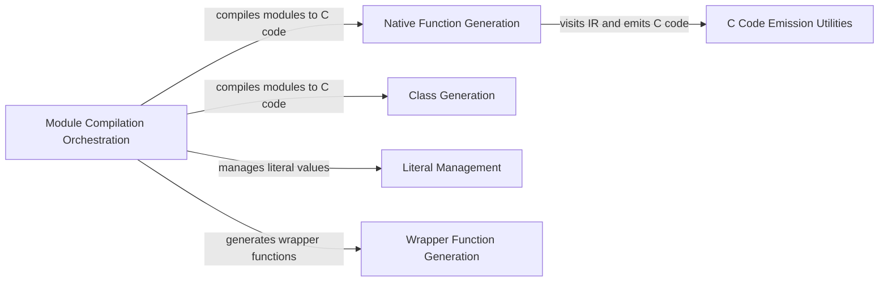

## Component Details

The C Code Generation component is responsible for translating the MyPyc intermediate representation (IR) into compilable C code. This process involves orchestrating the compilation of modules, generating C code for functions and classes, managing literal values, and creating wrapper functions for seamless interaction between Python and the compiled C code. The generated C code is then compiled into a native executable or library, enabling efficient execution of Python code.

### Module Compilation Orchestration
This component manages the overall process of compiling multiple modules into C code. It takes the IR of a module and translates it into C code, generating declarations for globals, internal globals, modules, imports, and finals. It also handles the generation of native functions and classes.
- **Related Classes/Methods**: `mypyc.codegen.emitmodule:compile_modules_to_c`, `mypyc.codegen.emitmodule:compile_ir_to_c`, `mypyc.codegen.emitmodule.GroupGenerator:generate_c_for_modules`

### Native Function Generation
This component focuses on generating C code for individual native functions. It converts the function's IR into corresponding C code, utilizing a visitor pattern to traverse the IR and emit the appropriate C code constructs.
- **Related Classes/Methods**: `mypyc.codegen.emitfunc:generate_native_function`, `mypyc.codegen.emitfunc.FunctionEmitterVisitor`

### Class Generation
This component is responsible for generating C code for classes, including their type declarations, object structs, vtables, constructors, and methods for garbage collection. It ensures that classes are properly represented in the generated C code.
- **Related Classes/Methods**: `mypyc.codegen.emitclass:generate_class`

### Literal Management
This component manages the encoding and storage of literal values (strings, integers, floats, etc.) used in the generated C code. It ensures that literals are properly represented and accessible in the generated C code.
- **Related Classes/Methods**: `mypyc.codegen.literals.Literals`

### C Code Emission Utilities
This component provides utility functions for emitting C code, such as emitting lines, labels, and printf statements. It also handles type conversions and error checking, providing a convenient interface for generating C code.
- **Related Classes/Methods**: `mypyc.codegen.emit.Emitter`

### Wrapper Function Generation
This component generates wrapper functions to handle the interface between Python and the compiled C code. These wrappers facilitate communication and data exchange between the two environments.
- **Related Classes/Methods**: `mypyc.codegen.emitwrapper:generate_wrapper_function`
