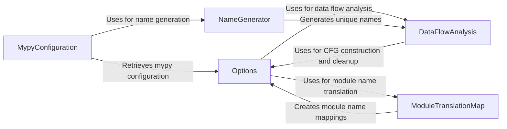

## Component Details

The Compiler Configuration and Utilities component provides the necessary tools and settings to configure and manage the compilation process in mypyc. It encompasses functionalities for setting compiler options, generating unique names for variables and functions, performing data flow analysis for optimization, and managing module dependencies. This component ensures that the compilation process is tailored to the specific needs of the project and that the generated code is efficient and correct.

### Options
The Options component encapsulates compiler settings, allowing users to customize the compilation process. It supports snapshotting, comparing, and applying changes to options, as well as building per-module caches and cloning options for specific modules. This component provides a flexible way to manage compiler behavior.
- **Related Classes/Methods**: `mypyc.options`

### NameGenerator
The NameGenerator component is responsible for generating unique names for variables, functions, and other entities within the compiled code. This prevents naming conflicts and ensures that the generated C code is valid. It provides methods for generating both public and private names, catering to different visibility requirements.
- **Related Classes/Methods**: `mypyc.namegen`

### DataFlowAnalysis
The DataFlowAnalysis component performs data flow analysis to construct and clean up the Control Flow Graph (CFG) for a given function or code block. The CFG represents the flow of execution within the code and is used for various optimization and analysis passes. This component is crucial for improving the efficiency and correctness of the compiled code.
- **Related Classes/Methods**: `mypyc.analysis.dataflow`

### ModuleTranslationMap
The ModuleTranslationMap component creates a mapping between module names and their corresponding translated names in the compiled code. This is important for managing module dependencies and ensuring that modules can be correctly imported and used within the compiled program. It facilitates the integration of different modules within the compiled application.
- **Related Classes/Methods**: `mypyc.namegen`

### MypyConfiguration
The MypyConfiguration component retrieves the mypy configuration settings used for compilation. This component is responsible for reading and parsing the mypy configuration file and extracting relevant settings for the mypyc compiler. It ensures that the compilation process is consistent with the mypy type checking settings.
- **Related Classes/Methods**: `mypy.mypyc.build`
