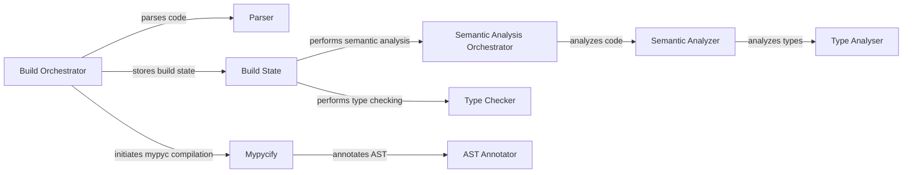

## Component Details

The Frontend Processing component of mypyc encompasses the initial stages of compilation, transforming Python source code into an optimized C representation. It begins with parsing the code into an Abstract Syntax Tree (AST), followed by semantic analysis to resolve names and perform type checking. The type checking phase leverages mypy to ensure type consistency and infer types where necessary. Finally, the AST is annotated with information required for code generation, such as native types and function signatures, preparing it for the subsequent code generation phase.

### Parser
The Parser component is responsible for transforming Python source code into an Abstract Syntax Tree (AST). It utilizes a fast parsing approach to improve performance. The AST serves as the foundation for subsequent semantic analysis and type checking phases.
- **Related Classes/Methods**: `mypy.mypy.fastparse:parse`, `mypy.mypy.fastparse.ASTConverter:visit_Module`

### Semantic Analyzer
The Semantic Analyzer component performs semantic analysis on the AST, resolving names, checking for undefined variables, and performing other semantic checks. It traverses the AST and builds a symbol table, which maps names to their corresponding declarations. This component ensures that the code is semantically correct and prepares it for type checking.
- **Related Classes/Methods**: `mypy.mypy.semanal.SemanticAnalyzer:__init__`, `mypy.mypy.semanal.SemanticAnalyzer:visit_func_def`, `mypy.mypy.semanal.SemanticAnalyzer:visit_class_def`, `mypy.mypy.semanal.SemanticAnalyzer:visit_import`

### Type Checker
The Type Checker component is responsible for performing type checking on the AST. It traverses the AST and checks whether the types of expressions are consistent with their declared types. It also infers types for expressions that do not have explicit type annotations. This component ensures that the code is type-safe and prepares it for code generation.
- **Related Classes/Methods**: `mypy.mypy.checker.TypeChecker:__init__`, `mypy.mypy.checker.TypeChecker:check_first_pass`, `mypy.mypy.checker.TypeChecker:check_second_pass`

### Type Analyser
The Type Analyser component analyzes type aliases, resolving them to their underlying types. It traverses the AST and resolves type annotations, checking for errors and inferring types. This component ensures that type aliases are correctly resolved and prepares them for type checking.
- **Related Classes/Methods**: `mypy.mypy.typeanal.TypeAnalyser:visit_unbound_type`, `mypy.mypy.typeanal.TypeAnalyser:visit_callable_type`

### AST Annotator
The AST Annotator component annotates the AST with information needed for mypyc code generation, such as native types and function signatures. It traverses the AST and adds annotations that guide the code generation process. This component prepares the AST for the final code generation phase.
- **Related Classes/Methods**: `mypy.mypyc.annotate.ASTAnnotateVisitor:visit_func_def`, `mypy.mypyc.annotate.ASTAnnotateVisitor:visit_class_def`, `mypy.mypyc.annotate.ASTAnnotateVisitor:visit_call_expr`

### Build Orchestrator
The Build Orchestrator component manages the entire build process, coordinating the parsing, semantic analysis, type checking, and code generation phases. It creates and manages the State object, which stores the state of a single module during the build process. This component ensures that all phases of the build process are executed in the correct order.
- **Related Classes/Methods**: `mypy.mypy.build:build`, `mypy.mypy.build:_build`

### Build State
The Build State component represents the state of a single module during the build process, storing the parsed AST, symbol table, and type information. It manages different passes of semantic analysis and type checking. This component provides a central repository for all information related to a module during the build process.
- **Related Classes/Methods**: `mypy.mypy.build.State:parse_file`, `mypy.mypy.build.State:semantic_analysis_pass1`, `mypy.mypy.build.State:type_check_first_pass`

### Semantic Analysis Orchestrator
The Semantic Analysis Orchestrator component performs semantic analysis on a strongly connected component (SCC) of modules, resolving names, checking for undefined variables, and performing other semantic checks. It ensures that semantic analysis is performed correctly for modules with dependencies on each other.
- **Related Classes/Methods**: `mypy.mypy.semanal_main:semantic_analysis_for_scc`, `mypy.mypy.semanal_main:semantic_analysis_for_targets`

### Mypycify
The Mypycify component initiates the mypyc compilation process, transforming mypy's internal representation into C code. It serves as the entry point for the mypyc compiler and coordinates the various phases of code generation.
- **Related Classes/Methods**: `mypy.mypyc.build:mypycify`, `mypy.mypyc.build:mypyc_build`
