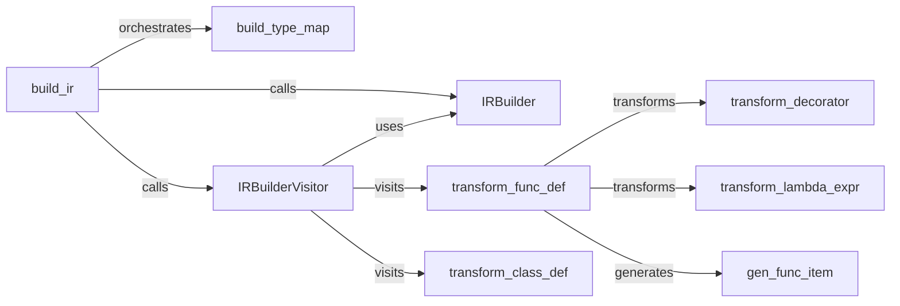

## Component Details

The IR Management component is responsible for translating the Abstract Syntax Tree (AST) into an Intermediate Representation (IR). This IR serves as a lower-level, more optimized representation of the source code, facilitating subsequent optimization and compilation stages. The process begins with building a type map, which associates AST nodes with their corresponding types. An IR builder visitor then traverses the AST, leveraging an IR builder to generate IR instructions. Function and class definitions are transformed into their IR equivalents, with decorators and lambda expressions also being handled. The resulting IR consists of modules, functions, classes, and various operations, providing a structured and efficient representation of the original code.

### build_ir
This component serves as the entry point for the IR building process. It orchestrates the entire process, from preparing the type map to traversing the AST and generating the IR.
- **Related Classes/Methods**: `mypyc.irbuild.main:build_ir`

### build_type_map
This component constructs a type map, which is a mapping from AST nodes to their corresponding types. This map is crucial for the IR generation process, as it provides type information necessary for creating accurate IR instructions.
- **Related Classes/Methods**: `mypyc.irbuild.prepare:build_type_map`

### IRBuilderVisitor
This component implements the visitor pattern to traverse the AST. As it visits each node, it uses the IRBuilder to generate the corresponding IR code. It handles different types of nodes, such as imports, function definitions, and class definitions.
- **Related Classes/Methods**: `mypyc.irbuild.visitor.IRBuilderVisitor:visit_import`, `mypyc.irbuild.visitor.IRBuilderVisitor:visit_import_from`, `mypyc.irbuild.visitor.IRBuilderVisitor:visit_import_all`, `mypyc.irbuild.visitor.IRBuilderVisitor:visit_func_def`, `mypyc.irbuild.visitor.IRBuilderVisitor:visit_class_def`

### IRBuilder
This component provides the core functionality for constructing IR code. It offers a wide range of methods for generating different types of IR instructions, such as assignments, calls, and operations on various data types. It also manages the current module and block being built.
- **Related Classes/Methods**: `mypyc.irbuild.builder.IRBuilder:set_module`, `mypyc.irbuild.builder.IRBuilder:add`, `mypyc.irbuild.builder.IRBuilder:goto`, `mypyc.irbuild.builder.IRBuilder:activate_block`, `mypyc.irbuild.builder.IRBuilder:goto_and_activate`, `mypyc.irbuild.builder.IRBuilder:self`, `mypyc.irbuild.builder.IRBuilder:py_get_attr`, `mypyc.irbuild.builder.IRBuilder:load_str`, `mypyc.irbuild.builder.IRBuilder:load_bytes_from_str_literal`, `mypyc.irbuild.builder.IRBuilder:load_int`, `mypyc.irbuild.builder.IRBuilder:load_float`, `mypyc.irbuild.builder.IRBuilder:unary_op`, `mypyc.irbuild.builder.IRBuilder:binary_op`, `mypyc.irbuild.builder.IRBuilder:coerce`, `mypyc.irbuild.builder.IRBuilder:none_object`, `mypyc.irbuild.builder.IRBuilder:none`, `mypyc.irbuild.builder.IRBuilder:true`, `mypyc.irbuild.builder.IRBuilder:false`, `mypyc.irbuild.builder.IRBuilder:new_list_op`, `mypyc.irbuild.builder.IRBuilder:new_set_op`, `mypyc.irbuild.builder.IRBuilder:translate_is_op`, `mypyc.irbuild.builder.IRBuilder:py_call`, `mypyc.irbuild.builder.IRBuilder:add_bool_branch`, `mypyc.irbuild.builder.IRBuilder:load_native_type_object`, `mypyc.irbuild.builder.IRBuilder:gen_method_call`, `mypyc.irbuild.builder.IRBuilder:load_module`, `mypyc.irbuild.builder.IRBuilder:call_c`, `mypyc.irbuild.builder.IRBuilder:primitive_op`, `mypyc.irbuild.builder.IRBuilder:int_op`, `mypyc.irbuild.builder.IRBuilder:compare_tuples`, `mypyc.irbuild.builder.IRBuilder:builtin_len`, `mypyc.irbuild.builder.IRBuilder:new_tuple`, `mypyc.irbuild.builder.IRBuilder:debug_print`, `mypyc.irbuild.builder.IRBuilder:add_to_non_ext_dict`, `mypyc.irbuild.builder.IRBuilder:gen_import`, `mypyc.irbuild.builder.IRBuilder:check_if_module_loaded`, `mypyc.irbuild.builder.IRBuilder:get_module`, `mypyc.irbuild.builder.IRBuilder:get_module_attr`, `mypyc.irbuild.builder.IRBuilder:assign_if_null`, `mypyc.irbuild.builder.IRBuilder:assign_if_bitmap_unset`, `mypyc.irbuild.builder.IRBuilder:maybe_add_implicit_return`, `mypyc.irbuild.builder.IRBuilder:add_implicit_return`, `mypyc.irbuild.builder.IRBuilder:add_implicit_unreachable`, `mypyc.irbuild.builder.IRBuilder:disallow_class_assignments`, `mypyc.irbuild.builder.IRBuilder:top_level_fn_info`, `mypyc.irbuild.builder.IRBuilder:init_final_static`, `mypyc.irbuild.builder.IRBuilder:load_final_static`, `mypyc.irbuild.builder.IRBuilder:init_type_var`, `mypyc.irbuild.builder.IRBuilder:load_type_var`, `mypyc.irbuild.builder.IRBuilder:load_literal_value`, `mypyc.irbuild.builder.IRBuilder:get_assignment_target`, `mypyc.irbuild.builder.IRBuilder:read`, `mypyc.irbuild.builder.IRBuilder:assign`, `mypyc.irbuild.builder.IRBuilder:coerce_rvalue`, `mypyc.irbuild.builder.IRBuilder:process_sequence_assignment`, `mypyc.irbuild.builder.IRBuilder:process_iterator_tuple_assignment_helper`, `mypyc.irbuild.builder.IRBuilder:process_iterator_tuple_assignment`, `mypyc.irbuild.builder.IRBuilder:push_loop_stack`, `mypyc.irbuild.builder.IRBuilder:make_spill_target`, `mypyc.irbuild.builder.IRBuilder:spill`, `mypyc.irbuild.builder.IRBuilder:maybe_spill`, `mypyc.irbuild.builder.IRBuilder:maybe_spill_assignable`, `mypyc.irbuild.builder.IRBuilder:get_sequence_type`, `mypyc.irbuild.builder.IRBuilder:get_sequence_type_from_type`, `mypyc.irbuild.builder.IRBuilder:get_dict_base_type`, `mypyc.irbuild.builder.IRBuilder:get_dict_base_type_from_type`, `mypyc.irbuild.builder.IRBuilder:get_dict_key_type`, `mypyc.irbuild.builder.IRBuilder:get_dict_value_type`, `mypyc.irbuild.builder.IRBuilder:get_dict_item_type`, `mypyc.irbuild.builder.IRBuilder:_analyze_iterable_item_type`, `mypyc.irbuild.builder.IRBuilder:get_final_ref`, `mypyc.irbuild.builder.IRBuilder:emit_load_final`, `mypyc.irbuild.builder.IRBuilder:call_refexpr_with_args`, `mypyc.irbuild.builder.IRBuilder:shortcircuit_expr`, `mypyc.irbuild.builder.IRBuilder:flatten_classes`, `mypyc.irbuild.builder.IRBuilder:enter`, `mypyc.irbuild.builder.IRBuilder:enter_method`, `mypyc.irbuild.builder.IRBuilder:add_argument`, `mypyc.irbuild.builder.IRBuilder:add_local`, `mypyc.irbuild.builder.IRBuilder:add_local_reg`, `mypyc.irbuild.builder.IRBuilder:add_self_to_env`, `mypyc.irbuild.builder.IRBuilder:node_type`, `mypyc.irbuild.builder.IRBuilder:add_var_to_env_class`, `mypyc.irbuild.builder.IRBuilder:load_global`, `mypyc.irbuild.builder.IRBuilder:load_global_str`, `mypyc.irbuild.builder.IRBuilder:load_globals_dict`, `mypyc.irbuild.builder.IRBuilder:load_module_attr_by_fullname`, `mypyc.irbuild.builder.IRBuilder:is_native_attr_ref`, `mypyc.irbuild.builder.IRBuilder:catch_errors`, `mypyc.irbuild.builder.IRBuilder:add_function`

### transform_func_def
This component transforms a function definition AST node into its corresponding IR representation. It handles aspects such as decorators, lambda expressions, and the function body itself.
- **Related Classes/Methods**: `mypyc.irbuild.function:transform_func_def`

### transform_class_def
This component transforms a class definition AST node into its corresponding IR representation. It handles the class body, methods, and attributes.
- **Related Classes/Methods**: `mypyc.irbuild.classdef:transform_class_def`

### transform_decorator
This component transforms a decorator applied to a function into its corresponding IR representation. It essentially wraps the function with the decorator's logic.
- **Related Classes/Methods**: `mypyc.irbuild.function:transform_decorator`

### transform_lambda_expr
This component transforms a lambda expression into its corresponding IR representation. It creates a function-like IR structure for the lambda expression.
- **Related Classes/Methods**: `mypyc.irbuild.function:transform_lambda_expr`

### gen_func_item
This component generates the actual function item in the IR, including its code and metadata. It is responsible for creating the IR representation of the function's body and signature.
- **Related Classes/Methods**: `mypyc.irbuild.function:gen_func_item`
