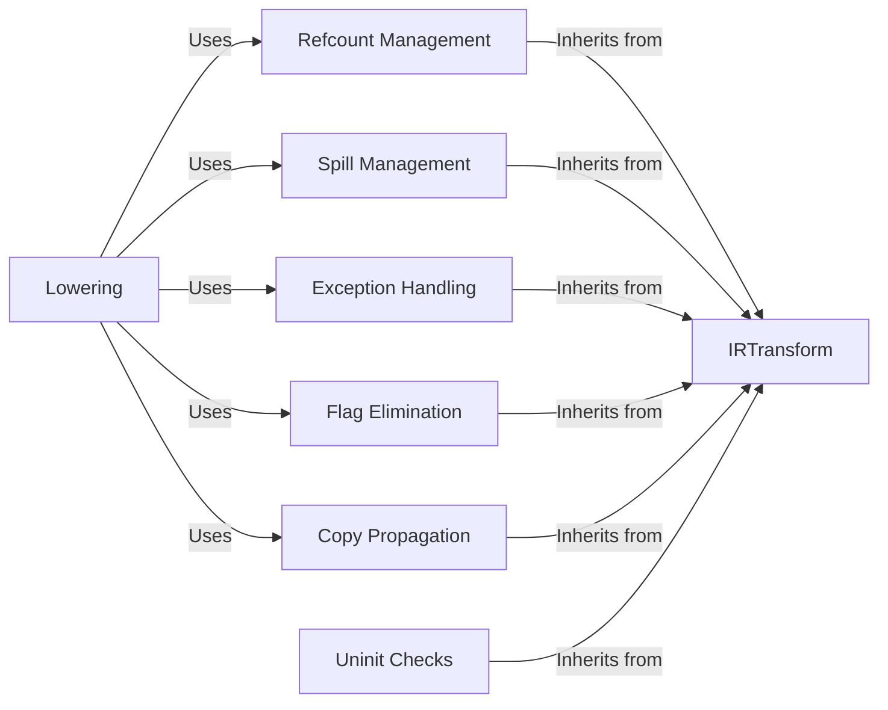

## Component Details

The IR Optimization and Lowering component in mypyc transforms the intermediate representation (IR) of Python code to improve its efficiency and prepare it for code generation. This involves several key steps, including managing object reference counts, handling register spilling, inserting exception handling logic, eliminating unnecessary flag variables, performing copy propagation, and lowering the IR to a more primitive form. These transformations work together to optimize memory management, reduce register usage, simplify control flow, and convert high-level operations into simpler, more basic operations, ultimately leading to more efficient and maintainable generated code.

### IRTransform
The base class for all IR transformations. It provides a framework for traversing and modifying the IR blocks and instructions. All specific transformations inherit from this class, implementing the core logic for modifying the IR.
- **Related Classes/Methods**: `mypyc.transform.ir_transform.IRTransform`

### Refcount Management
Manages reference counting for objects to ensure proper memory management. It inserts increment and decrement reference count operations at appropriate points in the code, preventing memory leaks and ensuring that objects are deallocated when they are no longer needed.
- **Related Classes/Methods**: `mypyc.transform.refcount`

### Spill Management
Handles register spilling, which involves moving values from registers to memory when there are not enough registers available. This transformation ensures that the code can be executed even with limited registers, preventing register exhaustion and maintaining program correctness.
- **Related Classes/Methods**: `mypyc.transform.spill`

### Exception Handling
Inserts exception handling logic into the code. This includes adding default exception handlers and splitting blocks to handle errors effectively, ensuring that exceptions are caught and handled gracefully, preventing program crashes and providing informative error messages.
- **Related Classes/Methods**: `mypyc.transform.exceptions`

### Flag Elimination
Eliminates unnecessary flag variables by analyzing and simplifying conditional branches. This optimization reduces the number of variables and improves code efficiency, simplifying control flow and reducing the overhead associated with flag variables.
- **Related Classes/Methods**: `mypyc.transform.flag_elimination`

### Copy Propagation
Performs copy propagation, which replaces variables with their values when possible. This optimization reduces the number of variables and improves code efficiency, simplifying expressions and reducing the number of memory accesses.
- **Related Classes/Methods**: `mypyc.transform.copy_propagation`

### Lowering
Lowers the IR to a more primitive form, making it easier to generate machine code. This transformation involves converting high-level operations into simpler, more basic operations, simplifying code generation and improving the efficiency of the generated code.
- **Related Classes/Methods**: `mypyc.transform.lower`

### Uninit Checks
Inserts checks for uninitialized variables to prevent errors. This transformation splits blocks and uses bitmaps to track the initialization status of variables, ensuring that variables are initialized before they are used, preventing undefined behavior and improving program reliability.
- **Related Classes/Methods**: `mypyc.transform.uninit`
