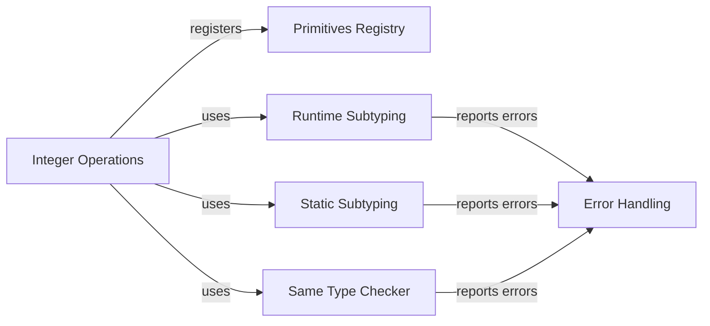

## Component Details

The Runtime Environment component in mypyc provides the foundational support for executing the generated C code. It encompasses primitive operations, type system functionalities (including subtyping and sameness checks), and error handling mechanisms. These elements work together to ensure the reliable and efficient execution of code produced by the mypyc compiler.

### Primitives Registry
The Primitives Registry is responsible for managing and providing access to primitive operations used by mypyc. It allows registration of primitive operations based on their kind (method, function, binary, unary, custom) and provides a mechanism to retrieve them during code generation. This ensures that the correct primitive operations are used for specific tasks.
- **Related Classes/Methods**: `mypyc.primitives.registry`

### Integer Operations
The Integer Operations component defines and registers primitive operations specifically for integer types. This includes binary operations (addition, subtraction, etc.) and unary operations (negation, etc.). By registering these operations with the Primitives Registry, they become available for use during code generation when dealing with integer types.
- **Related Classes/Methods**: `mypyc.primitives.int_ops`

### Runtime Subtyping
The Runtime Subtyping component implements runtime checks to determine if one type is a subtype of another. This is crucial for ensuring type safety during program execution, especially when dealing with inheritance and polymorphism. It provides functions and a visitor class to perform these checks at runtime.
- **Related Classes/Methods**: `mypyc.rt_subtype`

### Static Subtyping
The Static Subtyping component performs subtyping checks during compilation. It determines if one type is a subtype of another based on static type information. This helps catch type errors early in the development process and ensures type compatibility before runtime.
- **Related Classes/Methods**: `mypyc.subtype`

### Same Type Checker
The Same Type Checker component provides functions for determining if two types are identical. It includes functions for comparing types, signatures, and method signatures. This is used in various parts of the compiler to ensure that types match where required.
- **Related Classes/Methods**: `mypyc.sametype`

### Error Handling
The Error Handling component manages error reporting during mypyc compilation. It provides methods for adding errors, notes, and warnings, as well as for managing the error message queue. This ensures that errors are reported consistently and provides useful information to the user.
- **Related Classes/Methods**: `mypyc.errors`
