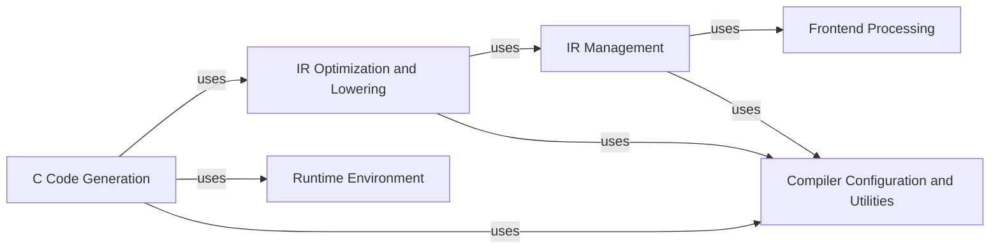

## Component Details

The mypyc compiler translates Python code into optimized C code. The process begins with parsing and type-checking the Python code, followed by constructing an intermediate representation (IR). This IR undergoes several optimization passes before being lowered to a C-like representation. Finally, C code is generated from the lowered IR, which can then be compiled into a native executable or library. The compiler utilizes runtime support components for primitive operations, type system, and error handling.

### Frontend Processing
This component encompasses the initial stages of compilation, including parsing Python code into an Abstract Syntax Tree (AST) and performing type checking. It ensures the code's syntactic correctness and gathers type information, which is crucial for subsequent optimization and code generation steps. It leverages the standard mypy library for type checking.
- **Related Classes/Methods**: `mypyc.annotate`, `mypy`

### IR Management
This component focuses on constructing and managing the Intermediate Representation (IR) of the code. It translates the annotated AST into a lower-level representation that is easier to optimize and compile. It defines the data structures and operations used in the IR, such as modules, functions, classes, and various operations like assignments and calls.
- **Related Classes/Methods**: `mypyc.irbuild`, `mypyc.ir`, `mypyc.ir.class_ir`, `mypyc.ir.func_ir`, `mypyc.ir.module_ir`, `mypyc.ir.ops`, `mypyc.ir.rtypes`

### IR Optimization and Lowering
This component optimizes the IR through various transformations, such as reference counting, spill insertion, and exception handling. It also lowers the IR to a level closer to C code by replacing high-level operations with more primitive ones, simplifying code generation and improving efficiency.
- **Related Classes/Methods**: `mypyc.transform`, `mypyc.lower`

### C Code Generation
This component generates C code from the transformed IR. It includes emitting C code for classes, functions, and modules, as well as handling literals and wrappers. The generated C code is then compiled into a native executable or library.
- **Related Classes/Methods**: `mypyc.codegen`

### Runtime Environment
This component provides the necessary runtime support for the generated C code. It includes definitions for primitive operations, the type system, and error handling. These elements ensure the correct and efficient execution of the generated code.
- **Related Classes/Methods**: `mypyc.primitives`, `mypyc.rt_subtype`, `mypyc.sametype`, `mypyc.subtype`, `mypyc.errors`

### Compiler Configuration and Utilities
This component manages compiler options, such as the target directory and verbosity level, allowing users to customize the compilation process. It also includes utilities for data flow analysis and name generation, which are used during optimization and code generation.
- **Related Classes/Methods**: `mypyc.options`, `mypyc.analysis`, `mypyc.namegen`