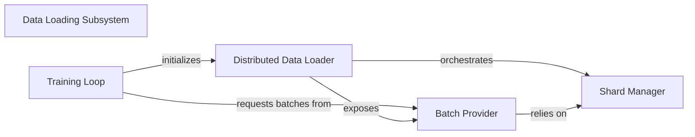

## Details

The `Data Loader` subsystem is crucial for efficiently preparing and delivering tokenized data, especially in distributed training environments. It adheres to the project's architectural bias towards simplicity and modularity within a monolithic structure.

### Data Loading Subsystem
This subsystem is dedicated to efficiently loading, sharding, and batching tokenized data, primarily for distributed training environments. It acts as the crucial interface between raw data and the training pipeline.

**Related Classes/Methods**:

- <a href="https://github.com/karpathy/nano-llama31/blob/master/llama31.py#L587-L644" target="_blank" rel="noopener noreferrer">`llama31.DistributedShardedDataLoader`:587-644</a>

### Distributed Data Loader
The central orchestrator for data loading, sharding, and distribution. It manages the overall data flow, including initialization and state management for distributed data access.

**Related Classes/Methods**:

- <a href="https://github.com/karpathy/nano-llama31/blob/master/llama31.py#L587-L644" target="_blank" rel="noopener noreferrer">`llama31.DistributedShardedDataLoader`:587-644</a>
- <a href="https://github.com/karpathy/nano-llama31/blob/master/llama31.py#L596-L617" target="_blank" rel="noopener noreferrer">`llama31.__init__`:596-617</a>
- <a href="https://github.com/karpathy/nano-llama31/blob/master/llama31.py#L619-L625" target="_blank" rel="noopener noreferrer">`llama31.reset`:619-625</a>

### Batch Provider
Provides the public interface for consumers (e.g., the training loop) to retrieve the next batch of tokenized data. It abstracts the underlying data sharding and loading mechanisms.

**Related Classes/Methods**:

- <a href="https://github.com/karpathy/nano-llama31/blob/master/llama31.py#L632-L644" target="_blank" rel="noopener noreferrer">`llama31.next_batch`:632-644</a>

### Shard Manager
Manages the internal progression of the data loading process, ensuring new data shards are loaded as needed and handling the low-level operations of reading data from storage.

**Related Classes/Methods**:

- <a href="https://github.com/karpathy/nano-llama31/blob/master/llama31.py#L627-L630" target="_blank" rel="noopener noreferrer">`llama31.advance`:627-630</a>
- <a href="https://github.com/karpathy/nano-llama31/blob/master/llama31.py#L575-L585" target="_blank" rel="noopener noreferrer">`llama31._load_data_shard`:575-585</a>
- <a href="https://github.com/karpathy/nano-llama31/blob/master/llama31.py#L563-L573" target="_blank" rel="noopener noreferrer">`llama31._peek_data_shard`:563-573</a>

### Training Loop
Represents the main training execution flow that interacts with the Data Loader to fetch data batches for model training. It drives the consumption of data.

**Related Classes/Methods**:

- <a href="https://github.com/karpathy/nano-llama31/blob/master/llama31.py#L649-L717" target="_blank" rel="noopener noreferrer">`llama31.main`:649-717</a>

### [FAQ](https://github.com/CodeBoarding/GeneratedOnBoardings/tree/main?tab=readme-ov-file#faq)