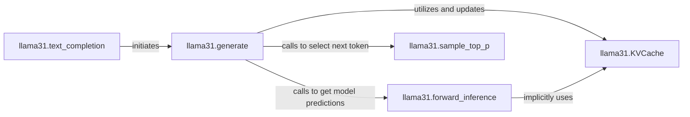

## Details

This subsystem focuses on the core text generation capabilities of the `nano-llama31` project, primarily handling the inference process from user request to token sampling. The components are tightly coupled within the `llama31.py` module, orchestrating the sequential generation of text by leveraging the Llama model's forward pass and efficient caching mechanisms.

### llama31.text_completion
Serves as the primary user-facing API for initiating text generation. It abstracts the complexities of the underlying generation process, providing a simplified interface for users to obtain text completions from the Llama model.

**Related Classes/Methods**:

- <a href="https://github.com/karpathy/nano-llama31/blob/master/llama31.py#L524-L548" target="_blank" rel="noopener noreferrer">`llama31.text_completion`:524-548</a>

### llama31.generate
This is the orchestrator of the text generation process. It manages the iterative loop of predicting and selecting new tokens, coordinating the model's forward passes and applying sampling strategies until a completion condition is met.

**Related Classes/Methods**:

- <a href="https://github.com/karpathy/nano-llama31/blob/master/llama31.py#L428-L522" target="_blank" rel="noopener noreferrer">`llama31.generate`:428-522</a>

### llama31.forward_inference
Executes a single forward pass of the Llama model for inference. It processes input tokens, applies token embeddings, handles rotational positional embeddings (`freqs_cis`), constructs attention masks for sequential decoding, and propagates the input through the model's transformer layers. Finally, it applies normalization and the output layer to produce logits for the next token. This component is the core computational step for generating predictions.

**Related Classes/Methods**:

- <a href="https://github.com/karpathy/nano-llama31/blob/master/llama31.py#L285-L308" target="_blank" rel="noopener noreferrer">`llama31.forward_inference`:285-308</a>

### llama31.KVCache
An optimization component crucial for efficient sequential decoding. It stores and reuses previously computed key-value states for the attention mechanism across different decoding steps, significantly preventing redundant calculations and improving inference speed.

**Related Classes/Methods**:

- <a href="https://github.com/karpathy/nano-llama31/blob/master/llama31.py#L141-L154" target="_blank" rel="noopener noreferrer">`llama31.KVCache`:141-154</a>

### llama31.sample_top_p
Implements the Top-P (nucleus) sampling strategy to select the next token. It sorts the predicted token probabilities, identifies the smallest set of tokens whose cumulative probability exceeds `p`, discards the rest, re-normalizes the probabilities of the selected tokens, and then samples one token from this reduced set using multinomial sampling. This ensures diverse yet coherent text generation.

**Related Classes/Methods**:

- <a href="https://github.com/karpathy/nano-llama31/blob/master/llama31.py#L550-L558" target="_blank" rel="noopener noreferrer">`llama31.sample_top_p`:550-558</a>

### [FAQ](https://github.com/CodeBoarding/GeneratedOnBoardings/tree/main?tab=readme-ov-file#faq)