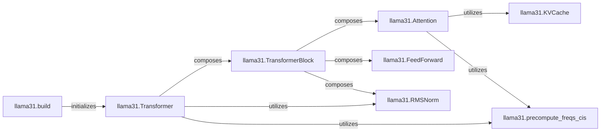

## Details

The `Llama Model Core` subsystem defines the fundamental architecture and computational logic of the Llama 3.1 model, including its layers and forward pass. It is primarily encapsulated within the `llama31.py` file.

### llama31.Transformer
The overarching component representing the complete Llama 3.1 model. It orchestrates token embeddings, multiple transformer layers, normalization, and the final output projection. It provides distinct forward pass methods for inference and training.

**Related Classes/Methods**:

- <a href="https://github.com/karpathy/nano-llama31/blob/master/llama31.py#L264-L373" target="_blank" rel="noopener noreferrer">`llama31.Transformer`:264-373</a>

### llama31.TransformerBlock
Represents a single, self-contained transformer layer within the `llama31.Transformer` model. It encapsulates the attention and feed-forward mechanisms, along with normalization.

**Related Classes/Methods**:

- <a href="https://github.com/karpathy/nano-llama31/blob/master/llama31.py#L237-L262" target="_blank" rel="noopener noreferrer">`llama31.TransformerBlock`:237-262</a>

### llama31.Attention
Implements the multi-head attention mechanism, a core component of the transformer architecture. It handles query, key, and value projections, applies rotary positional embeddings, and computes attention scores.

**Related Classes/Methods**:

- <a href="https://github.com/karpathy/nano-llama31/blob/master/llama31.py" target="_blank" rel="noopener noreferrer">`llama31.Attention`</a>

### llama31.FeedForward
Implements the position-wise feed-forward neural network within each transformer block. It consists of linear transformations and activation functions.

**Related Classes/Methods**:

- <a href="https://github.com/karpathy/nano-llama31/blob/master/llama31.py#L216-L235" target="_blank" rel="noopener noreferrer">`llama31.FeedForward`:216-235</a>

### llama31.RMSNorm
Applies Root Mean Square Normalization to model activations, a technique used to stabilize training and improve performance.

**Related Classes/Methods**:

- <a href="https://github.com/karpathy/nano-llama31/blob/master/llama31.py#L64-L75" target="_blank" rel="noopener noreferrer">`llama31.RMSNorm`:64-75</a>

### llama31.KVCache
A utility component that stores and manages the key and value states from previous attention computations. This is crucial for optimizing sequential token processing during inference, preventing redundant calculations.

**Related Classes/Methods**:

- <a href="https://github.com/karpathy/nano-llama31/blob/master/llama31.py#L141-L154" target="_blank" rel="noopener noreferrer">`llama31.KVCache`:141-154</a>

### llama31.precompute_freqs_cis
A function responsible for precomputing the frequency values for rotary positional embeddings (RoPE). These frequencies are then applied within the attention mechanism to inject positional information.

**Related Classes/Methods**:

- <a href="https://github.com/karpathy/nano-llama31/blob/master/llama31.py#L100-L108" target="_blank" rel="noopener noreferrer">`llama31.precompute_freqs_cis`:100-108</a>

### llama31.build
A top-level function responsible for initializing and configuring a `llama31.Transformer` model instance based on provided model arguments.

**Related Classes/Methods**:

- <a href="https://github.com/karpathy/nano-llama31/blob/master/llama31.py#L380-L422" target="_blank" rel="noopener noreferrer">`llama31.build`:380-422</a>

### [FAQ](https://github.com/CodeBoarding/GeneratedOnBoardings/tree/main?tab=readme-ov-file#faq)