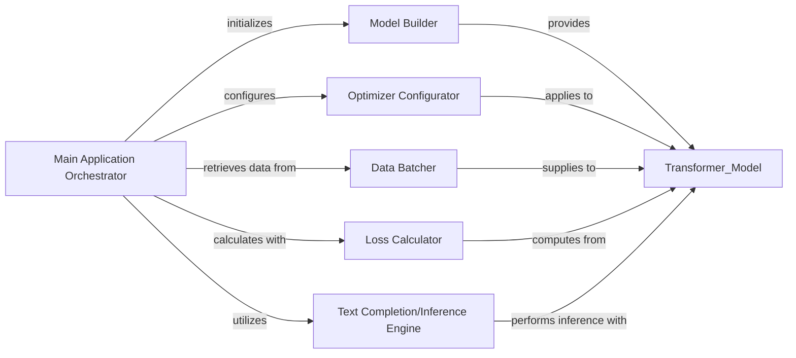

## Details

The `llama31` application is structured around a central `Main Application Orchestrator` that manages the entire lifecycle, from model initialization and data loading to training and inference. It leverages a `Model Builder` to construct the Llama 3.1 architecture, an `Optimizer Configurator` for setting up the training algorithm, and a `Data Batcher` for efficient data handling. During training, a `Loss Calculator` quantifies model performance, while the `Text Completion/Inference Engine` handles text generation. This modular design ensures clear separation of concerns and facilitates maintainability and scalability.

### Main Application Orchestrator
The central control flow for the `llama31` application, coordinating the entire application lifecycle. This includes model building, initialization, data handling, training loop execution, and inference. It acts as the primary orchestrator, directing the flow between various sub-components.

**Related Classes/Methods**:

- <a href="https://github.com/karpathy/nano-llama31/blob/master/llama31.py#L649-L717" target="_blank" rel="noopener noreferrer">`llama31.main`:649-717</a>

### Model Builder
Responsible for constructing and initializing the Llama 3.1 model architecture, including loading pre-trained weights and setting up the tokenizer.

**Related Classes/Methods**:

- <a href="https://github.com/karpathy/nano-llama31/blob/master/llama31.py#L409-L422" target="_blank" rel="noopener noreferrer">`llama31.Llama.build`:409-422</a>

### Optimizer Configurator
Handles the setup and configuration of the optimization algorithm (e.g., AdamW) used during the model training process, integrating with the model's parameters.

**Related Classes/Methods**:

- <a href="https://github.com/karpathy/nano-llama31/blob/master/reference.py#L300-L317" target="_blank" rel="noopener noreferrer">`reference.Transformer.configure_optimizers`:300-317</a>

### Data Batcher
Manages the preparation and delivery of data in batches for training or inference, ensuring efficient data flow to the model, and handling distributed data loading.

**Related Classes/Methods**:

- <a href="https://github.com/karpathy/nano-llama31/blob/master/llama31.py#L587-L644" target="_blank" rel="noopener noreferrer">`llama31.DistributedShardedDataLoader`:587-644</a>

### Loss Calculator
Computes the loss value during training, quantifying the difference between the model's predictions and the actual targets, which guides the optimization process.

**Related Classes/Methods**:

- <a href="https://github.com/karpathy/nano-llama31/blob/master/reference.py#L290-L298" target="_blank" rel="noopener noreferrer">`reference.Transformer.forward_loss`:290-298</a>

### Text Completion/Inference Engine
Executes the forward pass of the trained model to generate text completions or perform other inference tasks, managing tokenization and decoding.

**Related Classes/Methods**:

- <a href="https://github.com/karpathy/nano-llama31/blob/master/llama31.py#L524-L548" target="_blank" rel="noopener noreferrer">`llama31.Llama.text_completion`:524-548</a>
- <a href="https://github.com/karpathy/nano-llama31/blob/master/llama31.py#L428-L522" target="_blank" rel="noopener noreferrer">`llama31.Llama.generate`:428-522</a>

### [FAQ](https://github.com/CodeBoarding/GeneratedOnBoardings/tree/main?tab=readme-ov-file#faq)