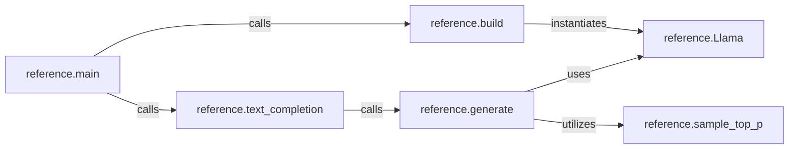

## Details

The `Reference Implementation` subsystem is a self-contained, simplified implementation of the Llama model for demonstration and comparative purposes. Its boundaries are defined by the `reference.py` file, specifically encompassing the `build`, `generate`, and `main` functions, along with the `Llama` model definition and utility functions like `sample_top_p`.

### reference.Llama
Encapsulates the architectural definition of the Llama model, including its layers, parameters, and the forward pass logic for processing input sequences and producing output logits.

**Related Classes/Methods**:

- <a href="https://github.com/karpathy/nano-llama31/blob/master/reference.py#L49-L298" target="_blank" rel="noopener noreferrer">`reference.Llama`:49-298</a>

### reference.build
Constructs and initializes an instance of the `reference.Llama` model. This involves setting up the model's architecture and potentially loading pre-trained weights, preparing it for text generation.

**Related Classes/Methods**:

- <a href="https://github.com/karpathy/nano-llama31/blob/master/reference.py#L50-L128" target="_blank" rel="noopener noreferrer">`reference.build`:50-128</a>

### reference.generate
Implements the core logic for autoregressive text generation. It takes a prompt and iteratively predicts the next token using the `reference.Llama` model, applying a sampling strategy (`reference.sample_top_p`) to select the next token.

**Related Classes/Methods**:

- <a href="https://github.com/karpathy/nano-llama31/blob/master/reference.py#L136-L245" target="_blank" rel="noopener noreferrer">`reference.generate`:136-245</a>

### reference.text_completion
Provides a higher-level, user-friendly interface for performing text completion tasks. It abstracts the direct call to the `generate` function, handling input and output formatting for text-based interactions.

**Related Classes/Methods**:

- <a href="https://github.com/karpathy/nano-llama31/blob/master/reference.py#L247-L298" target="_blank" rel="noopener noreferrer">`reference.text_completion`:247-298</a>

### reference.main
Serves as the primary entry point and orchestrator for the entire reference implementation. It coordinates the model setup and the text generation workflow, typically handling command-line arguments and initiating the process.

**Related Classes/Methods**:

- <a href="https://github.com/karpathy/nano-llama31/blob/master/reference.py#L325-L377" target="_blank" rel="noopener noreferrer">`reference.main`:325-377</a>

### reference.sample_top_p
Implements the top-p (nucleus) sampling method, a common technique used in text generation to select the next token from a dynamically sized vocabulary, influencing the diversity and coherence of the generated text.

**Related Classes/Methods**:

- <a href="https://github.com/karpathy/nano-llama31/blob/master/reference.py#L300-L322" target="_blank" rel="noopener noreferrer">`reference.sample_top_p`:300-322</a>

### [FAQ](https://github.com/CodeBoarding/GeneratedOnBoardings/tree/main?tab=readme-ov-file#faq)