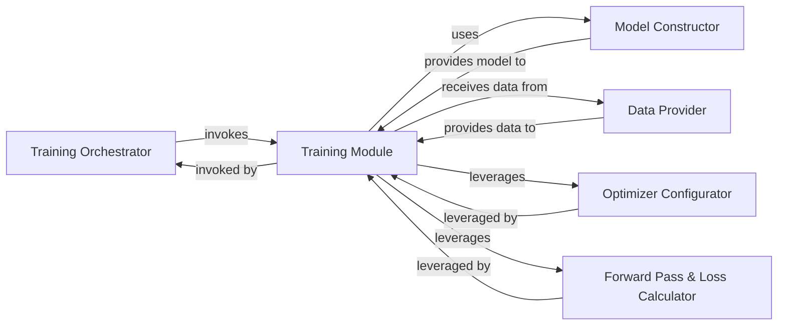

## Details

The `nano-llama31` project's core subsystem focuses on the implementation and training of a simplified Llama 3.1 model. This architecture is centered around the `Transformer` model, which handles the forward pass, loss calculation, and optimization configuration. The `Llama` class acts as a high-level interface for building and generating text using the `Transformer`. Data is prepared and provided by a `Tokenizer`, which converts raw text into numerical tokens suitable for model input. The training process involves an iterative loop where the `Training Module` (represented by the `Transformer`'s training methods) processes data provided by the `Data Provider`, calculates loss, and updates model weights with the help of the `Optimizer Configurator`.

### Training Orchestrator
Drives the overall training loop, managing the iterative process of training by repeatedly invoking the Training Module for each batch of data. While the full orchestration loop is external, the Transformer.forward_loss method represents the core computational step within each iteration.

**Related Classes/Methods**:

- <a href="https://github.com/karpathy/nano-llama31/blob/master/llama31.py#L310-L333" target="_blank" rel="noopener noreferrer">`llama31.Transformer.forward_loss`:310-333</a>

### Training Module [[Expand]](./Training_Module.md)
Orchestrates the core logic for a single training step. This includes configuring the optimizer, executing the model's forward pass, calculating the loss, and facilitating the backward pass for weight updates. It acts as the operational heart of the training loop.

**Related Classes/Methods**:

- <a href="https://github.com/karpathy/nano-llama31/blob/master/llama31.py#L335-L373" target="_blank" rel="noopener noreferrer">`llama31.Transformer.configure_optimizers`:335-373</a>
- <a href="https://github.com/karpathy/nano-llama31/blob/master/llama31.py#L310-L333" target="_blank" rel="noopener noreferrer">`llama31.Transformer.forward_loss`:310-333</a>

### Optimizer Configurator
Responsible for initializing and configuring the optimizer, which is a key internal dependency of the Training Module used to prepare for and apply weight updates based on gradients.

**Related Classes/Methods**:

- <a href="https://github.com/karpathy/nano-llama31/blob/master/llama31.py#L335-L373" target="_blank" rel="noopener noreferrer">`llama31.Transformer.configure_optimizers`:335-373</a>

### Forward Pass & Loss Calculator
Performs the crucial steps of running the model's forward pass to generate predictions and subsequently computing the loss based on these predictions and the target data. It acts as the core computational engine within a single training step.

**Related Classes/Methods**:

- <a href="https://github.com/karpathy/nano-llama31/blob/master/llama31.py#L310-L333" target="_blank" rel="noopener noreferrer">`llama31.Transformer.forward_loss`:310-333</a>

### Model Constructor
Responsible for instantiating and initializing the neural network model architecture (Transformer) that will be used by the Training Module during the forward pass. This includes loading pre-trained weights and setting up model parameters.

**Related Classes/Methods**:

- <a href="https://github.com/karpathy/nano-llama31/blob/master/llama31.py#L381-L422" target="_blank" rel="noopener noreferrer">`llama31.Llama.build`:381-422</a>

### Data Provider
Supplies batches of input data (features and labels) to the Training Module for processing during each training step. This component also handles tokenization of raw text into a format suitable for the model.

**Related Classes/Methods**:

- <a href="https://github.com/karpathy/nano-llama31/blob/master/tokenizer.py#L29-L167" target="_blank" rel="noopener noreferrer">`tokenizer.Tokenizer`:29-167</a>
- <a href="https://github.com/karpathy/nano-llama31/blob/master/llama31.py#L310-L333" target="_blank" rel="noopener noreferrer">`llama31.Transformer.forward_loss`:310-333</a>
- <a href="https://github.com/karpathy/nano-llama31/blob/master/llama31.py#L429-L445" target="_blank" rel="noopener noreferrer">`llama31.Llama.generate`:429-445</a>

### [FAQ](https://github.com/CodeBoarding/GeneratedOnBoardings/tree/main?tab=readme-ov-file#faq)