```mermaid
graph LR
    Data_Preprocessing_Acquisition["Data Preprocessing & Acquisition"]
    Tokenizer["Tokenizer"]
    Data_Loader["Data Loader"]
    Llama_Model_Core["Llama Model Core"]
    Training_Module["Training Module"]
    Inference_Generation_Module["Inference & Generation Module"]
    Main_Application_Entry_Point["Main Application Entry Point"]
    Reference_Implementation["Reference Implementation"]
    Data_Preprocessing_Acquisition -- "processes and tokenizes data for" --> Tokenizer
    Tokenizer -- "provides tokenized data to" --> Data_Loader
    Data_Loader -- "supplies batched data to" --> Training_Module
    Training_Module -- "updates weights and parameters of" --> Llama_Model_Core
    Llama_Model_Core -- "feeds back outputs to" --> Training_Module
    Inference_Generation_Module -- "uses" --> Llama_Model_Core
    Inference_Generation_Module -- "decodes generated tokens using" --> Tokenizer
    Main_Application_Entry_Point -- "initiates construction of" --> Llama_Model_Core
    Main_Application_Entry_Point -- "orchestrates" --> Training_Module
    Main_Application_Entry_Point -- "initiates" --> Inference_Generation_Module
    click Data_Loader href "https://github.com/CodeBoarding/GeneratedOnBoardings/blob/main/nano-llama31/Data_Loader.md" "Details"
    click Llama_Model_Core href "https://github.com/CodeBoarding/GeneratedOnBoardings/blob/main/nano-llama31/Llama_Model_Core.md" "Details"
    click Training_Module href "https://github.com/CodeBoarding/GeneratedOnBoardings/blob/main/nano-llama31/Training_Module.md" "Details"
    click Inference_Generation_Module href "https://github.com/CodeBoarding/GeneratedOnBoardings/blob/main/nano-llama31/Inference_Generation_Module.md" "Details"
    click Main_Application_Entry_Point href "https://github.com/CodeBoarding/GeneratedOnBoardings/blob/main/nano-llama31/Main_Application_Entry_Point.md" "Details"
    click Reference_Implementation href "https://github.com/CodeBoarding/GeneratedOnBoardings/blob/main/nano-llama31/Reference_Implementation.md" "Details"
```

## Details

The nano-llama31 project is structured around a core Llama 3.1 model, supported by distinct modules for data handling, training, and inference. The Data Preprocessing & Acquisition component is responsible for preparing raw text data, which is then tokenized by the Tokenizer. The Data Loader efficiently batches this tokenized data for consumption by the Training Module. The Llama Model Core encapsulates the fundamental architecture of the Llama model, with the Training Module orchestrating its optimization and learning process. For generating new text, the Inference & Generation Module leverages the trained Llama Model Core and the Tokenizer for decoding. The Main Application Entry Point serves as the central orchestrator, coordinating the setup and execution of the model's training and inference phases. A separate Reference Implementation provides a self-contained, simplified Llama model for comparative purposes, operating independently of the main Llama Model Core. This modular design facilitates clear separation of concerns, enabling efficient data flow and maintainable development.

### Data Preprocessing & Acquisition
Handles the initial retrieval, cleaning, and preparation of raw text data, specifically for the "Tiny Stories" dataset.

**Related Classes/Methods**:

- <a href="https://github.com/karpathy/nano-llama31/blob/master/tiny_stories.py#L71-L96" target="_blank" rel="noopener noreferrer">`tiny_stories.download`:71-96</a>
- <a href="https://github.com/karpathy/nano-llama31/blob/master/tiny_stories.py#L101-L117" target="_blank" rel="noopener noreferrer">`tiny_stories.process_shard`:101-117</a>
- <a href="https://github.com/karpathy/nano-llama31/blob/master/tiny_stories.py#L104-L105" target="_blank" rel="noopener noreferrer">`tiny_stories.encode`:104-105</a>

### Tokenizer
Manages the conversion of text to numerical tokens and vice-versa, essential for model input and output.

**Related Classes/Methods**:

- <a href="https://github.com/karpathy/nano-llama31/blob/master/tokenizer.py#L83-L137" target="_blank" rel="noopener noreferrer">`tokenizer.encode`:83-137</a>
- <a href="https://github.com/karpathy/nano-llama31/blob/master/tokenizer.py#L139-L141" target="_blank" rel="noopener noreferrer">`tokenizer.decode`:139-141</a>

### Data Loader [[Expand]](./Data_Loader.md)
Efficiently loads and batches tokenized data, particularly for training, supporting distributed data handling.

**Related Classes/Methods**:

- <a href="https://github.com/karpathy/nano-llama31/blob/master/llama31.py#L587-L644" target="_blank" rel="noopener noreferrer">`llama31.DistributedShardedDataLoader`:587-644</a>
- <a href="https://github.com/karpathy/nano-llama31/blob/master/llama31.py#L632-L644" target="_blank" rel="noopener noreferrer">`llama31.next_batch`:632-644</a>

### Llama Model Core [[Expand]](./Llama_Model_Core.md)
Defines the fundamental architecture and computational logic of the Llama 3.1 model, including its layers and forward pass.

**Related Classes/Methods**:

- <a href="https://github.com/karpathy/nano-llama31/blob/master/llama31.py" target="_blank" rel="noopener noreferrer">`llama31.Llama`</a>
- <a href="https://github.com/karpathy/nano-llama31/blob/master/llama31.py#L264-L373" target="_blank" rel="noopener noreferrer">`llama31.Transformer`:264-373</a>
- <a href="https://github.com/karpathy/nano-llama31/blob/master/llama31.py#L253-L262" target="_blank" rel="noopener noreferrer">`llama31.forward`:253-262</a>
- <a href="https://github.com/karpathy/nano-llama31/blob/master/llama31.py#L380-L422" target="_blank" rel="noopener noreferrer">`llama31.build`:380-422</a>

### Training Module [[Expand]](./Training_Module.md)
Orchestrates the model training process, including optimizer configuration, loss calculation, and weight updates.

**Related Classes/Methods**:

- <a href="https://github.com/karpathy/nano-llama31/blob/master/llama31.py#L335-L373" target="_blank" rel="noopener noreferrer">`llama31.configure_optimizers`:335-373</a>
- <a href="https://github.com/karpathy/nano-llama31/blob/master/llama31.py#L310-L333" target="_blank" rel="noopener noreferrer">`llama31.forward_loss`:310-333</a>

### Inference & Generation Module [[Expand]](./Inference_Generation_Module.md)
Manages the process of generating new text sequences from the trained Llama model.

**Related Classes/Methods**:

- <a href="https://github.com/karpathy/nano-llama31/blob/master/llama31.py#L428-L522" target="_blank" rel="noopener noreferrer">`llama31.generate`:428-522</a>
- <a href="https://github.com/karpathy/nano-llama31/blob/master/llama31.py#L524-L548" target="_blank" rel="noopener noreferrer">`llama31.text_completion`:524-548</a>
- <a href="https://github.com/karpathy/nano-llama31/blob/master/llama31.py#L141-L154" target="_blank" rel="noopener noreferrer">`llama31.KVCache`:141-154</a>

### Main Application Entry Point [[Expand]](./Main_Application_Entry_Point.md)
The central control flow for the llama31 application, coordinating model building, training, and inference.

**Related Classes/Methods**:

- <a href="https://github.com/karpathy/nano-llama31/blob/master/llama31.py#L649-L717" target="_blank" rel="noopener noreferrer">`llama31.main`:649-717</a>

### Reference Implementation [[Expand]](./Reference_Implementation.md)
A separate, simplified implementation of Llama model building and text generation, serving as a comparative or demonstrative example.

**Related Classes/Methods**:

- <a href="https://github.com/karpathy/nano-llama31/blob/master/reference.py#L50-L128" target="_blank" rel="noopener noreferrer">`reference.build`:50-128</a>
- <a href="https://github.com/karpathy/nano-llama31/blob/master/reference.py#L136-L245" target="_blank" rel="noopener noreferrer">`reference.generate`:136-245</a>
- <a href="https://github.com/karpathy/nano-llama31/blob/master/reference.py#L325-L377" target="_blank" rel="noopener noreferrer">`reference.main`:325-377</a>

### [FAQ](https://github.com/CodeBoarding/GeneratedOnBoardings/tree/main?tab=readme-ov-file#faq)