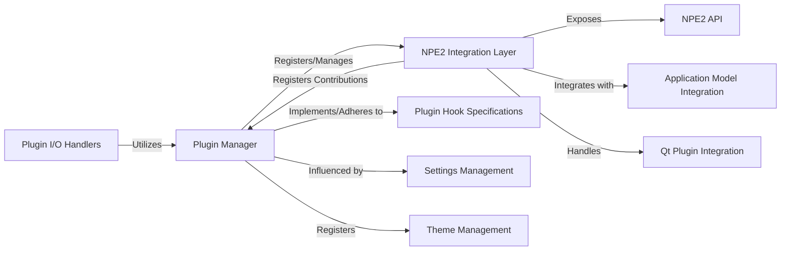

## Details

The `Plugin & Extensibility System` in Napari is a critical subsystem that enables the application to be extended beyond its core functionalities. It facilitates the discovery, loading, and integration of external plugins, supporting custom data I/O, widgets, processing functions, and themes.

### Plugin Manager
This is the central orchestrator of the plugin system. It is responsible for discovering, registering, unregistering, and managing the entire lifecycle of all plugins. It maintains a comprehensive registry of available plugins and their exposed capabilities (e.g., readers, writers, dock widgets, functions, themes, sample data). As an event emitter, it signals changes in the plugin landscape, allowing other parts of Napari to react dynamically. It also handles the assignment of specific plugins to file extensions for I/O operations.

**Related Classes/Methods**:

- <a href="https://github.com/napari/napari/src/napari/plugins/_plugin_manager.py#L38-L764" target="_blank" rel="noopener noreferrer">`napari.plugins._plugin_manager.NapariPluginManager` (38:764)</a>

### NPE2 Integration Layer
This component acts as the primary bridge between Napari's core and the `npe2` (Napari Plugin Engine 2) specification. It handles the parsing of `npe2` plugin manifests, registers `npe2`-defined contributions (commands, readers, writers, widgets, etc.) with the `Plugin Manager`, and facilitates `npe2`-compliant read/write operations. It is crucial for supporting the modern plugin ecosystem.

**Related Classes/Methods**:

- <a href="https://github.com/napari/napari/src/napari/plugins/_npe2.py#L1-L1" target="_blank" rel="noopener noreferrer">`napari.plugins._npe2` (1:1)</a>

### Plugin I/O Handlers
This component provides a high-level, unified interface for reading and writing data using registered plugins. It abstracts the complexity of finding the appropriate reader/writer plugin based on file extensions or layer types and then delegates the actual I/O operations to the selected plugin.

**Related Classes/Methods**:

- <a href="https://github.com/napari/napari/src/napari/plugins/io.py#L1-L1" target="_blank" rel="noopener noreferrer">`napari.plugins.io` (1:1)</a>

### Plugin Hook Specifications
This component defines the formal "hooks" or extension points that plugins can implement to integrate with Napari. These specifications act as a contract, ensuring compatibility and defining the expected interfaces for various plugin contributions (e.g., `napari_get_reader`, `napari_write_image`, `napari_provide_dock_widget`).

**Related Classes/Methods**:

- <a href="https://github.com/napari/napari/src/napari/plugins/hook_specifications.py#L1-L1" target="_blank" rel="noopener noreferrer">`napari.plugins.hook_specifications` (1:1)</a>

### NPE2 API
This module provides programmatic interfaces for interacting with `npe2` specific plugin information and capabilities. It allows for querying details about `npe2` plugins, such as their contributions and metadata.

**Related Classes/Methods**:

- <a href="https://github.com/napari/napari/src/napari/plugins/npe2api.py#L1-L1" target="_blank" rel="noopener noreferrer">`napari.plugins.npe2api.SummaryDict` (1:1)</a>

### Application Model Integration
This component (`napari._app_model`) is responsible for integrating plugin-contributed actions, commands, and menu items into Napari's application-wide command and menu system, making plugin functionalities accessible via the UI.

**Related Classes/Methods**:

- `napari._app_model` (1:1)

### Settings Management
The `napari.settings` package, particularly `napari.settings._plugins.PluginsSettings`, provides access to application settings that influence plugin behavior, such as enabling/disabling plugins or storing preferred I/O handlers. The `Plugin Manager` interacts with this to respect user configurations.

**Related Classes/Methods**:

- <a href="https://github.com/napari/napari/src/napari/settings/_plugins.py#L17-L79" target="_blank" rel="noopener noreferrer">`napari.settings._plugins.PluginsSettings` (17:79)</a>

### Theme Management
The `napari.utils.theme.py` module handles the registration and management of themes. Plugins can contribute themes, which are then registered through the `Plugin Manager` with this component to be available for the Napari application's visual styling.

**Related Classes/Methods**:

- <a href="https://github.com/napari/napari/src/napari/utils/theme.py#L1-L1" target="_blank" rel="noopener noreferrer">`napari.utils.theme` (1:1)</a>

### Qt Plugin Integration
The `napari._qt._qplugins._qnpe2.py` module specifically handles the integration of Qt-specific actions and widgets provided by plugins into the Napari Qt-based GUI, ensuring they are correctly displayed and functional.

**Related Classes/Methods**:

- <a href="https://github.com/napari/napari/src/napari/_qt/_qplugins/_qnpe2.py#L1-L1" target="_blank" rel="noopener noreferrer">`napari._qt._qplugins._qnpe2` (1:1)</a>

### [FAQ](https://github.com/CodeBoarding/GeneratedOnBoardings/tree/main?tab=readme-ov-file#faq)