```mermaid
graph LR
    napari__qt_qt_main_window_Window["napari._qt.qt_main_window.Window"]
    napari__qt_qt_viewer_QtViewer["napari._qt.qt_viewer.QtViewer"]
    napari__qt_layer_controls_qt_layer_controls_container_QtLayerControlsContainer["napari._qt.layer_controls.qt_layer_controls_container.QtLayerControlsContainer"]
    napari__vispy_canvas_VispyCanvas["napari._vispy.canvas.VispyCanvas"]
    napari__qt_widgets_qt_dims_QtDims["napari._qt.widgets.qt_dims.QtDims"]
    napari__qt_containers_qt_layer_list_QtLayerList["napari._qt.containers.qt_layer_list.QtLayerList"]
    napari__qt_widgets_qt_viewer_buttons_QtLayerButtons["napari._qt.widgets.qt_viewer_buttons.QtLayerButtons"]
    napari__qt_widgets_qt_viewer_buttons_QtViewerButtons["napari._qt.widgets.qt_viewer_buttons.QtViewerButtons"]
    napari__qt_dialogs_preferences_dialog_PreferencesDialog["napari._qt.dialogs.preferences_dialog.PreferencesDialog"]
    napari__qt_widgets_qt_command_palette_QCommandPalette["napari._qt.widgets.qt_command_palette.QCommandPalette"]
    napari__qt_layer_controls_qt_layer_controls_base_QtLayerControls["napari._qt.layer_controls.qt_layer_controls_base.QtLayerControls"]
    napari_components_viewer_model_ViewerModel["napari.components.viewer_model.ViewerModel"]
    napari_components_dims_Dims["napari.components.dims.Dims"]
    napari_components_layerlist_LayerList["napari.components.layerlist.LayerList"]
    napari_settings__napari_settings_NapariSettings["napari.settings._napari_settings.NapariSettings"]
    napari_utils_action_manager_ActionManager["napari.utils.action_manager.ActionManager"]
    napari__qt_qt_main_window_Window -- "Composes" --> napari__qt_qt_viewer_QtViewer
    napari__qt_qt_main_window_Window -- "Composes" --> napari__qt_widgets_qt_command_palette_QCommandPalette
    napari__qt_qt_main_window_Window -- "Composes" --> napari__qt_dialogs_preferences_dialog_PreferencesDialog
    napari__qt_qt_viewer_QtViewer -- "Composes" --> napari__vispy_canvas_VispyCanvas
    napari__qt_qt_viewer_QtViewer -- "Composes" --> napari__qt_layer_controls_qt_layer_controls_container_QtLayerControlsContainer
    napari__qt_qt_viewer_QtViewer -- "Composes" --> napari__qt_widgets_qt_dims_QtDims
    napari__qt_qt_viewer_QtViewer -- "Composes" --> napari__qt_containers_qt_layer_list_QtLayerList
    napari__qt_qt_viewer_QtViewer -- "Composes" --> napari__qt_widgets_qt_viewer_buttons_QtLayerButtons
    napari__qt_qt_viewer_QtViewer -- "Composes" --> napari__qt_widgets_qt_viewer_buttons_QtViewerButtons
    napari__qt_layer_controls_qt_layer_controls_container_QtLayerControlsContainer -- "Manages" --> napari__qt_layer_controls_qt_layer_controls_base_QtLayerControls
    napari__vispy_canvas_VispyCanvas -- "Renders data from" --> napari_components_viewer_model_ViewerModel
    napari__qt_widgets_qt_dims_QtDims -- "Interacts with" --> napari_components_dims_Dims
    napari__qt_containers_qt_layer_list_QtLayerList -- "Displays/Interacts with" --> napari_components_layerlist_LayerList
    napari__qt_widgets_qt_viewer_buttons_QtLayerButtons -- "Triggers actions on" --> napari_components_layerlist_LayerList
    napari__qt_widgets_qt_viewer_buttons_QtViewerButtons -- "Triggers actions on" --> napari_components_viewer_model_ViewerModel
    napari__qt_dialogs_preferences_dialog_PreferencesDialog -- "Interacts with" --> napari_settings__napari_settings_NapariSettings
    napari__qt_widgets_qt_command_palette_QCommandPalette -- "Interacts with" --> napari_utils_action_manager_ActionManager
```

## Details

The `User Interface & Interaction` component in `napari` is primarily built using PyQt and is responsible for presenting the application's graphical interface, handling user input, and displaying visual data. It acts as the bridge between the user and the core data models and rendering engine.

### napari._qt.qt_main_window.Window
This is the top-level application window, serving as the primary container for the entire Napari GUI. It orchestrates the setup of menus, themes, dock widgets, and handles global application events. It is the entry point for the user's interaction with the application.

**Related Classes/Methods**:

- <a href="https://github.com/napari/napari/src/napari/_qt/qt_main_window.py#L1-L1" target="_blank" rel="noopener noreferrer">`napari._qt.qt_main_window.Window` (1:1)</a>

### napari._qt.qt_viewer.QtViewer
This is the core visual component responsible for displaying image layers and handling user interactions within the main viewing area. It integrates with the Vispy rendering backend and manages various viewer-specific controls like dimension sliders and layer controls. It translates user gestures into actions on the underlying `ViewerModel`.

**Related Classes/Methods**:

- <a href="https://github.com/napari/napari/src/napari/_qt/qt_viewer.py#L135-L1192" target="_blank" rel="noopener noreferrer">`napari._qt.qt_viewer.QtViewer` (135:1192)</a>

### napari._qt.layer_controls.qt_layer_controls_container.QtLayerControlsContainer
This component manages and displays the control widgets for individual layers. It dynamically creates and updates the appropriate control widgets based on the type of the currently selected layer (e.g., image, labels, points), allowing users to modify layer properties.

**Related Classes/Methods**:

- <a href="https://github.com/napari/napari/src/napari/_qt/layer_controls/qt_layer_controls_container.py#L69-L160" target="_blank" rel="noopener noreferrer">`napari._qt.layer_controls.qt_layer_controls_container.QtLayerControlsContainer` (69:160)</a>

### napari._vispy.canvas.VispyCanvas
This is the rendering backend for Napari, responsible for drawing layers and handling low-level graphics operations using the Vispy library. It acts as the bridge between the Qt UI and the OpenGL rendering, receiving data from the `ViewerModel` and rendering it visually.

**Related Classes/Methods**:

- <a href="https://github.com/napari/napari/src/napari/_vispy/canvas.py#L67-L1039" target="_blank" rel="noopener noreferrer">`napari._vispy.canvas.VispyCanvas` (67:1039)</a>

### napari._qt.widgets.qt_dims.QtDims
This component provides interactive sliders and playback controls, enabling users to navigate through multi-dimensional data. It allows selection of the current slice along different axes and controls animation playback.

**Related Classes/Methods**:

- <a href="https://github.com/napari/napari/src/napari/_qt/widgets/qt_dims.py#L16-L362" target="_blank" rel="noopener noreferrer">`napari._qt.widgets.qt_dims.QtDims` (16:362)</a>

### napari._qt.containers.qt_layer_list.QtLayerList
This Qt widget visually displays the list of layers currently loaded in the viewer. It allows users to select, reorder, and manage layers through a graphical interface, reflecting the state of the `LayerList` model.

**Related Classes/Methods**:

- <a href="https://github.com/napari/napari/src/napari/_qt/containers/qt_layer_list.py#L40-L87" target="_blank" rel="noopener noreferrer">`napari._qt.containers.qt_layer_list.QtLayerList` (40:87)</a>

### napari._qt.widgets.qt_viewer_buttons.QtLayerButtons
This component is a collection of buttons that provide quick access to common actions related to layers, such as adding new layers, deleting selected layers, or duplicating layers.

**Related Classes/Methods**:

- <a href="https://github.com/napari/napari/src/napari/_qt/widgets/qt_viewer_buttons.py#L55-L110" target="_blank" rel="noopener noreferrer">`napari._qt.widgets.qt_viewer_buttons.QtLayerButtons` (55:110)</a>

### napari._qt.widgets.qt_viewer_buttons.QtViewerButtons
This component provides a set of buttons for common actions related to the viewer's state, such as toggling between 2D and 3D viewing modes, resetting the camera view, or adjusting the visual layout.

**Related Classes/Methods**:

- <a href="https://github.com/napari/napari/src/napari/_qt/widgets/qt_viewer_buttons.py#L157-L696" target="_blank" rel="noopener noreferrer">`napari._qt.widgets.qt_viewer_buttons.QtViewerButtons` (157:696)</a>

### napari._qt.dialogs.preferences_dialog.PreferencesDialog
This dialog window allows users to view and modify application-wide settings and preferences, such as theme, language, and various experimental features, persisting these choices across sessions.

**Related Classes/Methods**:

- <a href="https://github.com/napari/napari/src/napari/_qt/dialogs/preferences_dialog.py#L25-L268" target="_blank" rel="noopener noreferrer">`napari._qt.dialogs.preferences_dialog.PreferencesDialog` (25:268)</a>

### napari._qt.widgets.qt_command_palette.QCommandPalette
This component offers a searchable interface for executing commands and actions within Napari. It enhances user productivity by providing quick access to a wide range of functionalities without navigating through menus.

**Related Classes/Methods**:

- <a href="https://github.com/napari/napari/src/napari/_qt/widgets/qt_command_palette.py#L17-L121" target="_blank" rel="noopener noreferrer">`napari._qt.widgets.qt_command_palette.QCommandPalette` (17:121)</a>

### napari._qt.layer_controls.qt_layer_controls_base.QtLayerControls
Base class for layer control widgets.

**Related Classes/Methods**:

- <a href="https://github.com/napari/napari/src/napari/_qt/layer_controls/qt_layer_controls_base.py#L39-L373" target="_blank" rel="noopener noreferrer">`napari._qt.layer_controls.qt_layer_controls_base.QtLayerControls` (39:373)</a>

### napari.components.viewer_model.ViewerModel
Model for the Napari viewer state.

**Related Classes/Methods**:

- <a href="https://github.com/napari/napari/src/napari/components/viewer_model.py#L126-L1705" target="_blank" rel="noopener noreferrer">`napari.components.viewer_model.ViewerModel` (126:1705)</a>

### napari.components.dims.Dims
Model for managing multi-dimensional data dimensions.

**Related Classes/Methods**:

- <a href="https://github.com/napari/napari/src/napari/components/dims.py#L22-L490" target="_blank" rel="noopener noreferrer">`napari.components.dims.Dims` (22:490)</a>

### napari.components.layerlist.LayerList
Model for managing the list of layers.

**Related Classes/Methods**:

- <a href="https://github.com/napari/napari/src/napari/components/layerlist.py#L28-L542" target="_blank" rel="noopener noreferrer">`napari.components.layerlist.LayerList` (28:542)</a>

### napari.settings._napari_settings.NapariSettings
Model for application settings.

**Related Classes/Methods**:

- <a href="https://github.com/napari/napari/src/napari/settings/_napari_settings.py#L24-L111" target="_blank" rel="noopener noreferrer">`napari.settings._napari_settings.NapariSettings` (24:111)</a>

### napari.utils.action_manager.ActionManager
Manages application actions and commands.

**Related Classes/Methods**:

- <a href="https://github.com/napari/napari/src/napari/utils/action_manager.py#L54-L431" target="_blank" rel="noopener noreferrer">`napari.utils.action_manager.ActionManager` (54:431)</a>

### [FAQ](https://github.com/CodeBoarding/GeneratedOnBoardings/tree/main?tab=readme-ov-file#faq)