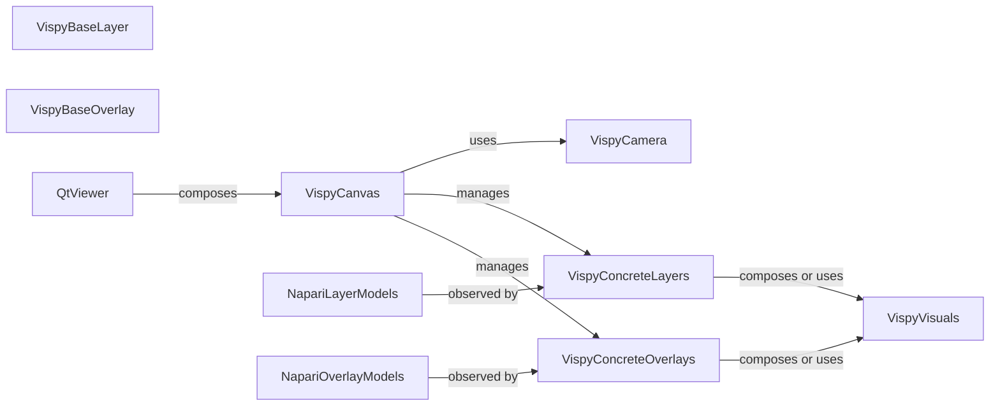

## Details

The Visualization Engine in napari is dedicated to the low-level, GPU-accelerated rendering of all visual elements, including layers, overlays, axes, and the scale bar, primarily leveraging the Vispy library. Its core purpose is to translate abstract data and viewer state from Napari's core models into rendered pixels displayed within the user interface.

### VispyCanvas
This is the core rendering surface and the primary interface to the Vispy library. It manages the OpenGL context, the Vispy scene graph, and the rendering loop. It acts as the central orchestrator for all visual elements to be drawn.

**Related Classes/Methods**:

- <a href="https://github.com/napari/napari/src/napari/_vispy/canvas.py#L67-L1039" target="_blank" rel="noopener noreferrer">`napari._vispy.canvas.VispyCanvas` (67:1039)</a>
- <a href="https://github.com/napari/napari/src/napari/_vispy/canvas.py#L55-L64" target="_blank" rel="noopener noreferrer">`napari._vispy.canvas.NapariSceneCanvas` (55:64)</a>

### VispyBaseLayer
This abstract base class defines the common interface and behavior for all Vispy-specific visual representations of Napari's layer models. Subclasses adapt Napari's layer data and state for Vispy rendering and observe changes in the NapariLayerModels.

**Related Classes/Methods**:

- <a href="https://github.com/napari/napari/src/napari/_vispy/layers/base.py#L14-L266" target="_blank" rel="noopener noreferrer">`napari._vispy.layers.base.VispyBaseLayer` (14:266)</a>
- <a href="https://github.com/napari/napari/src/napari/_vispy/layers/scalar_field.py#L29-L221" target="_blank" rel="noopener noreferrer">`napari._vispy.layers.scalar_field.VispyScalarFieldBaseLayer` (29:221)</a>

### VispyConcreteLayers
These are the concrete implementations of VispyBaseLayer for specific Napari layer types (e.g., images, labels, points). They translate the data and state of their corresponding NapariLayerModels into a format suitable for VispyVisuals.

**Related Classes/Methods**:

- <a href="https://github.com/napari/napari/src/napari/_vispy/layers/image.py#L76-L179" target="_blank" rel="noopener noreferrer">`napari._vispy.layers.image.VispyImageLayer` (76:179)</a>
- <a href="https://github.com/napari/napari/src/napari/_vispy/layers/labels.py#L194-L320" target="_blank" rel="noopener noreferrer">`napari._vispy.layers.labels.VispyLabelsLayer` (194:320)</a>
- <a href="https://github.com/napari/napari/src/napari/_vispy/layers/points.py#L11-L220" target="_blank" rel="noopener noreferrer">`napari._vispy.layers.points.VispyPointsLayer` (11:220)</a>
- <a href="https://github.com/napari/napari/src/napari/_vispy/layers/shapes.py#L15-L167" target="_blank" rel="noopener noreferrer">`napari._vispy.layers.shapes.VispyShapesLayer` (15:167)</a>
- <a href="https://github.com/napari/napari/src/napari/_vispy/layers/surface.py#L10-L220" target="_blank" rel="noopener noreferrer">`napari._vispy.layers.surface.VispySurfaceLayer` (10:220)</a>
- <a href="https://github.com/napari/napari/src/napari/_vispy/layers/tracks.py#L4-L125" target="_blank" rel="noopener noreferrer">`napari._vispy.layers.tracks.VispyTracksLayer` (4:125)</a>
- <a href="https://github.com/napari/napari/src/napari/_vispy/layers/vectors.py#L7-L47" target="_blank" rel="noopener noreferrer">`napari._vispy.layers.vectors.VispyVectorsLayer` (7:47)</a>

### VispyBaseOverlay
This abstract base class defines the common interface and behavior for all Vispy-specific visual representations of Napari's overlay models (e.g., axes, scale bar). Similar to layers, subclasses adapt Napari's overlay data and state for Vispy rendering.

**Related Classes/Methods**:

- <a href="https://github.com/napari/napari/src/napari/_vispy/overlays/base.py#L13-L53" target="_blank" rel="noopener noreferrer">`napari._vispy.overlays.base.VispyBaseOverlay` (13:53)</a>
- <a href="https://github.com/napari/napari/src/napari/_vispy/overlays/base.py#L56-L128" target="_blank" rel="noopener noreferrer">`napari._vispy.overlays.base.VispyCanvasOverlay` (56:128)</a>
- <a href="https://github.com/napari/napari/src/napari/_vispy/overlays/base.py#L131-L138" target="_blank" rel="noopener noreferrer">`napari._vispy.overlays.base.VispySceneOverlay` (131:138)</a>

### VispyConcreteOverlays
These are the concrete implementations of VispyBaseOverlay for specific Napari overlay types (e.g., axes, scale bar, bounding boxes). They are responsible for drawing specific UI elements that provide context or interaction feedback.

**Related Classes/Methods**:

- <a href="https://github.com/napari/napari/src/napari/_vispy/overlays/axes.py#L7-L79" target="_blank" rel="noopener noreferrer">`napari._vispy.overlays.axes.VispyAxesOverlay` (7:79)</a>
- <a href="https://github.com/napari/napari/src/napari/_vispy/overlays/scale_bar.py#L14-L215" target="_blank" rel="noopener noreferrer">`napari._vispy.overlays.scale_bar.VispyScaleBarOverlay` (14:215)</a>
- <a href="https://github.com/napari/napari/src/napari/_vispy/overlays/bounding_box.py#L6-L75" target="_blank" rel="noopener noreferrer">`napari._vispy.overlays.bounding_box.VispyBoundingBoxOverlay` (6:75)</a>
- <a href="https://github.com/napari/napari/src/napari/_vispy/overlays/brush_circle.py#L5-L91" target="_blank" rel="noopener noreferrer">`napari._vispy.overlays.brush_circle.VispyBrushCircleOverlay` (5:91)</a>
- <a href="https://github.com/napari/napari/src/napari/_vispy/overlays/interaction_box.py#L30-L52" target="_blank" rel="noopener noreferrer">`napari._vispy.overlays.interaction_box.VispySelectionBoxOverlay` (30:52)</a>
- <a href="https://github.com/napari/napari/src/napari/_vispy/overlays/interaction_box.py#L55-L89" target="_blank" rel="noopener noreferrer">`napari._vispy.overlays.interaction_box.VispyTransformBoxOverlay` (55:89)</a>
- <a href="https://github.com/napari/napari/src/napari/_vispy/overlays/labels_polygon.py#L34-L245" target="_blank" rel="noopener noreferrer">`napari._vispy.overlays.labels_polygon.VispyLabelsPolygonOverlay` (34:245)</a>
- <a href="https://github.com/napari/napari/src/napari/_vispy/overlays/text.py#L6-L58" target="_blank" rel="noopener noreferrer">`napari._vispy.overlays.text.VispyTextOverlay` (6:58)</a>

### VispyVisuals
This component comprises the low-level Vispy visual objects (e.g., vispy.scene.visuals.Image, vispy.scene.visuals.Markers, vispy.scene.visuals.Mesh). These are the direct interfaces to OpenGL, responsible for drawing specific graphical primitives on the screen. Each Vispy*Layer or Vispy*Overlay typically composes or manages one or more of these *Visual objects.

**Related Classes/Methods**:

- <a href="https://github.com/napari/napari/src/napari/_vispy/visuals/image.py#L6-L13" target="_blank" rel="noopener noreferrer">`napari._vispy.visuals.image.Image` (6:13)</a>
- <a href="https://github.com/napari/napari/src/napari/_vispy/visuals/labels.py#L12-L24" target="_blank" rel="noopener noreferrer">`napari._vispy.visuals.labels.LabelVisual` (12:24)</a>
- <a href="https://github.com/napari/napari/src/napari/_vispy/visuals/points.py#L8-L89" target="_blank" rel="noopener noreferrer">`napari._vispy.visuals.points.PointsVisual` (8:89)</a>
- <a href="https://github.com/napari/napari/src/napari/_vispy/visuals/shapes.py#L5-L44" target="_blank" rel="noopener noreferrer">`napari._vispy.visuals.shapes.ShapesVisual` (5:44)</a>
- <a href="https://github.com/napari/napari/src/napari/_vispy/visuals/surface.py#L6-L21" target="_blank" rel="noopener noreferrer">`napari._vispy.visuals.surface.SurfaceVisual` (6:21)</a>
- <a href="https://github.com/napari/napari/src/napari/_vispy/visuals/tracks.py#L6-L28" target="_blank" rel="noopener noreferrer">`napari._vispy.visuals.tracks.TracksVisual` (6:28)</a>
- <a href="https://github.com/napari/napari/src/napari/_vispy/visuals/vectors.py#L5-L8" target="_blank" rel="noopener noreferrer">`napari._vispy.visuals.vectors.VectorsVisual` (5:8)</a>
- <a href="https://github.com/napari/napari/src/napari/_vispy/visuals/volume.py#L321-L367" target="_blank" rel="noopener noreferrer">`napari._vispy.visuals.volume.Volume` (321:367)</a>

### VispyCamera
This class manages the camera's position, orientation, and projection within the Vispy scene. It translates Napari's abstract camera model into the concrete camera settings used by Vispy, determining how the 3D scene is viewed.

**Related Classes/Methods**:

- <a href="https://github.com/napari/napari/src/napari/_vispy/camera.py#L17-L239" target="_blank" rel="noopener noreferrer">`napari._vispy.camera.VispyCamera` (17:239)</a>

### NapariLayerModels
Represents the core data models for layers in Napari (e.g., napari.layers.image.Image, napari.layers.labels.Labels). These models hold the actual image data, labels, points, etc., and their associated properties. They emit events when their state changes.

**Related Classes/Methods**:

- <a href="https://github.com/napari/napari/src/napari/layers/base/base.py#L116-L2345" target="_blank" rel="noopener noreferrer">`napari.layers.base.base.Layer` (116:2345)</a>
- <a href="https://github.com/napari/napari/src/napari/layers/image/image.py#L32-L673" target="_blank" rel="noopener noreferrer">`napari.layers.image.image.Image` (32:673)</a>
- <a href="https://github.com/napari/napari/src/napari/layers/labels/labels.py#L66-L1603" target="_blank" rel="noopener noreferrer">`napari.layers.labels.labels.Labels` (66:1603)</a>
- <a href="https://github.com/napari/napari/src/napari/layers/points/points.py#L65-L2382" target="_blank" rel="noopener noreferrer">`napari.layers.points.points.Points` (65:2382)</a>
- <a href="https://github.com/napari/napari/src/napari/layers/shapes/shapes.py#L86-L3170" target="_blank" rel="noopener noreferrer">`napari.layers.shapes.shapes.Shapes` (86:3170)</a>
- <a href="https://github.com/napari/napari/src/napari/layers/surface/surface.py#L27-L820" target="_blank" rel="noopener noreferrer">`napari.layers.surface.surface.Surface` (27:820)</a>
- <a href="https://github.com/napari/napari/src/napari/layers/tracks/tracks.py#L17-L676" target="_blank" rel="noopener noreferrer">`napari.layers.tracks.tracks.Tracks` (17:676)</a>
- <a href="https://github.com/napari/napari/src/napari/layers/vectors/vectors.py#L28-L806" target="_blank" rel="noopener noreferrer">`napari.layers.vectors.vectors.Vectors` (28:806)</a>

### NapariOverlayModels
Represents the core data models for overlays in Napari (e.g., napari.components.overlays.axes.AxesOverlay, napari.components.overlays.scale_bar.ScaleBarOverlay). These models hold the state and properties of the UI overlays. They also emit events when their state changes.

**Related Classes/Methods**:

- <a href="https://github.com/napari/napari/src/napari/components/overlays/base.py#L5-L29" target="_blank" rel="noopener noreferrer">`napari.components.overlays.base.Overlay` (5:29)</a>
- <a href="https://github.com/napari/napari/src/napari/components/overlays/axes.py#L3-L33" target="_blank" rel="noopener noreferrer">`napari.components.overlays.axes.AxesOverlay` (3:33)</a>
- <a href="https://github.com/napari/napari/src/napari/components/overlays/scale_bar.py#L7-L57" target="_blank" rel="noopener noreferrer">`napari.components.overlays.scale_bar.ScaleBarOverlay` (7:57)</a>
- <a href="https://github.com/napari/napari/src/napari/components/overlays/bounding_box.py#L5-L36" target="_blank" rel="noopener noreferrer">`napari.components.overlays.bounding_box.BoundingBoxOverlay` (5:36)</a>
- <a href="https://github.com/napari/napari/src/napari/components/overlays/brush_circle.py#L3-L19" target="_blank" rel="noopener noreferrer">`napari.components.overlays.brush_circle.BrushCircleOverlay` (3:19)</a>
- <a href="https://github.com/napari/napari/src/napari/components/overlays/interaction_box.py#L7-L32" target="_blank" rel="noopener noreferrer">`napari.components.overlays.interaction_box.SelectionBoxOverlay` (7:32)</a>
- <a href="https://github.com/napari/napari/src/napari/components/overlays/interaction_box.py#L35-L50" target="_blank" rel="noopener noreferrer">`napari.components.overlays.interaction_box.TransformBoxOverlay` (35:50)</a>
- <a href="https://github.com/napari/napari/src/napari/components/overlays/labels_polygon.py#L5-L43" target="_blank" rel="noopener noreferrer">`napari.components.overlays.labels_polygon.LabelsPolygonOverlay` (5:43)</a>
- <a href="https://github.com/napari/napari/src/napari/components/overlays/text.py#L7-L32" target="_blank" rel="noopener noreferrer">`napari.components.overlays.text.TextOverlay` (7:32)</a>

### QtViewer
Represents the Qt-based graphical user interface (GUI) viewer in Napari. It acts as the top-level container for the VispyCanvas and other UI elements, integrating the visualization engine into the overall Napari application.

**Related Classes/Methods**:

- <a href="https://github.com/napari/napari/src/napari/_qt/qt_viewer.py#L135-L1192" target="_blank" rel="noopener noreferrer">`napari._qt.qt_viewer.QtViewer` (135:1192)</a>

### [FAQ](https://github.com/CodeBoarding/GeneratedOnBoardings/tree/main?tab=readme-ov-file#faq)