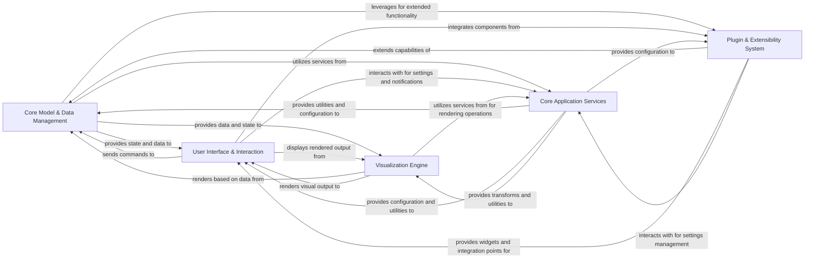

## Details

This analysis consolidates insights from the Control Flow Graph (CFG) and Source Code Analysis to present a high-level overview of the `napari` architecture, focusing on critical interaction pathways and central modules.

### Core Model & Data Management
This central component manages the fundamental state and logic of the Napari application. It encompasses the collection of displayed layers, current view settings (e.g., camera, dimensions), and overall application logic. It also defines the abstract base for all visual data layers and implements specific layer types, handling layer-specific data, logic (e.g., slicing, transformations), and visual properties (e.g., color, text).

**Related Classes/Methods**:

- <a href="https://github.com/napari/napari/src/napari/viewer.py#L17-L276" target="_blank" rel="noopener noreferrer">`napari.viewer.Viewer` (17:276)</a>
- <a href="https://github.com/napari/napari/src/napari/components/viewer_model.py#L126-L1705" target="_blank" rel="noopener noreferrer">`napari.components.viewer_model.ViewerModel` (126:1705)</a>
- <a href="https://github.com/napari/napari/src/napari/components/layerlist.py#L28-L542" target="_blank" rel="noopener noreferrer">`napari.components.layerlist.LayerList` (28:542)</a>
- <a href="https://github.com/napari/napari/src/napari/layers/base/base.py#L116-L2345" target="_blank" rel="noopener noreferrer">`napari.layers.base.base.Layer` (116:2345)</a>
- <a href="https://github.com/napari/napari/src/napari/layers/utils/color_manager.py#L102-L577" target="_blank" rel="noopener noreferrer">`napari.layers.utils.color_manager.ColorManager` (102:577)</a>
- <a href="https://github.com/napari/napari/src/napari/layers/utils/text_manager.py#L30-L394" target="_blank" rel="noopener noreferrer">`napari.layers.utils.text_manager.TextManager` (30:394)</a>

### User Interface & Interaction [[Expand]](./User_Interface_Interaction.md)
This component implements the graphical user interface using PyQt. It provides the main application window, the visual display of the viewer, various interactive widgets, and dialogs. It is responsible for translating user input into actions on the core models and integrates built-in data reading/writing capabilities along with specific Qt widgets for features like layer tables.

**Related Classes/Methods**:

- <a href="https://github.com/napari/napari/src/napari/_qt/qt_main_window.py#L0-L0" target="_blank" rel="noopener noreferrer">`napari._qt.qt_main_window.Window` (0:0)</a>
- <a href="https://github.com/napari/napari/src/napari/_qt/qt_viewer.py#L135-L1192" target="_blank" rel="noopener noreferrer">`napari._qt.qt_viewer.QtViewer` (135:1192)</a>
- `napari._qt.layer_controls` (0:0)
- `napari._qt.widgets` (0:0)
- <a href="https://github.com/napari/napari/src/napari_builtins/io/_read.py#L0-L0" target="_blank" rel="noopener noreferrer">`napari_builtins.io._read` (0:0)</a>
- <a href="https://github.com/napari/napari/src/napari_builtins/_qt/features_table.py#L0-L0" target="_blank" rel="noopener noreferrer">`napari_builtins._qt.features_table` (0:0)</a>

### Visualization Engine [[Expand]](./Visualization_Engine.md)
This component is solely responsible for the low-level, GPU-accelerated rendering of all visual elements (layers, overlays, axes, scale bar) using the Vispy library. It translates abstract data and viewer state received from the core models into rendered pixels displayed within the user interface.

**Related Classes/Methods**:

- <a href="https://github.com/napari/napari/src/napari/_vispy/canvas.py#L67-L1039" target="_blank" rel="noopener noreferrer">`napari._vispy.canvas.VispyCanvas` (67:1039)</a>
- `napari._vispy.layers` (0:0)
- `napari._vispy.visuals` (0:0)

### Plugin & Extensibility System [[Expand]](./Plugin_Extensibility_System.md)
This component manages the discovery, loading, and integration of external plugins. It enables extensibility for various functionalities, including custom data reading/writing, custom widgets, and processing functions, serving as the primary mechanism for extending Napari's capabilities beyond its core features.

**Related Classes/Methods**:

- <a href="https://github.com/napari/napari/src/napari/plugins/_plugin_manager.py#L38-L764" target="_blank" rel="noopener noreferrer">`napari.plugins._plugin_manager.NapariPluginManager` (38:764)</a>
- <a href="https://github.com/napari/napari/src/napari/plugins/_npe2.py#L0-L0" target="_blank" rel="noopener noreferrer">`napari.plugins._npe2` (0:0)</a>
- <a href="https://github.com/napari/napari/src/napari/plugins/io.py#L0-L0" target="_blank" rel="noopener noreferrer">`napari.plugins.io` (0:0)</a>

### Core Application Services
This foundational component provides fundamental, reusable functionalities and application-wide configurations. This includes services such as event handling, colormap management, coordinate transformations, action management, user notifications, and key/mouse binding. It also manages application settings and user preferences, including their persistence to a configuration file.

**Related Classes/Methods**:

- <a href="https://github.com/napari/napari/src/napari/utils/events/evented_model.py#L213-L497" target="_blank" rel="noopener noreferrer">`napari.utils.events.evented_model.EventedModel` (213:497)</a>
- <a href="https://github.com/napari/napari/src/napari/utils/colormaps/colormap.py#L44-L178" target="_blank" rel="noopener noreferrer">`napari.utils.colormaps.colormap.Colormap` (44:178)</a>
- <a href="https://github.com/napari/napari/src/napari/utils/transforms/transforms.py#L27-L118" target="_blank" rel="noopener noreferrer">`napari.utils.transforms.transforms.Transform` (27:118)</a>
- <a href="https://github.com/napari/napari/src/napari/settings/_napari_settings.py#L24-L111" target="_blank" rel="noopener noreferrer">`napari.settings._napari_settings.NapariSettings` (24:111)</a>
- <a href="https://github.com/napari/napari/src/napari/settings/_base.py#L88-L268" target="_blank" rel="noopener noreferrer">`napari.settings._base.EventedConfigFileSettings` (88:268)</a>

### [FAQ](https://github.com/CodeBoarding/GeneratedOnBoardings/tree/main?tab=readme-ov-file#faq)