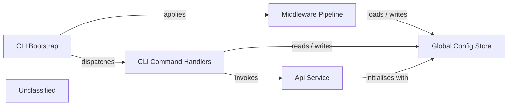

## Details

The napi CLI is built around a thin Bootstrap (src/cli/index.ts) that creates a yargs command‑line program. At start‑up it attaches a Middleware Pipeline—an ordered series of middlewares (version check, global‑config loading, authentication guard) that enrich the parsed arguments with a Global Config Store (a JSON file located in the user’s OS‑specific config directory). After the pipeline, the Bootstrap registers the CLI Command Handlers (login, init, extract, manifest‑generate, set). Each handler receives the enriched context, reads the persisted configuration, and, when needed, creates an Api Service instance that is pre‑configured with the host and JWT/token from the Global Config. The Api Service performs the required HTTP calls to the remote NanoAPI, while the handlers persist any new credentials or artefacts back to the Global Config or the project’s .napirc file. This layered architecture cleanly separates entry‑point orchestration, cross‑cutting context preparation, pure command logic, and external service interaction.

### CLI Bootstrap
Entry point; creates yargs, registers global options, attaches middlewares, and registers command handlers.

**Related Classes/Methods**:

- <a href="https://github.com/nanoapi-io/napi/blob/main/src/cli/index.ts" target="_blank" rel="noopener noreferrer">`src/cli/index.ts`</a>

### Middleware Pipeline
Executes ordered middlewares (version check, global‑config loading, auth guard) to build an enriched execution context.

**Related Classes/Methods**:

- <a href="https://github.com/nanoapi-io/napi/blob/main/src/cli/middlewares/checkVersion.ts" target="_blank" rel="noopener noreferrer">`src/cli/middlewares/checkVersion.ts`</a>
- <a href="https://github.com/nanoapi-io/napi/blob/main/src/cli/middlewares/globalConfig.ts" target="_blank" rel="noopener noreferrer">`src/cli/middlewares/globalConfig.ts`</a>
- <a href="https://github.com/nanoapi-io/napi/blob/main/src/cli/middlewares/isAuthenticated.ts" target="_blank" rel="noopener noreferrer">`src/cli/middlewares/isAuthenticated.ts`</a>
- <a href="https://github.com/nanoapi-io/napi/blob/main/src/cli/middlewares/napiConfig.ts" target="_blank" rel="noopener noreferrer">`src/cli/middlewares/napiConfig.ts`</a>

### CLI Command Handlers
Implements concrete commands (login, init, extract, manifest‑generate, set). Each handler validates input, calls the Api Service, and persists results.

**Related Classes/Methods**:

- <a href="https://github.com/nanoapi-io/napi/blob/main/src/cli/handlers/login/index.ts" target="_blank" rel="noopener noreferrer">`src/cli/handlers/login/index.ts`</a>
- <a href="https://github.com/nanoapi-io/napi/blob/main/src/cli/handlers/init/index.ts" target="_blank" rel="noopener noreferrer">`src/cli/handlers/init/index.ts`</a>
- <a href="https://github.com/nanoapi-io/napi/blob/main/src/cli/handlers/extract/index.ts" target="_blank" rel="noopener noreferrer">`src/cli/handlers/extract/index.ts`</a>
- <a href="https://github.com/nanoapi-io/napi/blob/main/src/cli/handlers/manifest/generate.ts" target="_blank" rel="noopener noreferrer">`src/cli/handlers/manifest/generate.ts`</a>
- <a href="https://github.com/nanoapi-io/napi/blob/main/src/cli/handlers/set/apiKey.ts" target="_blank" rel="noopener noreferrer">`src/cli/handlers/set/apiKey.ts`</a>

### Api Service
Thin wrapper around fetch; instantiated with Global Config and provides performRequest for remote NanoAPI calls.

**Related Classes/Methods**:

- <a href="https://github.com/nanoapi-io/napi/blob/main/src/apiService/index.ts" target="_blank" rel="noopener noreferrer">`src/apiService/index.ts`</a>

### Global Config Store
Persistent JSON configuration file handling read/write of API host, JWT/token, and optional labeling keys.

**Related Classes/Methods**:

- <a href="https://github.com/nanoapi-io/napi/blob/main/src/cli/middlewares/globalConfig.ts" target="_blank" rel="noopener noreferrer">`src/cli/middlewares/globalConfig.ts`</a>

### Unclassified
Component for all unclassified files and utility functions (Utility functions/External Libraries/Dependencies)

**Related Classes/Methods**: _None_

### [FAQ](https://github.com/CodeBoarding/GeneratedOnBoardings/tree/main?tab=readme-ov-file#faq)