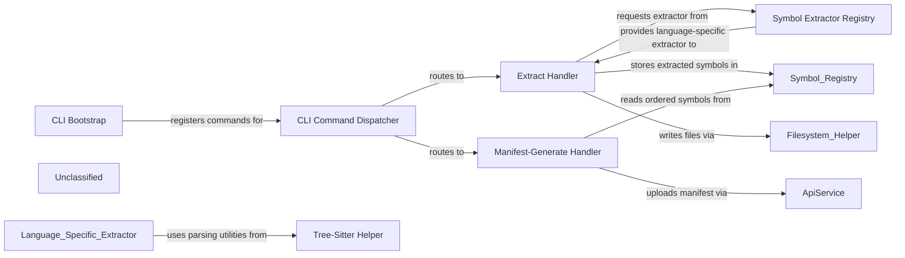

## Details

The CLI‑driven Symbol‑Extraction subsystem is anchored by the `initCli` bootstrap, which configures global middle‑wares and registers all sub‑commands with yargs. The Command Dispatcher acts as a thin router, delegating each command to its dedicated handler. The Extract Handler validates user input, obtains a language‑specific extractor through the Symbol Extractor Registry, and runs the extractor on the project files. Extractors rely on the Tree‑Sitter Helper for grammar‑aware parsing and feed their results into the Symbol Registry, an in‑memory store that deduplicates symbols and resolves type aliases. The Manifest‑Generate Handler reads the deterministic symbol snapshot from the registry, builds a full dependency manifest, and uploads it via the ApiService. This layered design isolates CLI concerns, language‑specific parsing, and manifest production, enabling clear, testable responsibilities and a straightforward flow diagram.

### CLI Bootstrap
Parses process.argv, builds the yargs command tree, installs global middle‑wares (checkVersion, globalConfig) and launches the CLI via initCli().

**Related Classes/Methods**:

- <a href="https://github.com/nanoapi-io/napi/blob/main/src/cli/index.ts" target="_blank" rel="noopener noreferrer">`src/cli/index.ts:initCli`</a>

### CLI Command Dispatcher
Thin routing layer that registers sub‑commands (login, init, set, manifest, extract) and delegates execution to the appropriate handler module.

**Related Classes/Methods**:

- <a href="https://github.com/nanoapi-io/napi/blob/main/src/cli/index.ts" target="_blank" rel="noopener noreferrer">`src/cli/index.ts:command registration`</a>

### Extract Handler
Validates user‑provided symbol specs, loads the Symbol Extractor Registry, runs the language‑specific extractor, writes extracted symbols via the Filesystem Helper, and records results in the Symbol Registry.

**Related Classes/Methods**:

- <a href="https://github.com/nanoapi-io/napi/blob/main/src/cli/handlers/extract/index.ts" target="_blank" rel="noopener noreferrer">`src/cli/handlers/extract/index.ts:default export`</a>

### Manifest‑Generate Handler
Collects the deterministic symbol snapshot from the Symbol Registry, builds a dependency manifest, and uploads it to the remote API using ApiService.

**Related Classes/Methods**:

- <a href="https://github.com/nanoapi-io/napi/blob/main/src/cli/handlers/manifest/generate.ts" target="_blank" rel="noopener noreferrer">`src/cli/handlers/manifest/generate.ts:handler function`</a>

### Symbol Extractor Registry
Maps a language identifier (python, c, c‑sharp, java) to the concrete extractor implementation and provides a single entry point for the Extract Handler to obtain the correct extractor.

**Related Classes/Methods**:

- <a href="https://github.com/nanoapi-io/napi/blob/main/src/symbolExtractor/index.ts" target="_blank" rel="noopener noreferrer">`src/symbolExtractor/index.ts:handlerMap & extractSymbols`</a>

### Tree‑Sitter Helper
Loads language grammars, parses source strings into ASTs, and supplies query utilities used by every language‑specific extractor.

**Related Classes/Methods**:

- <a href="https://github.com/nanoapi-io/napi/blob/main/src/helpers/treeSitter/parsers.ts" target="_blank" rel="noopener noreferrer">`src/helpers/treeSitter/parsers.ts`</a>

### Unclassified
Component for all unclassified files and utility functions (Utility functions/External Libraries/Dependencies)

**Related Classes/Methods**: _None_

### [FAQ](https://github.com/CodeBoarding/GeneratedOnBoardings/tree/main?tab=readme-ov-file#faq)