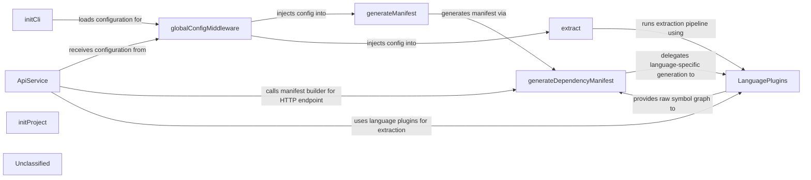

## Details

The napi system is organized around a thin CLI presentation layer that bootstraps the application, injects a read‑only execution‑context (global configuration) via a dedicated middleware, and dispatches to command handlers. The two primary handlers – manifest generation and extraction – drive the core domain logic. Both handlers rely on the Manifest Builder, a language‑agnostic orchestrator that selects the appropriate language plugins (C, C#, Java, Python, …) to parse source files, resolve symbols and format dependencies. The same manifest‑generation flow is exposed through an API Service; a single ApiService class holds the configuration, builds request headers, and uses its internal performRequest method (the thin HTTP client) to optionally push the manifest to the remote NanoAPI endpoint. This layered design cleanly separates presentation (CLI / HTTP), configuration, domain (manifest building) and language‑specific concerns, enabling straightforward documentation and a clear arrow‑driven diagram that shows data flowing from the user‑provided config → handlers → plugins → manifest → optional remote push.

### initCli
Boots the CLI, registers global options, attaches middle‑wares and command handlers.

**Related Classes/Methods**:

- <a href="https://github.com/nanoapi-io/napi/blob/main/src/cli/index.ts" target="_blank" rel="noopener noreferrer">`src/cli/index.ts:initCli`</a>

### globalConfigMiddleware
Loads & validates the user configuration, attaches it as args.globalConfig.

**Related Classes/Methods**:

- <a href="https://github.com/nanoapi-io/napi/blob/main/src/cli/middlewares/globalConfig.ts" target="_blank" rel="noopener noreferrer">`src/cli/middlewares/globalConfig.ts:globalConfigMiddleware`</a>

### generateManifest
Orchestrates manifest generation for the current project (calls Manifest Builder).

**Related Classes/Methods**:

- <a href="https://github.com/nanoapi-io/napi/blob/main/src/cli/handlers/manifest/generate.ts" target="_blank" rel="noopener noreferrer">`src/cli/handlers/manifest/generate.ts:generateManifest`</a>

### extract
Runs the language‑plugin extraction pipeline and prints raw symbols.

**Related Classes/Methods**:

- <a href="https://github.com/nanoapi-io/napi/blob/main/src/cli/handlers/extract/index.ts" target="_blank" rel="noopener noreferrer">`src/cli/handlers/extract/index.ts:extract`</a>

### generateDependencyManifest
Dispatches to language‑specific generators, sorts output, and optionally adds AI labels.

**Related Classes/Methods**:

- <a href="https://github.com/nanoapi-io/napi/blob/main/src/manifest/dependencyManifest/index.ts" target="_blank" rel="noopener noreferrer">`src/manifest/dependencyManifest/index.ts:generateDependencyManifest`</a>

### ApiService
Holds configuration, builds request headers, and performs HTTP calls (performRequest).

**Related Classes/Methods**:

- <a href="https://github.com/nanoapi-io/napi/blob/main/src/apiService/index.ts" target="_blank" rel="noopener noreferrer">`src/apiService/index.ts:ApiService`</a>

### LanguagePlugins
Provide the concrete extraction, formatting and resolution logic for each supported language.

**Related Classes/Methods**:

- <a href="https://github.com/nanoapi-io/napi/blob/main/src/languagePlugins" target="_blank" rel="noopener noreferrer">`src/languagePlugins/*`</a>

### initProject
Sets up a new project (creates .napirc, etc.).

**Related Classes/Methods**:

- <a href="https://github.com/nanoapi-io/napi/blob/main/src/cli/handlers/init/index.ts" target="_blank" rel="noopener noreferrer">`src/cli/handlers/init/index.ts:initProject`</a>

### Unclassified
Component for all unclassified files and utility functions (Utility functions/External Libraries/Dependencies)

**Related Classes/Methods**: _None_

### [FAQ](https://github.com/CodeBoarding/GeneratedOnBoardings/tree/main?tab=readme-ov-file#faq)