```mermaid
graph LR
    CLI_Core["CLI Core"]
    Middleware_Layer["Middleware Layer"]
    Command_Handlers["Command Handlers"]
    Language_Plugin_Symbol_Registry["Language‑Plugin & Symbol‑Registry"]
    Manifest_Builder_API_Service["Manifest Builder + API Service"]
    CI_CD_Runner_external_["CI/CD Runner (external)"]
    Unclassified["Unclassified"]
    CLI_Core -- "enriches request" --> Middleware_Layer
    Middleware_Layer -- "invokes handler" --> Command_Handlers
    Command_Handlers -- "requests symbols" --> Language_Plugin_Symbol_Registry
    Language_Plugin_Symbol_Registry -- "provides symbol map" --> Manifest_Builder_API_Service
    Manifest_Builder_API_Service -- "posts manifest" --> Manifest_Builder_API_Service
    CI_CD_Runner_external_ -- "invokes CLI Core" --> CLI_Core
    click Command_Handlers href "https://github.com/CodeBoarding/GeneratedOnBoardings/blob/main/napi/Command_Handlers.md" "Details"
    click Language_Plugin_Symbol_Registry href "https://github.com/CodeBoarding/GeneratedOnBoardings/blob/main/napi/Language_Plugin_Symbol_Registry.md" "Details"
    click Manifest_Builder_API_Service href "https://github.com/CodeBoarding/GeneratedOnBoardings/blob/main/napi/Manifest_Builder_API_Service.md" "Details"
```

## Details

The system implements a command‑line interface (CLI) that bootstraps with a yargs‑based core, runs a stack of global middle‑wares to enrich the raw request with configuration, version checks, authentication and language settings, and then dispatches to specific command handlers. The most complex handler (manifest generate) discovers source files, delegates to language‑specific extractors which feed raw symbols into a central symbol registry that resolves typedef relationships and produces a deterministic, case‑insensitive symbol map. This map is consumed by the manifest builder to create a sorted dependency manifest, which is finally posted via a thin API service to a remote endpoint. All external invocations, whether interactive or from CI/CD runners, start at the CLI core, ensuring a single, well‑defined entry point for the entire data‑flow.

### CLI Core
Parses arguments, registers middle‑wares and commands, and serves as the entry point for the CLI.

**Related Classes/Methods**:

- <a href="https://github.com/nanoapi-io/napi/blob/main/src/cli/index.ts" target="_blank" rel="noopener noreferrer">`src/cli/index.ts`</a>

### Middleware Layer
Enriches the raw request with version checking, global configuration loading, authentication verification, and NAPI‑specific options.

**Related Classes/Methods**:

- <a href="https://github.com/nanoapi-io/napi/blob/main/src/cli/middlewares/checkVersion.ts" target="_blank" rel="noopener noreferrer">`src/cli/middlewares/checkVersion.ts`</a>
- <a href="https://github.com/nanoapi-io/napi/blob/main/src/cli/middlewares/globalConfig.ts" target="_blank" rel="noopener noreferrer">`src/cli/middlewares/globalConfig.ts`</a>
- <a href="https://github.com/nanoapi-io/napi/blob/main/src/cli/middlewares/isAuthenticated.ts" target="_blank" rel="noopener noreferrer">`src/cli/middlewares/isAuthenticated.ts`</a>
- <a href="https://github.com/nanoapi-io/napi/blob/main/src/cli/middlewares/napiConfig.ts" target="_blank" rel="noopener noreferrer">`src/cli/middlewares/napiConfig.ts`</a>

### Command Handlers [[Expand]](./Command_Handlers.md)
Implements each CLI verb; the manifest‑generate handler orchestrates extraction, manifest building, and upload.

**Related Classes/Methods**:

- <a href="https://github.com/nanoapi-io/napi/blob/main/src/cli/handlers/login/index.ts" target="_blank" rel="noopener noreferrer">`src/cli/handlers/login/index.ts`</a>
- <a href="https://github.com/nanoapi-io/napi/blob/main/src/cli/handlers/init/index.ts" target="_blank" rel="noopener noreferrer">`src/cli/handlers/init/index.ts`</a>
- <a href="https://github.com/nanoapi-io/napi/blob/main/src/cli/handlers/extract/index.ts" target="_blank" rel="noopener noreferrer">`src/cli/handlers/extract/index.ts`</a>
- <a href="https://github.com/nanoapi-io/napi/blob/main/src/cli/handlers/manifest/generate.ts" target="_blank" rel="noopener noreferrer">`src/cli/handlers/manifest/generate.ts`</a>
- <a href="https://github.com/nanoapi-io/napi/blob/main/src/cli/handlers/set/apiKey.ts" target="_blank" rel="noopener noreferrer">`src/cli/handlers/set/apiKey.ts`</a>

### Language‑Plugin & Symbol‑Registry [[Expand]](./Language_Plugin_Symbol_Registry.md)
Language‑specific extractors produce raw symbols; the central registry aggregates them, resolves typedef relationships, and provides a deterministic cross‑language symbol map.

**Related Classes/Methods**:

- <a href="https://github.com/nanoapi-io/napi/blob/main/src/languagePlugins/c/extractor/index.ts" target="_blank" rel="noopener noreferrer">`src/languagePlugins/c/extractor/index.ts`</a>
- <a href="https://github.com/nanoapi-io/napi/blob/main/src/languagePlugins/csharp/extractor/index.ts" target="_blank" rel="noopener noreferrer">`src/languagePlugins/csharp/extractor/index.ts`</a>
- <a href="https://github.com/nanoapi-io/napi/blob/main/src/languagePlugins/java/extractor/index.ts" target="_blank" rel="noopener noreferrer">`src/languagePlugins/java/extractor/index.ts`</a>
- `src/languagePlugins/python/extractor/index.ts`
- <a href="https://github.com/nanoapi-io/napi/blob/main/src/languagePlugins/c/symbolRegistry/index.ts" target="_blank" rel="noopener noreferrer">`src/languagePlugins/c/symbolRegistry/index.ts`</a>

### Manifest Builder + API Service [[Expand]](./Manifest_Builder_API_Service.md)
Generates a deterministic, sorted dependency manifest (including optional AI labeling) and posts it to the remote /manifests endpoint via a thin HTTP client.

**Related Classes/Methods**:

- <a href="https://github.com/nanoapi-io/napi/blob/main/src/manifest/dependencyManifest/index.ts" target="_blank" rel="noopener noreferrer">`src/manifest/dependencyManifest/index.ts`</a>
- <a href="https://github.com/nanoapi-io/napi/blob/main/src/apiService/index.ts" target="_blank" rel="noopener noreferrer">`src/apiService/index.ts`</a>

### CI/CD Runner (external)
External GitHub Action that invokes the CLI in headless mode, feeding arguments to the CLI Core.

**Related Classes/Methods**: _None_

### Unclassified
Component for all unclassified files and utility functions (Utility functions/External Libraries/Dependencies)

**Related Classes/Methods**: _None_

### [FAQ](https://github.com/CodeBoarding/GeneratedOnBoardings/tree/main?tab=readme-ov-file#faq)