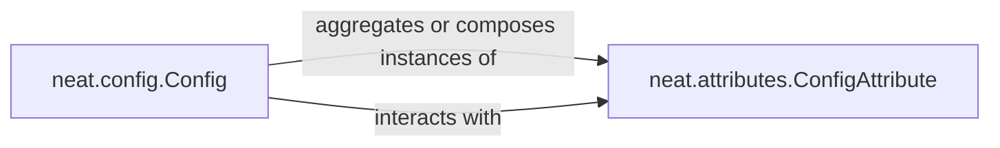

## Details

The Configuration Manager subsystem is responsible for centralizing and managing all configurable parameters for the NEAT algorithm. It primarily encompasses the neat.config and neat.attributes modules.

### neat.config.Config
This component serves as the primary interface for users and other parts of the NEAT algorithm to access and manage configuration parameters. It is responsible for loading configuration settings from various sources (e.g., files), parsing them, and providing a consistent API for retrieval. It also handles error conditions related to undefined or invalid configuration items. In an ML Toolkit context, it acts as the main entry point for defining and manipulating the algorithm's hyperparameters and structural properties.

**Related Classes/Methods**:

- <a href="https://github.com/CodeReclaimers/neat-python/blob/master/neat/config.py#L121-L203" target="_blank" rel="noopener noreferrer">`neat.config.Config`:121-203</a>

### neat.attributes.ConfigAttribute
This component defines the fundamental structure and behavior for individual configurable parameters within the NEAT algorithm. It encapsulates properties such as default values, data types, validation rules, and potentially mutation behaviors for specific attributes (e.g., genetic encoding parameters, neural network properties). It promotes modularity by allowing diverse configuration items to be defined and managed in a standardized way.

**Related Classes/Methods**:

- <a href="https://github.com/CodeReclaimers/neat-python/blob/master/neat/attributes.py" target="_blank" rel="noopener noreferrer">`neat.attributes.ConfigAttribute`</a>

### [FAQ](https://github.com/CodeBoarding/GeneratedOnBoardings/tree/main?tab=readme-ov-file#faq)