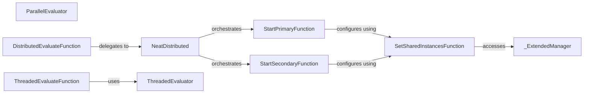

## Details

The `neat-python` distributed evaluation subsystem facilitates the parallel and distributed evaluation of genomes, crucial for evolutionary algorithms. It offers both multi-threaded and multi-process (distributed) evaluation strategies. The `DistributedEvaluateFunction` and `ThreadedEvaluateFunction` serve as primary user-facing APIs, abstracting the underlying evaluation mechanisms. The `NeatDistributed` component orchestrates the distributed evaluation, managing primary and secondary roles, while `_ExtendedManager` handles shared resources for inter-process communication. The `ThreadedEvaluator` and `ParallelEvaluator` provide the core logic for threaded and parallel genome evaluation, respectively. This modular design allows for flexible deployment across various computational environments, from single multi-core machines to distributed clusters.

### NeatDistributed
The core orchestrator for distributed genome evaluation across multiple processes or machines. It manages the overall flow and coordination of distributed evaluation tasks, including starting primary and secondary roles.

**Related Classes/Methods**:

- <a href="https://github.com/CodeReclaimers/neat-python/blob/master/" target="_blank" rel="noopener noreferrer">`neat.distributed.StartPrimaryFunction`</a>
- <a href="https://github.com/CodeReclaimers/neat-python/blob/master/" target="_blank" rel="noopener noreferrer">`neat.distributed.StartSecondaryFunction`</a>
- <a href="https://github.com/CodeReclaimers/neat-python/blob/master/neat/distributed.py#L163-L309" target="_blank" rel="noopener noreferrer">`neat.distributed._ExtendedManager`:163-309</a>

### ThreadedEvaluator
Manages genome evaluation using a pool of threads within a single process, optimizing for multi-core performance on a single machine. It uses an `eval_function` to evaluate genomes concurrently.

**Related Classes/Methods**:

- <a href="https://github.com/CodeReclaimers/neat-python/blob/master/neat/threaded.py#L17-L95" target="_blank" rel="noopener noreferrer">`neat.threaded.ThreadedEvaluator`:17-95</a>

### ParallelEvaluator
Provides a process-based parallel evaluation strategy, leveraging Python's `multiprocessing.Pool` for concurrent execution across multiple CPU cores. It applies the evaluation function asynchronously to genomes.

**Related Classes/Methods**:

- <a href="https://github.com/CodeReclaimers/neat-python/blob/master/neat/parallel.py#L8-L30" target="_blank" rel="noopener noreferrer">`neat.parallel.ParallelEvaluator`:8-30</a>

### DistributedEvaluateFunction
Serves as the main API for users to initiate distributed genome evaluation, handling workload partitioning and error management. It is the primary user-facing entry point for distributed evaluation.

**Related Classes/Methods**:

- <a href="https://github.com/CodeReclaimers/neat-python/blob/master/neat/distributed.py#L312-L573" target="_blank" rel="noopener noreferrer">`neat.distributed.DistributedEvaluator`:312-573</a>

### ThreadedEvaluateFunction
Serves as the main API for users to initiate threaded genome evaluation, ensuring worker threads are ready and managing their execution.

**Related Classes/Methods**:

- <a href="https://github.com/CodeReclaimers/neat-python/blob/master/neat/threaded.py#L17-L95" target="_blank" rel="noopener noreferrer">`neat.threaded.ThreadedEvaluator`:17-95</a>

### _ExtendedManager
A specialized manager for creating and managing shared resources (e.g., queues, lists) necessary for inter-process communication in the distributed evaluation environment. It registers callable methods for managing shared queues and state.

**Related Classes/Methods**:

- <a href="https://github.com/CodeReclaimers/neat-python/blob/master/neat/distributed.py#L163-L309" target="_blank" rel="noopener noreferrer">`_ExtendedManager`:163-309</a>

### StartPrimaryFunction
Handles the setup and initialization for the primary (master) role in a distributed evaluation setup, coordinating tasks and results.

**Related Classes/Methods**:

- <a href="https://github.com/CodeReclaimers/neat-python/blob/master/" target="_blank" rel="noopener noreferrer">`neat.distributed.SetSharedInstancesFunction`</a>

### StartSecondaryFunction
Handles the setup and initialization for the secondary (worker) role in a distributed evaluation setup, performing assigned evaluation tasks.

**Related Classes/Methods**:

- <a href="https://github.com/CodeReclaimers/neat-python/blob/master/" target="_blank" rel="noopener noreferrer">`neat.distributed.SetSharedInstancesFunction`</a>

### SetSharedInstancesFunction
Configures shared resources for distributed evaluation by interacting with the `_ExtendedManager` to get and set shared queues and state.

**Related Classes/Methods**:

- <a href="https://github.com/CodeReclaimers/neat-python/blob/master/neat/distributed.py#L163-L309" target="_blank" rel="noopener noreferrer">`neat.distributed._ExtendedManager`:163-309</a>

### [FAQ](https://github.com/CodeBoarding/GeneratedOnBoardings/tree/main?tab=readme-ov-file#faq)