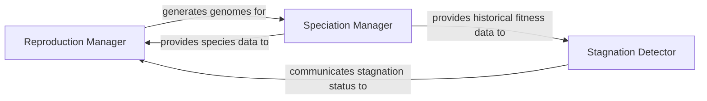

## Details

The Evolutionary Operators subsystem is responsible for implementing the core genetic operations within the NEAT algorithm, specifically focusing on speciation (grouping similar genomes) and reproduction (creating new genomes through crossover and mutation), while also managing species stagnation.

### Reproduction Manager
Orchestrates the generation of offspring for the next evolutionary step. This involves calculating the number of progeny per species and applying genetic operations (crossover and mutation) to produce new genomes.

**Related Classes/Methods**:

- <a href="https://github.com/CodeReclaimers/neat-python/blob/master/neat/reproduction.py" target="_blank" rel="noopener noreferrer">`neat.reproduction:reproduce`</a>
- <a href="https://github.com/CodeReclaimers/neat-python/blob/master/neat/reproduction.py" target="_blank" rel="noopener noreferrer">`neat.reproduction:compute_spawn`</a>

### Speciation Manager
Groups genetically similar genomes into species, a crucial mechanism for protecting novel genetic innovations and promoting diversity. It also manages the lifecycle and properties of these species.

**Related Classes/Methods**:

- <a href="https://github.com/CodeReclaimers/neat-python/blob/master/neat/species.py" target="_blank" rel="noopener noreferrer">`neat.species:speciate`</a>
- <a href="https://github.com/CodeReclaimers/neat-python/blob/master/neat/species.py" target="_blank" rel="noopener noreferrer">`neat.species:update`</a>
- <a href="https://github.com/CodeReclaimers/neat-python/blob/master/neat/species.py" target="_blank" rel="noopener noreferrer">`neat.species:Species`</a>
- <a href="https://github.com/CodeReclaimers/neat-python/blob/master/neat/species.py" target="_blank" rel="noopener noreferrer">`neat.species:GenomeDistanceCache`</a>

### Stagnation Detector
Monitors the fitness progress of individual species over generations. Its role is to identify species that are no longer improving (stagnant) and potentially remove or penalize them to free up computational resources and prevent unproductive exploration.

**Related Classes/Methods**:

- <a href="https://github.com/CodeReclaimers/neat-python/blob/master/neat/stagnation.py" target="_blank" rel="noopener noreferrer">`neat.stagnation:StagnationDetector`</a>

### [FAQ](https://github.com/CodeBoarding/GeneratedOnBoardings/tree/main?tab=readme-ov-file#faq)