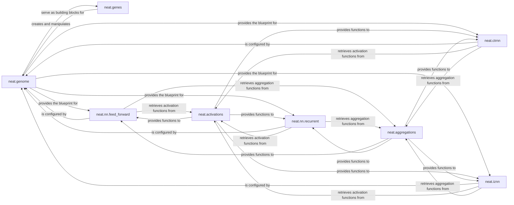

## Details

The `Genome & Network Representation` subsystem is a core part of the `neat-python` project, an ML Toolkit/Library for Neuroevolution. This subsystem is responsible for defining the genetic encoding of neural networks (nodes and connections) and constructing executable neural network models from these genetic blueprints.

### neat.genome
The central component representing the genetic blueprint of a neural network. It encapsulates the collection of node genes and connection genes, defining the network's topology and properties.

**Related Classes/Methods**:

- <a href="https://github.com/CodeReclaimers/neat-python/blob/master/neat/genome.py" target="_blank" rel="noopener noreferrer">`neat.genome`</a>

### neat.genes
Defines the fundamental genetic units (`NodeGene`, `ConnectionGene`) that compose a genome. These genes carry specific properties like activation functions, weights, and biases.

**Related Classes/Methods**:

- <a href="https://github.com/CodeReclaimers/neat-python/blob/master/neat/genes.py" target="_blank" rel="noopener noreferrer">`neat.genes`</a>

### neat.nn.feed_forward
Constructs and represents executable feed-forward neural networks based on a given `neat.genome`.

**Related Classes/Methods**:

- <a href="https://github.com/CodeReclaimers/neat-python/blob/master/neat/nn/feed_forward.py" target="_blank" rel="noopener noreferrer">`neat.nn.feed_forward`</a>

### neat.nn.recurrent
Constructs and represents executable recurrent neural networks from a `neat.genome`.

**Related Classes/Methods**:

- <a href="https://github.com/CodeReclaimers/neat-python/blob/master/neat/nn/recurrent.py" target="_blank" rel="noopener noreferrer">`neat.nn.recurrent`</a>

### neat.ctrnn
Implements and represents Continuous-Time Recurrent Neural Networks (CTRNNs), a specialized type of executable network model.

**Related Classes/Methods**:

- <a href="https://github.com/CodeReclaimers/neat-python/blob/master/neat/ctrnn" target="_blank" rel="noopener noreferrer">`neat.ctrnn`</a>

### neat.iznn
Implements and represents Izhikevich Spiking Neural Networks (IZNNs), another specialized executable network model.

**Related Classes/Methods**:

- <a href="https://github.com/CodeReclaimers/neat-python/blob/master/neat/iznn" target="_blank" rel="noopener noreferrer">`neat.iznn`</a>

### neat.activations
A registry and utility for managing and providing various activation functions (e.g., sigmoid, ReLU, tanh) used by the nodes within the neural networks.

**Related Classes/Methods**:

- <a href="https://github.com/CodeReclaimers/neat-python/blob/master/neat/activations.py" target="_blank" rel="noopener noreferrer">`neat.activations`</a>

### neat.aggregations
A registry and utility for managing and providing aggregation functions (e.g., sum, mean, max) used by the nodes to combine inputs from multiple connections.

**Related Classes/Methods**:

- <a href="https://github.com/CodeReclaimers/neat-python/blob/master/neat/aggregations.py" target="_blank" rel="noopener noreferrer">`neat.aggregations`</a>

### [FAQ](https://github.com/CodeBoarding/GeneratedOnBoardings/tree/main?tab=readme-ov-file#faq)