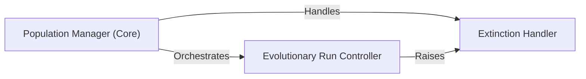

## Details

The `Population Manager` subsystem is central to the NEAT algorithm's execution, orchestrating the evolutionary process.

### Population Manager (Core)
The primary orchestrator of the entire evolutionary process. It manages the collection of genomes (the population), drives the progression through generations, handles population initialization, maintenance, and evolution. It also coordinates speciation, reproduction, and external fitness evaluation, tracks progress, and manages termination conditions.

**Related Classes/Methods**:

- <a href="https://github.com/CodeReclaimers/neat-python/blob/master/neat/population.py" target="_blank" rel="noopener noreferrer">`neat.population.Population`</a>

### Evolutionary Run Controller
This component encapsulates the main generational loop of the evolutionary algorithm. It serves as the primary entry point for executing the NEAT process, sequentially invoking internal methods for speciation, fitness evaluation, and reproduction in each generation.

**Related Classes/Methods**:

- <a href="https://github.com/CodeReclaimers/neat-python/blob/master/neat/population.py" target="_blank" rel="noopener noreferrer">`neat.population.Population:run`</a>

### Extinction Handler
A specialized mechanism for signaling and handling a critical termination event where the entire population has been lost. This component ensures that the evolutionary process can gracefully (or abruptly) conclude when no viable genomes remain.

**Related Classes/Methods**:

- <a href="https://github.com/CodeReclaimers/neat-python/blob/master/neat/population.py#L7-L8" target="_blank" rel="noopener noreferrer">`neat.population.CompleteExtinctionException`:7-8</a>

### [FAQ](https://github.com/CodeBoarding/GeneratedOnBoardings/tree/main?tab=readme-ov-file#faq)