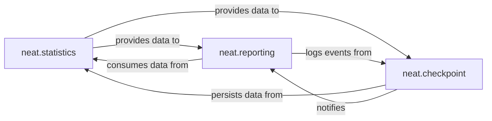

## Details

The `Reporting & Persistence` subsystem demonstrates a clear separation of concerns and a defined data flow. `neat.statistics` serves as the central data source for evolutionary metrics, collecting and aggregating information from the core evolutionary process (outside this subsystem's scope). `neat.reporting` acts as an observer and presentation layer, consuming data from `neat.statistics` to provide real-time feedback and logs. `neat.checkpoint` is responsible for the serialization and deserialization of the entire system state, including the historical data managed by `neat.statistics`. This establishes a dependency where `neat.reporting` relies on `neat.statistics` for content, and `neat.checkpoint` relies on `neat.statistics` (and other core components) to capture the full state for persistence. Additionally, `neat.checkpoint` can inform `neat.reporting` about its operations, ensuring comprehensive logging. This structure aligns with the "Pipeline" and "Component-based" architectural patterns, promoting modularity and clear responsibilities within the NEAT ML Toolkit.

### neat.statistics
Collects, calculates, and provides various fitness statistics (mean, standard deviation, median) for genomes and species. It also identifies and tracks the best genomes across generations. Manages the saving of statistical data (e.g., fitness over generations, species counts) to files.

**Related Classes/Methods**:

- <a href="https://github.com/CodeReclaimers/neat-python/blob/master/neat/statistics.py" target="_blank" rel="noopener noreferrer">`neat.statistics`</a>

### neat.reporting
Consumes statistical data and events from other parts of the NEAT system (primarily `neat.statistics`) to generate human-readable reports, log progress to the console or files, and provide real-time feedback on the evolutionary process. It acts as an observer of the evolutionary process.

**Related Classes/Methods**:

- <a href="https://github.com/CodeReclaimers/neat-python/blob/master/neat/reporting.py" target="_blank" rel="noopener noreferrer">`neat.reporting`</a>

### neat.checkpoint
Manages the saving of the entire evolutionary process state (e.g., population, species, configuration, random state) at specific points (typically at the end of a generation) to allow for later resumption, analysis, or transfer. It also handles loading these saved states.

**Related Classes/Methods**:

- <a href="https://github.com/CodeReclaimers/neat-python/blob/master/neat/checkpoint.py" target="_blank" rel="noopener noreferrer">`neat.checkpoint`</a>

### [FAQ](https://github.com/CodeBoarding/GeneratedOnBoardings/tree/main?tab=readme-ov-file#faq)