```mermaid
graph LR
    Configuration_Manager["Configuration Manager"]
    Genome_Network_Representation["Genome & Network Representation"]
    Population_Manager["Population Manager"]
    Evolutionary_Operators["Evolutionary Operators"]
    Evaluation_Orchestration["Evaluation Orchestration"]
    Reporting_Persistence["Reporting & Persistence"]
    Fitness_Evaluation_Interface_User_Defined_["Fitness Evaluation Interface (User-Defined)"]
    Visualization_Interface_User_Defined_["Visualization Interface (User-Defined)"]
    Configuration_Manager -- "configures" --> Genome_Network_Representation
    Configuration_Manager -- "configures" --> Population_Manager
    Configuration_Manager -- "configures" --> Evolutionary_Operators
    Configuration_Manager -- "configures" --> Evaluation_Orchestration
    Evolutionary_Operators -- "modifies" --> Genome_Network_Representation
    Genome_Network_Representation -- "builds networks for" --> Evaluation_Orchestration
    Population_Manager -- "sends population to" --> Evolutionary_Operators
    Population_Manager -- "submits genomes to" --> Evaluation_Orchestration
    Population_Manager -- "provides data to" --> Reporting_Persistence
    Evolutionary_Operators -- "returns new genomes to" --> Population_Manager
    Evaluation_Orchestration -- "requests network build from" --> Genome_Network_Representation
    Evaluation_Orchestration -- "delegates evaluation to" --> Fitness_Evaluation_Interface_User_Defined_
    Evaluation_Orchestration -- "returns evaluated genomes to" --> Population_Manager
    Reporting_Persistence -- "manages persistence for" --> Population_Manager
    Reporting_Persistence -- "provides data to" --> Visualization_Interface_User_Defined_
    Fitness_Evaluation_Interface_User_Defined_ -- "returns fitness to" --> Evaluation_Orchestration
    click Configuration_Manager href "https://github.com/CodeBoarding/GeneratedOnBoardings/blob/main/neat-python/Configuration_Manager.md" "Details"
    click Genome_Network_Representation href "https://github.com/CodeBoarding/GeneratedOnBoardings/blob/main/neat-python/Genome_Network_Representation.md" "Details"
    click Population_Manager href "https://github.com/CodeBoarding/GeneratedOnBoardings/blob/main/neat-python/Population_Manager.md" "Details"
    click Evolutionary_Operators href "https://github.com/CodeBoarding/GeneratedOnBoardings/blob/main/neat-python/Evolutionary_Operators.md" "Details"
    click Evaluation_Orchestration href "https://github.com/CodeBoarding/GeneratedOnBoardings/blob/main/neat-python/Evaluation_Orchestration.md" "Details"
    click Reporting_Persistence href "https://github.com/CodeBoarding/GeneratedOnBoardings/blob/main/neat-python/Reporting_Persistence.md" "Details"
```

## Details

The NEAT (NeuroEvolution of Augmenting Topologies) algorithm's architecture is designed around a clear evolutionary loop, orchestrated by the `Population Manager`. The process begins with the `Configuration Manager` setting up all parameters, which are then utilized by various components.

The `Population Manager` initiates the evolutionary cycle by sending the current population of genomes to the `Evolutionary Operators` for genetic operations like speciation and reproduction. Concurrently, it submits genomes to the `Evaluation Orchestration` component.

The `Evaluation Orchestration` requests the `Genome & Network Representation` to build executable neural networks from the genetic blueprints. It then delegates the actual performance assessment to the `Fitness Evaluation Interface (User-Defined)`, which is a crucial external component where users define their problem-specific fitness function. Once evaluated, the results are returned to the `Evaluation Orchestration`, which then passes the evaluated genomes back to the `Population Manager`.

The `Evolutionary Operators` return newly generated genomes to the `Population Manager`, completing the genetic cycle. Throughout this process, the `Population Manager` provides data to the `Reporting & Persistence` component, which collects statistics and manages saving/loading the evolutionary state. The `Reporting & Persistence` component, in turn, provides data to the `Visualization Interface (User-Defined)`, another external component where users can implement custom visualization logic.

This modular design allows for clear separation of concerns, enabling users to easily integrate their specific problem domains through the defined user interfaces while leveraging the core NEAT evolutionary mechanisms.

### Configuration Manager [[Expand]](./Configuration_Manager.md)
Centralizes and manages all configurable parameters for the NEAT algorithm, including genetic encoding rules, evolutionary hyperparameters, and neural network properties.

**Related Classes/Methods**:

- <a href="https://github.com/CodeReclaimers/neat-python/blob/master/neat/config.py#L1-L100" target="_blank" rel="noopener noreferrer">`neat.config`:1-100</a>
- <a href="https://github.com/CodeReclaimers/neat-python/blob/master/neat/attributes.py#L1-L100" target="_blank" rel="noopener noreferrer">`neat.attributes`:1-100</a>

### Genome & Network Representation [[Expand]](./Genome_Network_Representation.md)
Defines the genetic encoding of neural networks (nodes and connections) and constructs executable neural network models from these genetic blueprints.

**Related Classes/Methods**:

- <a href="https://github.com/CodeReclaimers/neat-python/blob/master/neat/genome.py#L1-L100" target="_blank" rel="noopener noreferrer">`neat.genome`:1-100</a>
- <a href="https://github.com/CodeReclaimers/neat-python/blob/master/neat/genes.py#L1-L100" target="_blank" rel="noopener noreferrer">`neat.genes`:1-100</a>
- <a href="https://github.com/CodeReclaimers/neat-python/blob/master/neat/graphs.py#L1-L100" target="_blank" rel="noopener noreferrer">`neat.graphs`:1-100</a>
- <a href="https://github.com/CodeReclaimers/neat-python/blob/master/neat/nn/feed_forward.py#L1-L100" target="_blank" rel="noopener noreferrer">`neat.nn.feed_forward`:1-100</a>
- <a href="https://github.com/CodeReclaimers/neat-python/blob/master/neat/nn/recurrent.py#L1-L100" target="_blank" rel="noopener noreferrer">`neat.nn.recurrent`:1-100</a>
- <a href="https://github.com/CodeReclaimers/neat-python/blob/master/neat/ctrnn#L1-L100" target="_blank" rel="noopener noreferrer">`neat.ctrnn`:1-100</a>
- <a href="https://github.com/CodeReclaimers/neat-python/blob/master/neat/iznn#L1-L100" target="_blank" rel="noopener noreferrer">`neat.iznn`:1-100</a>
- <a href="https://github.com/CodeReclaimers/neat-python/blob/master/neat/activations.py#L1-L100" target="_blank" rel="noopener noreferrer">`neat.activations`:1-100</a>
- <a href="https://github.com/CodeReclaimers/neat-python/blob/master/neat/aggregations.py#L1-L100" target="_blank" rel="noopener noreferrer">`neat.aggregations`:1-100</a>

### Population Manager [[Expand]](./Population_Manager.md)
The core orchestrator of the entire evolutionary process, managing the collection of genomes (the population) and driving the progression through generations.

**Related Classes/Methods**:

- <a href="https://github.com/CodeReclaimers/neat-python/blob/master/neat/population.py#L1-L100" target="_blank" rel="noopener noreferrer">`neat.population`:1-100</a>

### Evolutionary Operators [[Expand]](./Evolutionary_Operators.md)
Implements the core genetic operations: speciation (grouping similar genomes to protect innovation) and reproduction (creating new genomes through crossover and mutation).

**Related Classes/Methods**:

- <a href="https://github.com/CodeReclaimers/neat-python/blob/master/neat/species.py#L1-L100" target="_blank" rel="noopener noreferrer">`neat.species`:1-100</a>
- <a href="https://github.com/CodeReclaimers/neat-python/blob/master/neat/stagnation.py#L1-L100" target="_blank" rel="noopener noreferrer">`neat.stagnation`:1-100</a>
- <a href="https://github.com/CodeReclaimers/neat-python/blob/master/neat/reproduction.py#L1-L100" target="_blank" rel="noopener noreferrer">`neat.reproduction`:1-100</a>

### Evaluation Orchestration [[Expand]](./Evaluation_Orchestration.md)
Manages the process of evaluating the fitness of each genome in the population, handling task distribution and delegating the actual fitness calculation.

**Related Classes/Methods**:

- <a href="https://github.com/CodeReclaimers/neat-python/blob/master/neat/distributed.py#L1-L100" target="_blank" rel="noopener noreferrer">`neat.distributed`:1-100</a>
- <a href="https://github.com/CodeReclaimers/neat-python/blob/master/neat/threaded.py#L1-L100" target="_blank" rel="noopener noreferrer">`neat.threaded`:1-100</a>
- <a href="https://github.com/CodeReclaimers/neat-python/blob/master/neat/parallel.py#L1-L100" target="_blank" rel="noopener noreferrer">`neat.parallel`:1-100</a>

### Reporting & Persistence [[Expand]](./Reporting_Persistence.md)
Collects statistical insights into the evolutionary progress and manages saving/loading the state of the evolutionary process.

**Related Classes/Methods**:

- <a href="https://github.com/CodeReclaimers/neat-python/blob/master/neat/statistics.py#L1-L100" target="_blank" rel="noopener noreferrer">`neat.statistics`:1-100</a>
- <a href="https://github.com/CodeReclaimers/neat-python/blob/master/neat/reporting.py#L1-L100" target="_blank" rel="noopener noreferrer">`neat.reporting`:1-100</a>
- <a href="https://github.com/CodeReclaimers/neat-python/blob/master/neat/checkpoint.py#L1-L100" target="_blank" rel="noopener noreferrer">`neat.checkpoint`:1-100</a>

### Fitness Evaluation Interface (User-Defined)
An external, problem-specific component implemented by the user, defining the logic for assessing the performance (fitness) of a neural network. This component is not part of the core NEAT library and its source code resides in the user's project.

**Related Classes/Methods**: _None_

### Visualization Interface (User-Defined)
An external, user-implemented component that consumes statistical data and network structures to generate visual representations of the evolutionary process. This component is not part of the core NEAT library and its source code resides in the user's project.

**Related Classes/Methods**: _None_

### [FAQ](https://github.com/CodeBoarding/GeneratedOnBoardings/tree/main?tab=readme-ov-file#faq)