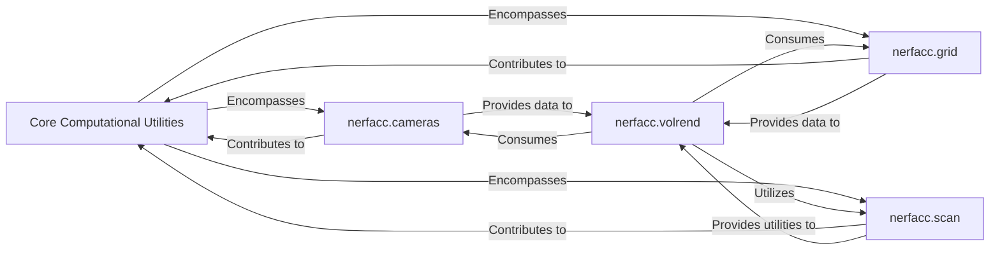

## Details

The `nerfacc` project's core volumetric rendering subsystem is built upon a foundation of `Core Computational Utilities`. This foundational component encompasses `nerfacc.cameras`, responsible for precise camera geometry and ray generation; `nerfacc.grid`, which manages efficient 3D spatial data structures for ray traversal; and `nerfacc.scan`, providing highly optimized CUDA-accelerated array primitives for parallel computations. At the heart of the rendering process is the `nerfacc.volrend` component. It acts as the central orchestrator, consuming data from `nerfacc.cameras` (ray information) and `nerfacc.grid` (spatial sample data derived from grid traversals), and utilizing the high-performance utilities from `nerfacc.scan` to compute final rendered outputs such as colors, opacities, and depths. This architecture ensures a modular and high-performance approach to neural radiance field rendering.

### Core Computational Utilities [[Expand]](./Core_Computational_Utilities.md)
The overarching component that encapsulates fundamental helper functions and low-level operations. It provides the high-performance bedrock for higher-level rendering and estimation components by integrating specialized computational modules.

**Related Classes/Methods**:

- <a href="https://github.com/nerfstudio-project/nerfacc/blob/master/nerfacc/cameras.py" target="_blank" rel="noopener noreferrer">`nerfacc.cameras`</a>
- <a href="https://github.com/nerfstudio-project/nerfacc/blob/master/nerfacc/grid.py" target="_blank" rel="noopener noreferrer">`nerfacc.grid`</a>
- <a href="https://github.com/nerfstudio-project/nerfacc/blob/master/nerfacc/scan.py" target="_blank" rel="noopener noreferrer">`nerfacc.scan`</a>

### nerfacc.cameras
Manages precise camera geometry, including lens undistortion, camera pose transformations, and efficient ray generation. This is crucial for accurately projecting 3D scene data into 2D images and vice-versa, forming the basis for view-dependent operations.

**Related Classes/Methods**:

- <a href="https://github.com/nerfstudio-project/nerfacc/blob/master/nerfacc/cameras.py" target="_blank" rel="noopener noreferrer">`nerfacc.cameras`</a>

### nerfacc.grid
Handles spatial data structures and algorithms for efficient 3D space querying and management. This includes operations like ray-AABB intersections and grid traversals, which are vital for accelerating volumetric operations and sparse data representations in 3D reconstruction.

**Related Classes/Methods**:

- <a href="https://github.com/nerfstudio-project/nerfacc/blob/master/nerfacc/grid.py" target="_blank" rel="noopener noreferrer">`nerfacc.grid`</a>

### nerfacc.scan
Provides highly optimized, CUDA-accelerated array primitives, such as prefix sums and prefix products. These operations are fundamental for parallel computations in volumetric rendering, neural field processing, and other data-parallel tasks, significantly boosting performance.

**Related Classes/Methods**:

- <a href="https://github.com/nerfstudio-project/nerfacc/blob/master/nerfacc/scan.py" target="_blank" rel="noopener noreferrer">`nerfacc.scan`</a>

### nerfacc.volrend
Orchestrates the core volumetric rendering process, taking ray marching results and radiance field properties to compute final colors, opacities, and depths. It integrates camera information, spatial grid data, and optimized scan operations to perform efficient rendering.

**Related Classes/Methods**:

- <a href="https://github.com/nerfstudio-project/nerfacc/blob/master/nerfacc/volrend.py#L15-L164" target="_blank" rel="noopener noreferrer">`nerfacc.volrend.rendering`:15-164</a>

### [FAQ](https://github.com/CodeBoarding/GeneratedOnBoardings/tree/main?tab=readme-ov-file#faq)