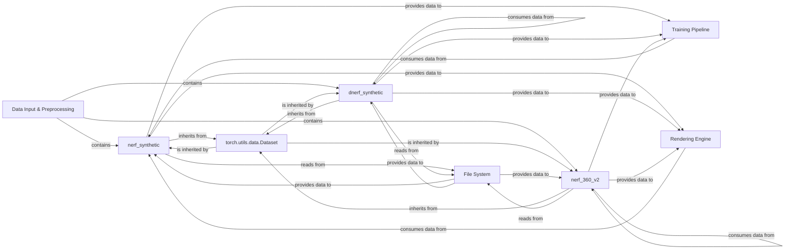

## Details

The Data Input & Preprocessing subsystem is a critical part of the NeRFacc project, responsible for efficiently loading, augmenting, and preparing diverse NeRF datasets for subsequent use by the Training Pipeline and Rendering Engine. It acts as an intermediary, abstracting the complexities of data handling from the core NeRF model operations. This subsystem leverages the torch.utils.data.Dataset interface, ensuring seamless integration with PyTorch's data loading utilities. It interacts directly with the File System to retrieve raw data and provides structured data to downstream components.

### Data Input & Preprocessing [[Expand]](./Data_Input_Preprocessing.md)
The overarching subsystem responsible for managing the loading, augmentation, and preparation of various NeRF datasets. It orchestrates the activities of specific dataset handlers.

**Related Classes/Methods**:

- <a href="https://github.com/nerfstudio-project/nerfacc/blob/master/examples/datasets/nerf_synthetic.py" target="_blank" rel="noopener noreferrer">`nerf_synthetic`</a>
- <a href="https://github.com/nerfstudio-project/nerfacc/blob/master/examples/datasets/dnerf_synthetic.py" target="_blank" rel="noopener noreferrer">`dnerf_synthetic`</a>
- <a href="https://github.com/nerfstudio-project/nerfacc/blob/master/examples/datasets/nerf_360_v2.py" target="_blank" rel="noopener noreferrer">`nerf_360_v2`</a>

### nerf_synthetic
Specializes in loading, augmenting, and preparing static synthetic NeRF datasets. It implements the torch.utils.data.Dataset interface to provide structured data.

**Related Classes/Methods**:

- <a href="https://github.com/nerfstudio-project/nerfacc/blob/master/examples/datasets/nerf_synthetic.py" target="_blank" rel="noopener noreferrer">`nerf_synthetic`</a>

### dnerf_synthetic
Handles the loading, augmentation, and preparation of dynamic synthetic NeRF datasets, also adhering to the torch.utils.data.Dataset interface.

**Related Classes/Methods**:

- <a href="https://github.com/nerfstudio-project/nerfacc/blob/master/examples/datasets/dnerf_synthetic.py" target="_blank" rel="noopener noreferrer">`dnerf_synthetic`</a>

### nerf_360_v2
Manages the loading, augmentation, and preparation of real-world 360-degree NeRF datasets, including integration with COLMAP data for camera pose information. It implements the torch.utils.data.Dataset interface.

**Related Classes/Methods**:

- <a href="https://github.com/nerfstudio-project/nerfacc/blob/master/examples/datasets/nerf_360_v2.py" target="_blank" rel="noopener noreferrer">`nerf_360_v2`</a>

### torch.utils.data.Dataset
This is a foundational PyTorch abstract class that defines the standard interface for data loading. All specific dataset components (nerf_synthetic, dnerf_synthetic, nerf_360_v2) inherit from it, ensuring compatibility with PyTorch's data utilities (e.g., DataLoader).

**Related Classes/Methods**:

- <a href="https://github.com/nerfstudio-project/nerfacc/blob/master/" target="_blank" rel="noopener noreferrer">`torch.utils.data.Dataset`</a>

### File System
An external dependency representing the underlying storage mechanism from which raw dataset files (images, camera poses, metadata) are read.

**Related Classes/Methods**:

- <a href="https://github.com/nerfstudio-project/nerfacc/blob/master/" target="_blank" rel="noopener noreferrer">`File System`</a>

### Training Pipeline
A downstream component that consumes the preprocessed and augmented data provided by the Data Input & Preprocessing subsystem for training NeRF models.

**Related Classes/Methods**:

- <a href="https://github.com/nerfstudio-project/nerfacc/blob/master/" target="_blank" rel="noopener noreferrer">`Training Pipeline`</a>

### Rendering Engine
Another downstream component that utilizes the prepared dataset information (e.g., camera poses, scene metadata) for rendering NeRF scenes.

**Related Classes/Methods**:

- <a href="https://github.com/nerfstudio-project/nerfacc/blob/master/" target="_blank" rel="noopener noreferrer">`Rendering Engine`</a>

### [FAQ](https://github.com/CodeBoarding/GeneratedOnBoardings/tree/main?tab=readme-ov-file#faq)