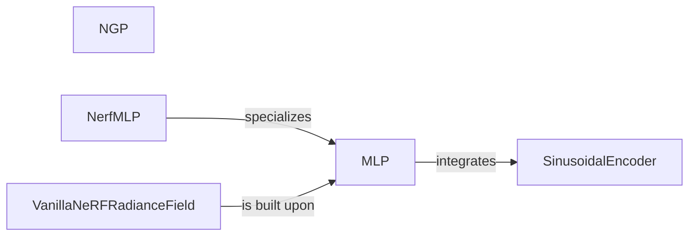

## Details

The `Neural Scene Representation` subsystem is central to `nerfacc`'s ability to model 3D scenes. It focuses on implementing various neural network architectures that map 3D coordinates and viewing directions to volumetric properties like color and density.

### NGP
Implements the Instant Neural Graphics Primitives (Instant-NGP) approach, a highly optimized neural network architecture for high-performance scene representation. It efficiently maps 3D coordinates and viewing directions to volumetric properties (color and density).

**Related Classes/Methods**:

- <a href="https://github.com/nerfstudio-project/nerfacc/blob/master/examples/radiance_fields/ngp.py" target="_blank" rel="noopener noreferrer">`NGP`</a>

### MLP
A foundational, generic Multi-Layer Perceptron (MLP) structure. It provides core neural network capabilities for mapping input features (e.g., 3D coordinates, viewing directions) to output properties (e.g., density, RGB color) and supports coordinate warping.

**Related Classes/Methods**:

- <a href="https://github.com/nerfstudio-project/nerfacc/blob/master/examples/radiance_fields/mlp.py" target="_blank" rel="noopener noreferrer">`MLP`</a>

### NerfMLP
A specialized Multi-Layer Perceptron (MLP) tailored specifically for Neural Radiance Fields. It extends or composes the base `MLP` to incorporate NeRF-specific architectural patterns or functionalities, optimizing it for radiance field tasks.

**Related Classes/Methods**:

- <a href="https://github.com/nerfstudio-project/nerfacc/blob/master/examples/radiance_fields/mlp.py#L114-L165" target="_blank" rel="noopener noreferrer">`NerfMLP`:114-165</a>

### VanillaNeRFRadianceField
Represents a standard, "vanilla" Neural Radiance Field implementation. This component orchestrates the use of `MLP` and other related components to construct a complete, functional NeRF model capable of rendering scenes.

**Related Classes/Methods**:

- <a href="https://github.com/nerfstudio-project/nerfacc/blob/master/examples/radiance_fields/mlp.py#L206-L245" target="_blank" rel="noopener noreferrer">`VanillaNeRFRadianceField`:206-245</a>

### SinusoidalEncoder
Encodes input coordinates (e.g., 3D positions, viewing directions) into a higher-dimensional feature space using sinusoidal functions. This encoding is critical for helping MLPs learn high-frequency details and is a common technique in NeRFs to improve reconstruction quality.

**Related Classes/Methods**:

- <a href="https://github.com/nerfstudio-project/nerfacc/blob/master/examples/radiance_fields/mlp.py#L168-L203" target="_blank" rel="noopener noreferrer">`SinusoidalEncoder`:168-203</a>

### [FAQ](https://github.com/CodeBoarding/GeneratedOnBoardings/tree/main?tab=readme-ov-file#faq)